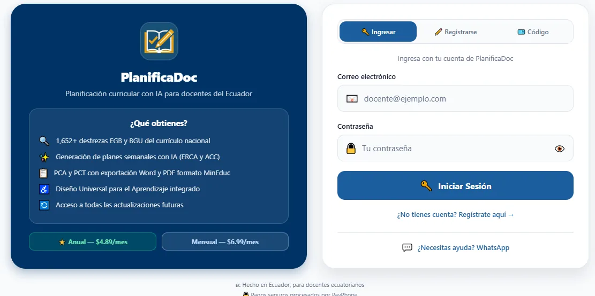
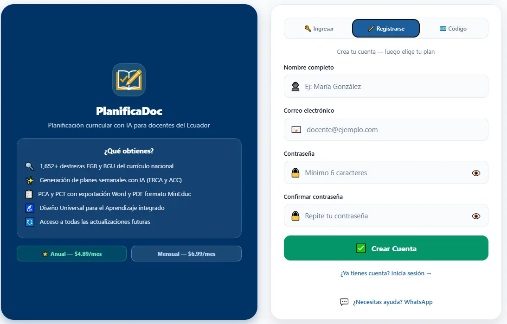
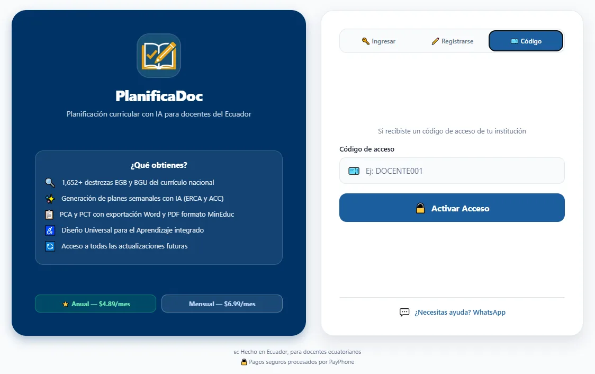
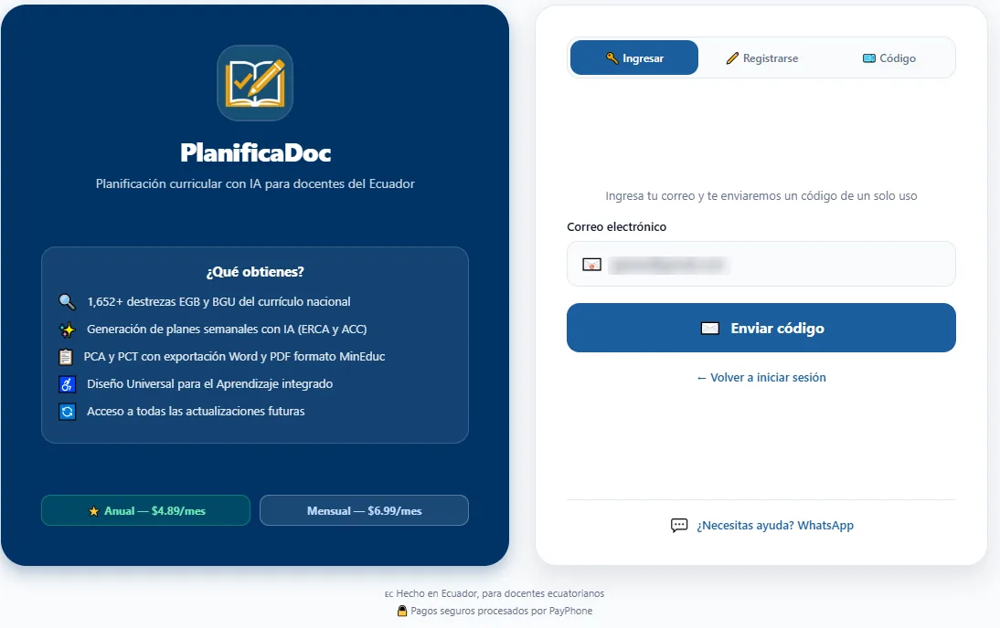
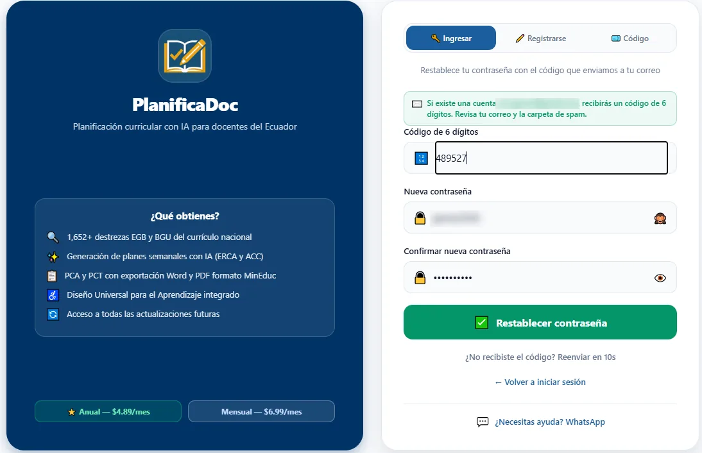
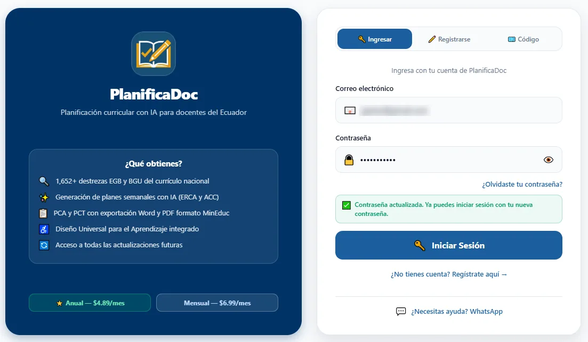
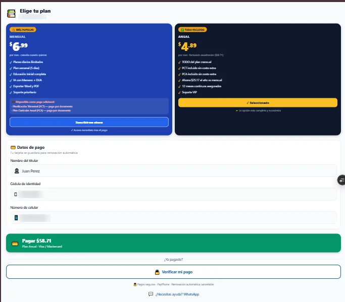
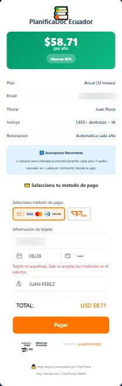

# 2. Requisitos y acceso al sistema

Este capítulo describe lo que usted necesita para trabajar con PlanificaDoc y los procedimientos para crear su cuenta, ingresar, recuperar la contraseña, activar el acceso mediante una suscripción o un código institucional y cerrar la sesión. Todas estas operaciones se realizan desde la pantalla de acceso, que es lo primero que muestra la aplicación cuando no existe una sesión activa en el dispositivo.

## 2.1. Requisitos previos

PlanificaDoc es una aplicación web: no requiere instalación y se utiliza desde el navegador. La generación de contenidos con inteligencia artificial (IA) y el almacenamiento de las planificaciones se realizan en línea, por lo que la calidad de la conexión influye directamente en el tiempo de respuesta. Verifique que su equipo cumpla los siguientes requisitos antes de comenzar:

| **Elemento** | **Requisito** |
| --- | --- |
| Dispositivo | Computadora, tableta o teléfono inteligente. Se recomienda una computadora para los módulos con formularios extensos (PCA, PCT, CNC), porque en pantallas anchas la aplicación muestra el menú lateral permanente y aprovecha mejor el espacio de trabajo. |
| Navegador | Versión actualizada de Google Chrome, Microsoft Edge, Mozilla Firefox o Safari. Mantenga habilitadas las ventanas emergentes para PlanificaDoc: el pago con PayPhone se abre en una pestaña nueva. |
| Conexión | Acceso a internet estable; la generación con IA se realiza en línea y puede tardar varios segundos en documentos extensos. |
| Cuenta | Correo electrónico válido y contraseña de al menos 6 caracteres, o un código de acceso entregado por su institución. |
| Suscripción | Plan mensual o anual activo, o código de acceso vigente. |
| Software complementario | Microsoft Word 2016 o superior (o LibreOffice Writer) para editar los documentos exportados, y un lector de PDF para revisarlos o imprimirlos. |

> **Consejo:** utilice siempre el mismo correo electrónico para registrarse, suscribirse y recuperar la contraseña. El sistema asocia la suscripción al correo con el que usted inició el pago.

## 2.2. Pantalla de acceso

Al abrir PlanificaDoc se presenta la pantalla de acceso. En pantallas anchas (computadora) se organiza en dos columnas: en el panel izquierdo se muestran el nombre y el lema de la plataforma, el recuadro **¿Qué obtienes?** con los beneficios principales (catálogo de destrezas del currículo nacional, generación de planes con IA, PCA y PCT con exportación a Word y PDF, Diseño Universal para el Aprendizaje integrado y acceso a las actualizaciones) y un resumen de los precios de los planes anual y mensual. En el panel derecho se encuentra la tarjeta de acceso con tres pestañas: **Ingresar**, **Registrarse** y **Código**. En el teléfono, los beneficios y los precios se muestran debajo de la tarjeta de acceso.

Al pie de la tarjeta está el enlace **¿Necesitas ayuda? WhatsApp**, que abre una conversación con el equipo de soporte con un mensaje ya redactado sobre la suscripción.

*Figura 1. Pantalla de acceso con las pestañas Ingresar, Registrarse y Código.*

| **Pestaña** | **Cuándo utilizarla** |
| --- | --- |
| **Ingresar** | Usted ya tiene una cuenta creada con correo y contraseña. Desde esta pestaña también se inicia la recuperación de la contraseña. |
| **Registrarse** | Es la primera vez que usa PlanificaDoc y desea crear una cuenta propia para luego elegir un plan de suscripción. |
| **Código** | Su institución educativa o el equipo de PlanificaDoc le entregó un código de acceso; no necesita correo ni contraseña. |

## 2.3. Iniciar sesión

Utilice este procedimiento cada vez que necesite ingresar desde un dispositivo nuevo o después de haber cerrado la sesión.

1. Seleccione la pestaña **Ingresar**.
2. Escriba su **Correo electrónico** y su **Contraseña**. Puede pulsar el ícono del ojo, a la derecha del campo, para mostrar u ocultar la contraseña y comprobar que la escribió correctamente.
3. Haga clic en **Iniciar Sesión**. Mientras el sistema verifica los datos, el botón muestra un indicador de carga.
4. Si su cuenta tiene una suscripción activa, se muestra el mensaje “¡Acceso Activado!” y se carga la pantalla de Inicio. Si la cuenta existe pero aún no tiene suscripción, el sistema lo lleva a la pantalla **Elige tu plan** (véase la sección Suscripción y activación del acceso).

El sistema valida los datos antes de enviarlos y muestra el motivo del problema debajo de los campos:

| **Mensaje en pantalla** | **Causa y acción recomendada** |
| --- | --- |
| “Ingresa tu correo” / “Ingresa tu contraseña” | Uno de los campos está vacío. Complételo y vuelva a intentarlo. |
| “No encontramos una cuenta con ese correo. ¿Quieres crear una?” | El correo no está registrado. Revise que esté bien escrito o regístrese en la pestaña **Registrarse**. |
| “Correo o contraseña incorrectos” | La contraseña no coincide. Vuelva a escribirla o utilice **¿Olvidaste tu contraseña?** |

> **Importante:** si aún no dispone de una cuenta, regístrese primero (véase la sección siguiente). Si el sistema responde “No encontramos una cuenta con ese correo”, verifique que el correo esté bien escrito.

## 2.4. Registrarse

El registro crea su cuenta personal en PlanificaDoc. La cuenta es el contenedor de todas sus planificaciones y de su suscripción, por lo que se recomienda que cada docente tenga la suya.

1. Seleccione la pestaña **Registrarse** o haga clic en el enlace **¿No tienes cuenta? Regístrate aquí**.
2. Complete el campo **Nombre completo** (nombres y apellidos), el **Correo electrónico** y una **Contraseña** de al menos 6 caracteres.
3. Repita la contraseña en el campo **Confirmar contraseña**.
4. Haga clic en **Crear Cuenta**. Si los datos son válidos, el sistema crea la cuenta y lo dirige a la pantalla **Elige tu plan** para activar la suscripción.

*Figura 2. Formulario de registro de un nuevo usuario.*

### 2.4.1. Descripción de los campos

| **Campo** | **Descripción** | **Validación del sistema** |
| --- | --- | --- |
| **Nombre completo** | Nombres y apellidos del docente (por ejemplo, María González). | Obligatorio. Mensaje: “Ingresa tu nombre completo”. |
| **Correo electrónico** | Correo al que se asociarán la cuenta, la suscripción y los códigos de recuperación. | Obligatorio y con formato válido. Mensaje: “Correo inválido”. |
| **Contraseña** | Clave personal de acceso. | Mínimo 6 caracteres. Mensaje: “La contraseña debe tener al menos 6 caracteres”. |
| **Confirmar contraseña** | Repetición de la contraseña para evitar errores de digitación. | Debe coincidir con la anterior. Mensaje: “Las contraseñas no coinciden”. |

> **Nota:** si el correo ya se encuentra registrado, el sistema cambia a la pestaña Ingresar, deja escrito el correo y muestra el mensaje “Ya tienes una cuenta con ese correo. Ingresa tu contraseña.”

## 2.5. Ingresar con código de acceso

Las instituciones o usuarios que disponen de un código de acceso pueden ingresar sin correo ni contraseña. Esta modalidad está pensada para convenios institucionales en los que la unidad educativa distribuye un código a sus docentes.

1. Seleccione la pestaña **Código**.
2. Escriba en el campo **Código de acceso** el código entregado por su institución (por ejemplo, DOCENTE001). El sistema convierte automáticamente las letras a mayúsculas.
3. Haga clic en **Activar Acceso**. Si el código es válido, se muestra “¡Acceso Activado!” y se carga la aplicación. En **Mi cuenta** el método de acceso se mostrará como “Código de acceso”.

*Figura 3. Pestaña Código con el campo Código de acceso y el botón Activar Acceso.*

Si el campo está vacío, el sistema muestra “Ingresa tu código”; si el código no existe o está mal escrito, muestra “Código inválido. Verifica e intenta de nuevo.”

> **Importante:** cada código admite un número limitado de dispositivos. Si se supera, el sistema muestra “Código bloqueado por exceso de dispositivos”; en ese caso comuníquese con soporte. No comparta su código con otras personas.

## 2.6. Recuperar la contraseña

Si olvidó su contraseña, puede definir una nueva mediante un código de un solo uso que el sistema envía a su correo. El procedimiento se realiza en dos pantallas, ambas bajo la pestaña **Ingresar**.

1. En la pestaña **Ingresar**, haga clic en **¿Olvidaste tu contraseña?** Si ya había escrito su correo, este aparece precargado.
2. Escriba el correo electrónico asociado a su cuenta y haga clic en **Enviar código**.

*Figura 4. Solicitud de recuperación de contraseña.*

El sistema confirma el envío con el mensaje “Si existe una cuenta con [su correo], recibirás un código de 6 dígitos. Revisa tu correo y la carpeta de spam.” Por seguridad, el mensaje es el mismo aunque el correo no esté registrado.

1. Revise su bandeja de entrada (y la carpeta de correo no deseado) y copie el código de 6 dígitos recibido.
2. En la pantalla **Restablecer contraseña**, escriba el código en el campo **Código de 6 dígitos**, la contraseña en **Nueva contraseña** (mínimo 6 caracteres) y repítala en **Confirmar nueva** **contraseña**.
3. Haga clic en **Restablecer contraseña**. El sistema vuelve a la pestaña **Ingresar** con su correo precargado y muestra el mensaje “Contraseña actualizada. Ya puedes iniciar sesión con tu nueva contraseña.”

*Figura 5. Pantalla para restablecer la contraseña con el código de 6 dígitos.*

4. Inicie sesión con la nueva contraseña.

*Figura 6. Inicio de sesión con la contraseña restablecida.*

> **Consejo:** si el código no llega, utilice el enlace ¿No recibiste el código? Reenviar. Para evitar envíos repetidos, el enlace se habilita nuevamente después de 60 segundos; mientras tanto muestra la cuenta regresiva. Si el código tiene menos o más de 6 dígitos, el sistema muestra “El código debe tener 6 dígitos”.

## 2.7. Suscripción y activación del acceso

Para utilizar la plataforma se requiere una suscripción activa. La pantalla **Elige tu plan** aparece automáticamente después de registrarse o de iniciar sesión con una cuenta que aún no tiene suscripción; en la parte superior muestra el correo al que se asociará el pago. Los planes disponibles son los siguientes:

| **Plan** | **Precio** | **Incluye** |
| --- | --- | --- |
| Mensual | USD 6,99 por mes; puede cancelarse en cualquier momento. | Planes diarios ilimitados, plan semanal (5 días), Educación Inicial completa, IA con enfoque Marzano y DUA, exportación a Word y PDF, soporte prioritario. El PCA y el PCT se adquieren como pago adicional por documento. |
| Anual | USD 4,89 por mes, facturado anualmente (USD 58,71). | Todo lo del plan mensual, más PCA y PCT incluidos sin costo adicional, 12 meses continuos asegurados y soporte VIP. Ahorro de USD 25,17 al año frente al plan mensual. |

> **Nota:** los precios corresponden a los vigentes a la fecha de elaboración de este manual y pueden variar.

Al elegir el plan, considere el tipo de documentos que elaborará durante el año lectivo. Si prevé elaborar la Planificación Curricular Anual (PCA) y las planificaciones trimestrales (PCT) de sus asignaturas, el plan anual las incluye sin costo adicional. De forma predeterminada, la pantalla muestra seleccionado el plan anual.

Para suscribirse:

1. En la pantalla **Elige tu plan**, haga clic en **Suscribirme ahora** (plan mensual) o en **Obtener plan** **anual**. El plan elegido se marca como “Seleccionado”.
2. En **Datos de pago**, complete el **Nombre del titular**, la **Cédula de identidad** y el **Número de** **celular**.
3. Haga clic en el botón **Pagar**, que muestra el valor a cancelar (por ejemplo, “Pagar $58.71” para el plan anual). El botón es verde para el plan anual y azul para el mensual.

*Figura 7. Pantalla Elige tu plan con los planes mensual y anual y el formulario Datos de pago.*

### 2.7.1. Descripción de los campos de pago

| **Campo** | **Descripción** | **Validación del sistema** |
| --- | --- | --- |
| **Nombre del titular** | Nombre tal como aparece en la tarjeta con la que se realizará el pago. | Obligatorio. Mensaje: “Ingresa el nombre del titular”. |
| **Cédula de identidad** | Número de identificación del titular (por ejemplo, 0912345678). Solo admite dígitos. | Mínimo 8 dígitos, máximo 13. Mensaje: “Ingresa tu cédula (mínimo 8 dígitos)”. |
| **Número de celular** | Número de teléfono móvil del titular (por ejemplo, 0987654321). El sistema le agrega automáticamente el prefijo de Ecuador (+593). | Mínimo 9 dígitos. Mensaje: “Ingresa tu número de celular”. |

1. Se abre, en una pestaña nueva, la ventana de pago seguro de **PayPhone** con el resumen de la suscripción. Elija el método de pago (tarjeta Visa o Mastercard, o PayPhone Wallet), ingrese los datos de la tarjeta y haga clic en **Pagar**.
2. Regrese a PlanificaDoc. Al confirmarse el pago se muestra el mensaje “¡Acceso Activado!” y se carga la aplicación. Si el acceso no se activa automáticamente, haga clic en **Verificar mi pago**, bajo el separador “¿Ya pagaste?”.

*Figura 8. Ventana de pago seguro de PayPhone con el resumen de la suscripción.*

> **Nota:** la suscripción es recurrente: la tarjeta se guarda para la renovación automática al finalizar cada periodo. Puede cancelar la renovación en cualquier momento desde Mi cuenta. Solo se aceptan las tarjetas indicadas en el selector de PayPhone; si aparece “Tarjeta no soportada”, utilice otra tarjeta o PayPhone Wallet.

> **Importante:** si acaba de pagar y el sistema indica “Pago aún no confirmado”, espere unos segundos y vuelva a intentarlo. No repita el pago. Si el problema persiste, utilice el enlace de ayuda por WhatsApp que aparece al final de la pantalla.

## 2.8. Cerrar sesión

Cierre la sesión cuando utilice un equipo compartido (por ejemplo, la sala de docentes o un laboratorio de la institución), para que otras personas no puedan ver ni modificar sus planificaciones.

1. Ingrese a **Mi cuenta** desde el menú lateral.
2. Haga clic en **Cerrar sesión** (texto en rojo, al final de la pantalla).
3. Confirme la acción en el mensaje “¿Cerrar sesión? Deberás ingresar tu código o email nuevamente.” Para volver a ingresar necesitará su correo y contraseña, o su código.
