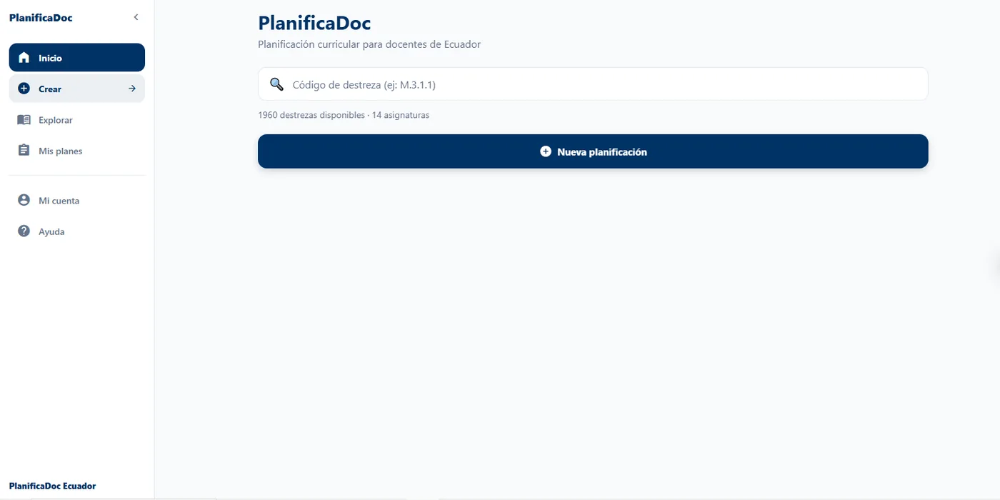
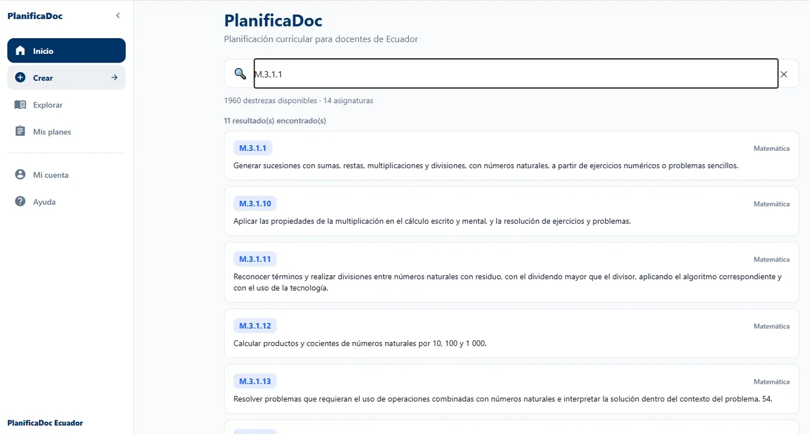
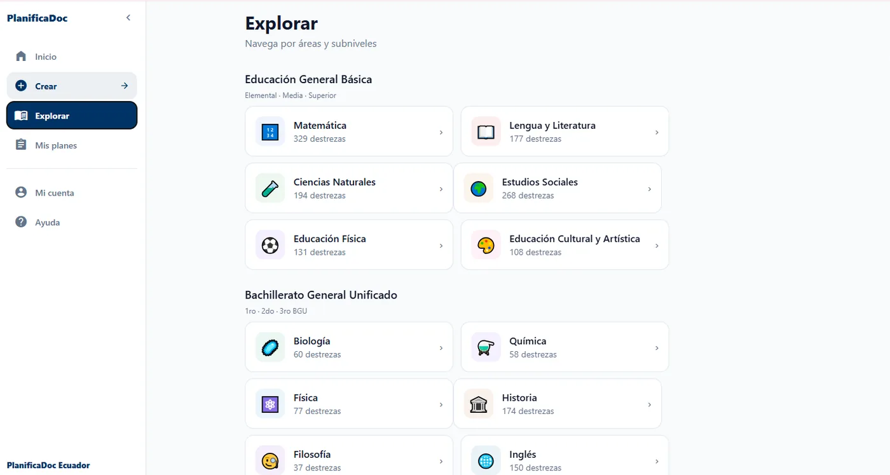
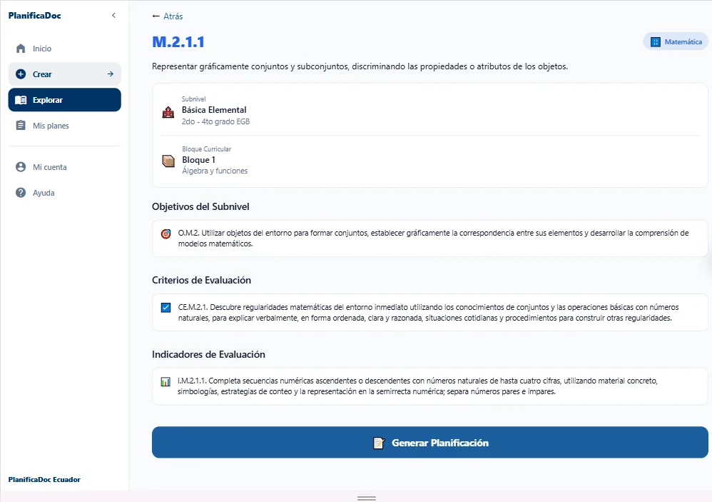
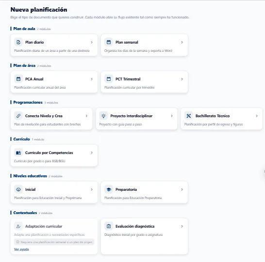
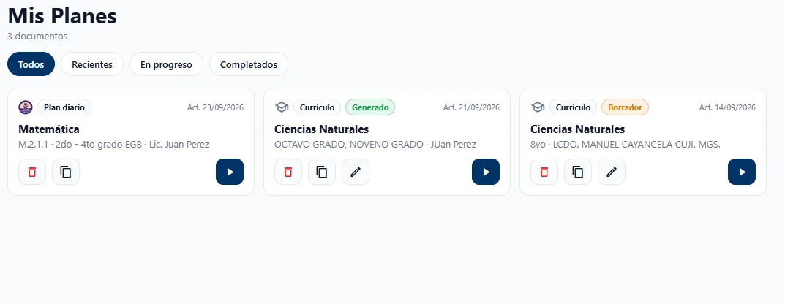
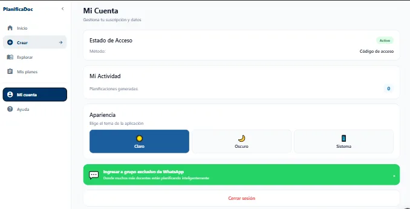
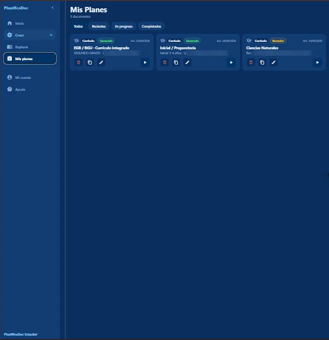
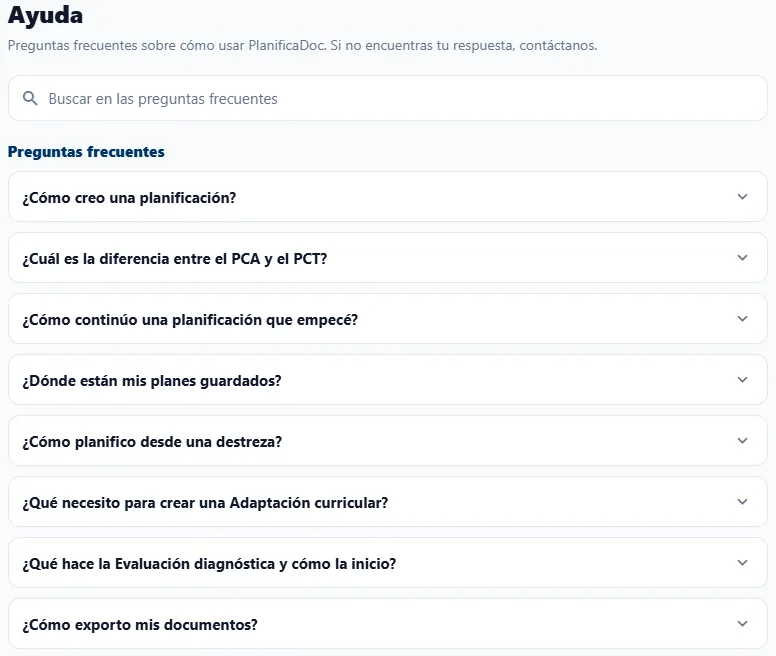
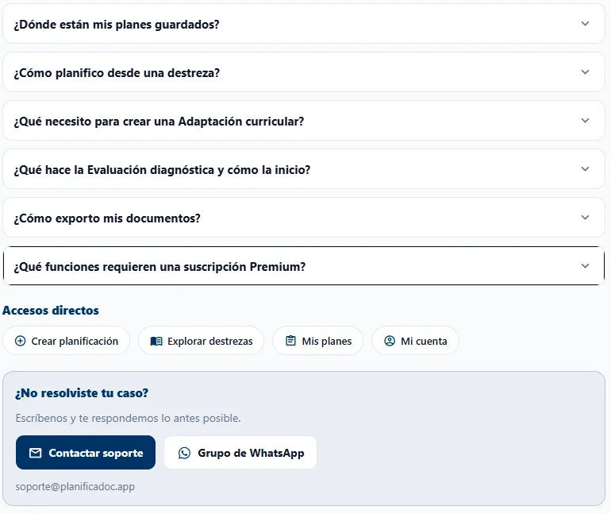

# 3. Descripción general de la interfaz

Este capítulo presenta la organización de la aplicación: el menú de navegación y las seis secciones principales. La interfaz está diseñada por intención de uso: **Inicio** y **Explorar** sirven para consultar el currículo, **Crear** para elaborar documentos nuevos, **Mis planes** para gestionar lo ya elaborado, y **Mi** **cuenta** y **Ayuda** para la configuración y el soporte.

## 3.1. Menú de navegación

El menú da acceso a las secciones principales desde cualquier pantalla, incluso desde el detalle de una destreza o desde el interior de un formulario. Su presentación depende del ancho de la pantalla:

- **Computadora y tableta:** el menú lateral permanece visible a la izquierda. La opción activa se resalta en azul de marca y la opción **Crear** se destaca con un color propio, por ser la acción principal. El botón **‹** junto al nombre PlanificaDoc contrae el menú a una franja de íconos para ampliar el área de trabajo; el mismo control permite expandirlo de nuevo.
- **Teléfono:** el menú se oculta en un encabezado con el botón de menú (tres líneas horizontales). Al pulsarlo se despliega un panel lateral con las mismas opciones, que se cierra al elegir una sección.

Las opciones se agrupan en una zona principal (Inicio, Crear, Explorar y Mis planes) y una zona de gestión (Mi cuenta y Ayuda):

| **Opción** | **Función** |
| --- | --- |
| **Inicio** | Buscador de destrezas por código o texto, acceso a las planificaciones recientes (bloque **Continuar**) y botón **Nueva planificación**. |
| **Crear** | Catálogo de todos los tipos de planificación, organizados en seis categorías. |
| **Explorar** | Navegación del currículo por nivel, área o ámbito, subnivel y bloque curricular. |
| **Mis planes** | Listado de todas las planificaciones guardadas, con filtros y acciones de gestión. |
| **Mi cuenta** | Estado del acceso, detalles de la suscripción, actividad, tema de la aplicación, comunidad de WhatsApp y cierre de sesión. |
| **Ayuda** | Preguntas frecuentes con buscador, accesos directos y canales de soporte. |

## 3.2. Inicio

Inicio es la pantalla que se muestra al ingresar. Está pensada para que usted llegue en pocos pasos a la destreza que desea planificar o retome un documento que dejó pendiente. Presenta tres elementos:

- **Buscador de destrezas:** permite localizar cualquier destreza con criterio de desempeño (DCD) por su código (por ejemplo, M.3.1.1) o por una palabra de su enunciado. Debajo se indica el total de destrezas y el número de asignaturas disponibles.
- **Continuar:** muestra hasta cinco planificaciones recientes (planes diarios, planes semanales, planes Conecta, Nivela y Crea y evaluaciones diagnósticas), ordenadas de la más reciente a la más antigua. Cada tarjeta indica el tipo de documento, el título y un dato de referencia (por ejemplo, el código de la destreza y la fecha). Al seleccionar una, se abre en el punto donde se dejó. El bloque no aparece si todavía no tiene planificaciones.
- **Nueva planificación:** abre el catálogo **Crear**.

*Figura 9. Pantalla de Inicio con el buscador de destrezas y el botón Nueva planificación.*

### 3.2.1. Cómo se lee el código de una destreza

En el currículo ecuatoriano cada elemento curricular tiene un código que indica a qué área, subnivel y bloque pertenece. En el Currículo Priorizado, el código de una destreza con criterio de desempeño se compone de cuatro partes separadas por puntos. Por ejemplo, en M.2.1.1:

| **Parte** | **Significado** | **Ejemplo M.2.1.1** |
| --- | --- | --- |
| Área | Sigla del área o asignatura: M (Matemática), LL (Lengua y Literatura), CN (Ciencias Naturales), CS (Estudios Sociales), EF (Educación Física), ECA (Educación Cultural y Artística), EFL (Inglés), entre otras. | M = Matemática |
| Subnivel | Número del subnivel o nivel: 1 Preparatoria, 2 Básica Elemental, 3 Básica Media, 4 Básica Superior, 5 Bachillerato. | 2 = Básica Elemental |
| Bloque curricular | Número del bloque curricular al que pertenece la destreza dentro del área y subnivel. | 1 = bloque 1 |
| Número de destreza | Número secuencial de la destreza dentro del bloque. | 1 = primera destreza |

La misma lógica se aplica a los demás elementos: el objetivo del subnivel se codifica con el prefijo O (O.M.2.1), el criterio de evaluación con CE (CE.M.2.1) y el indicador de evaluación con I (I.M.2.1.1). El documento Generalidades del currículo por competencias (EGB y BG) mantiene esta numeración de subniveles (0 Inicial, 1 Preparatoria, 2 Elemental, 3 Media, 4 Superior, 5 Bachillerato) y la aplica también a las competencias específicas y a los saberes; los Lineamientos de inicio de año lectivo 2026- 2027 señalan que comprender esta codificación es necesaria para planificar, enseñar y evaluar en el marco del nuevo currículo.

### 3.2.2. Buscar una destreza

1. En el buscador de Inicio, escriba total o parcialmente el código (por ejemplo, M.3) o una palabra del enunciado (por ejemplo, fracciones). La búsqueda comienza a partir del segundo carácter.
2. Revise la lista de resultados. El sistema muestra hasta 20 coincidencias con el código (resaltado con el color del área), el nombre del área y el enunciado de la destreza, y encima indica cuántos resultados encontró.
3. Seleccione la destreza para ver su detalle y generar una planificación diaria (véase la sección Plan diario).

*Figura 10. Resultados de la búsqueda de destrezas por código.*

Si no hay coincidencias, el sistema muestra “No se encontraron destrezas para” seguido del texto buscado. Para borrar la búsqueda y volver a la vista inicial, pulse la **X** del extremo derecho del buscador.

### 3.2.3. Detalle de la destreza

Al seleccionar una destreza, desde Inicio o desde Explorar, se abre su ficha de detalle. Esta pantalla reúne los elementos curriculares oficiales asociados a la destreza, de modo que usted pueda revisarlos antes de planificar:

| **Elemento** | **Contenido** |
| --- | --- |
| Código y área | Código de la destreza y nombre del área, con el color que la identifica. |
| Enunciado | Texto completo de la destreza con criterio de desempeño. |
| **Subnivel** | Nombre del subnivel y grados que abarca (por ejemplo, Básica Media, de 5.° a 7.° grado de EGB). |
| **Bloque Curricular** o **Ámbito de** **desarrollo** | Número y nombre del bloque. En Educación Inicial y Preparatoria se muestra el ámbito de desarrollo y aprendizaje, porque esos currículos se organizan por ámbitos y no por bloques. |
| **Objetivos del Subnivel** | Objetivos del área para el subnivel con los que se relaciona la destreza. |
| **Criterios de Evaluación** | Criterios de evaluación oficiales vinculados a la destreza. |
| **Indicadores de Evaluación** | Indicadores de evaluación que describen el logro de aprendizaje esperado. |

Según el Currículo Priorizado, las destrezas con criterios de desempeño integran habilidades, contenidos y procedimientos de distinta complejidad, mientras que los indicadores de evaluación describen los logros que el estudiantado debe alcanzar en cada subnivel. Por ello, conviene revisar los criterios e indicadores antes de generar el plan: son la referencia para las actividades de evaluación que propondrá la IA.

Al final de la ficha, el botón **Generar Planificación** abre el formulario del plan diario para esa destreza. En las destrezas de Educación Inicial, el botón abre el módulo de planificación de Inicial. Si el código no existe, el sistema muestra “Destreza no encontrada” y el botón **Volver**.

## 3.3. Explorar

La sección Explorar permite recorrer el currículo sin conocer el código de la destreza. Es útil para revisar la secuencia de un área, ubicar las destrezas de un bloque curricular o preparar una planificación de largo plazo. Las tarjetas se agrupan en cuatro secciones que corresponden a los niveles y subniveles del Sistema Nacional de Educación, y cada tarjeta indica cuántas destrezas contiene.

| **Sección** | **Organización** | **Qué contiene** |
| --- | --- | --- |
| Educación Inicial | Por grado (3 a 5 años) | Dos tarjetas: Inicial 1 (3 a 4 años) e Inicial 2 (4 a 5 años). Cada una abre directamente el listado de destrezas del grado, organizadas por ámbito de desarrollo. |
| Preparatoria | Por ámbito (1.° de EGB) | Siete tarjetas, una por ámbito del currículo integrador: Identidad y Autonomía; Convivencia; Descubrimiento y comprensión del medio natural y cultural; Relaciones lógico-matemáticas; Comprensión y expresión oral y escrita; Comprensión y expresión artística; y Expresión corporal. |
| Educación General Básica | Por área y subnivel | Matemática, Lengua y Literatura, Ciencias Naturales, Estudios Sociales, Educación Física, Educación Cultural y Artística e Inglés, con los subniveles Básica Elemental (2.° a 4.°), Básica Media (5.° a 7.°) y Básica Superior (8.° a 10.°). |
| Bachillerato General Unificado | Por asignatura (1.° a 3.° BGU) | Las asignaturas comunes (Matemática, Lengua y Literatura, Educación Física, Educación Cultural y Artística, Inglés) y las propias del bachillerato, como Biología, Química, Física, Historia, Filosofía, Educación para la Ciudadanía y Emprendimiento y Gestión. |

La organización por ámbitos en Inicial y Preparatoria responde a los currículos oficiales de esos niveles: el Currículo Priorizado de Preparatoria y el de Educación Inicial se estructuran en ejes y ámbitos de desarrollo y aprendizaje, mientras que la Educación General Básica y el Bachillerato se organizan por áreas, subniveles y bloques curriculares.

1. Haga clic en **Explorar** en el menú lateral.
2. Seleccione la tarjeta de su interés dentro de la sección del nivel correspondiente (por ejemplo, **Matemática** en Educación General Básica).
3. Si el área abarca varios subniveles, elija el subnivel en la pantalla **Selecciona un subnivel** (por ejemplo, **Básica Media**). En Bachillerato, Inicial y Preparatoria este paso se omite, porque la tarjeta ya corresponde a un único subnivel, grado o ámbito.
4. Revise el listado de destrezas. Cada tarjeta muestra el código, el bloque curricular (o el ámbito) con su nombre y el enunciado.
5. Elija la destreza que desea planificar para abrir su detalle.

*Figura 11. Sección Explorar con las áreas agrupadas por nivel educativo.*

*Figura 12. Selección de la destreza dentro del área.*

> **Consejo:** para volver al nivel anterior utilice el enlace con la flecha ← de la parte superior (por ejemplo, ← Áreas o ← Matemática). En Preparatoria, el listado de un ámbito reúne destrezas de varias áreas; el área de cada una se indica en su tarjeta.

## 3.4. Crear

Crear es el punto único de entrada para elaborar cualquier planificación. Se accede desde el menú lateral o desde el botón **Nueva planificación** de Inicio. La pantalla, titulada **Nueva planificación**, muestra los módulos agrupados en seis categorías; junto al nombre de cada categoría se indica cuántos módulos contiene. Al seleccionar un módulo se abre su formulario en estado inicial.

Las categorías siguen los niveles de concreción de la planificación curricular: el plan de área (PCA y PCT) organiza el trabajo del año o del trimestre, el plan de aula (diario y semanal) concreta las experiencias de aprendizaje, y las programaciones y los módulos contextuales responden a necesidades específicas. Los Lineamientos de inicio de año lectivo 2026-2027 destacan la planificación curricular trimestral y los proyectos interdisciplinarios como parte de la práctica docente del nuevo currículo por competencias.

*Figura 13. Catálogo Crear con los módulos agrupados por categoría.*

| **Categoría** | **Módulo** | **Descripción** |
| --- | --- | --- |
| Plan de aula | Plan diario | Planificación diaria de un área a partir de una destreza. |
|  | Plan semanal | Organiza los días de la semana y exporta a Word. |
| Plan de área | PCA Anual | Planificación curricular anual del área. |
|  | PCT Trimestral | Planificación curricular por trimestre. |
| Programaciones | Conecta Nivela y Crea | Plan de nivelación para estudiantes con brechas de aprendizaje. |
|  | Proyecto Interdisciplinar | Proyecto integrador con guía paso a paso. |
|  | Bachillerato Técnico | Planificación por perfil de egreso y figuras profesionales. |
| Currículo | Currículo por Competencias | Currículo por grado o para EGB/BGU. |
| Niveles educativos | Inicial | Planificación para Educación Inicial. |
|  | Preparatoria | Planificación para Educación Preparatoria. |
| Contextuales | Adaptación curricular | Adapta una planificación existente a necesidades específicas. |
|  | Evaluación diagnóstica | Diagnóstico inicial por grado o asignatura. |

> **Nota:** el módulo Adaptación curricular aparece deshabilitado en el catálogo, con la leyenda “Requiere una planificación semanal o un plan de origen” y el enlace Ver ayuda, porque la adaptación parte de un documento existente. Se habilita al acceder desde el detalle de un plan diario o semanal, o desde una planificación de Currículo por Competencias marcada con estudiantes con NEE; en ese caso, la pantalla Crear muestra un aviso que indica desde qué documento llegó y que el módulo está disponible con ese contexto precargado. Del mismo modo, Plan diario conduce al buscador de Inicio, ya que parte de una destreza.

## 3.5. Mis planes

Mis planes reúne todas las planificaciones guardadas, independientemente de su tipo: planes diarios y semanales, PCA, PCT, Conecta, Nivela y Crea, Bachillerato Técnico, Currículo por Competencias, proyectos interdisciplinarios y evaluaciones. Bajo el título se indica el número total de documentos. Esta sección es exclusivamente de gestión: para elaborar un documento nuevo utilice **Crear**.

Cada tarjeta muestra:

- **Ícono:** en los planes diarios, los íconos de las competencias o inserciones curriculares asociadas a la destreza, los mismos que utiliza el Currículo Priorizado en sus mapas curriculares; en los demás documentos, el ícono del área o del tipo de plan.
- **Tipo de documento:** Plan diario, Plan semanal, PCA, PCT, CNC, BT, Currículo, Proyecto o Evaluación.
- **Estado:** en los tipos que lo registran, se muestra en ámbar cuando el documento está en progreso (por ejemplo, “Borrador”) y en verde cuando está completado (por ejemplo, “Generado”).
- **Fecha de la última actualización**, con el prefijo “Act.”.
- **Título y dato de referencia**, como el grado, la asignatura o el nombre del docente.

### 3.5.1. Filtros

| **Filtro** | **Qué muestra** |
| --- | --- |
| **Todos** | Todos los documentos, ordenados del actualizado más recientemente al más antiguo. |
| **Recientes** | Los documentos actualizados en los últimos 30 días. |
| **En progreso** | Los documentos cuyo estado indica que no se han terminado, como los borradores. |
| **Completados** | Los documentos cuyo estado indica que están terminados, como los generados. |

Los filtros **En progreso** y **Completados** solo incluyen los tipos de documento que registran un estado (PCA, PCT, Conecta, Nivela y Crea, Currículo por Competencias, proyectos y evaluaciones); los planes diarios, semanales y de Bachillerato Técnico se consultan en **Todos** o **Recientes**. Si ningún documento coincide con el filtro elegido, se muestra un mensaje que lo indica.

### 3.5.2. Acciones

| **Acción** | **Función** |
| --- | --- |
| **Continuar** | Botón principal de la tarjeta. Abre el plan donde lo dejó: su vista de detalle o su formulario. |
| **Editar** | Reanuda el formulario del plan para modificar sus datos. Solo aparece en los tipos de documento que admiten reanudación. |
| **Duplicar** | Crea una copia del plan con la fecha actual, que aparece como un documento independiente en el listado. |
| **Eliminar** | Borra el plan después de una confirmación. |

En la computadora, al pasar el puntero sobre cada ícono de acción se muestra una breve descripción de su función.

*Figura 14. Sección Mis planes con el listado de planificaciones y sus acciones.*

> **Importante:** la eliminación de una planificación no puede deshacerse; el sistema lo advierte con el mensaje “¿Eliminar «[título]»? Esta acción no se puede deshacer.” Si necesita una variante de un plan (por ejemplo, para otro paralelo), utilice Duplicar en lugar de editar el original.

> **Nota:** si todavía no tiene documentos, la sección muestra “Aún no tienes planes” y el botón Nueva planificación, que lo lleva al catálogo Crear.

## 3.6. Mi cuenta

En Mi cuenta se consulta la información del usuario y de la suscripción, y se configuran las preferencias de la aplicación. La pantalla se organiza en los siguientes bloques:

- **Estado de Acceso:** indica si el acceso está “Activo” (en verde) o “Inactivo” (en rojo) y el método utilizado. Con suscripción, muestra el método “Suscripción”, el correo asociado y la fecha de vencimiento; con código, muestra el método “Código de acceso”.
- **Detalles de Suscripción:** plan contratado (Mensual o Anual), estado de la suscripción (Activa, Pago pendiente, Expirada o Cancelada), fecha de inicio, fecha de vencimiento, días restantes y si la **Renovación automática** está activada o desactivada. Si hay una tarjeta registrada, se muestra la marca con los últimos cuatro dígitos y el titular, en el apartado **Método de pago**.
- **Mi Actividad:** contador de planificaciones generadas.
- **Apariencia:** permite elegir el tema de la aplicación entre **Claro**, **Oscuro** o **Sistema** (se adapta a la configuración del dispositivo). El cambio se aplica de inmediato.
- **Grupo exclusivo de WhatsApp:** acceso a la comunidad de docentes y al equipo de soporte.
- **Cerrar sesión.**

### 3.6.1. Cancelar la renovación automática

1. En **Mi cuenta**, ubique el bloque **Detalles de Suscripción**.
2. Haga clic en **Cancelar renovación automática**. El botón solo aparece cuando la renovación está activada.
3. Confirme la acción. El sistema advierte que su suscripción seguirá activa hasta la fecha de vencimiento; a partir de entonces no se realizará un nuevo cobro.

*Figura 15. Sección Mi cuenta: estado de acceso, actividad, apariencia (Claro, Oscuro, Sistema), grupo de WhatsApp y cierre*

de sesión.

*Figura 16. Sección Mis planes con el tema oscuro activado.*

> **Consejo:** el tema Oscuro reduce el brillo de la pantalla en jornadas largas de planificación nocturna. La opción Sistema sigue automáticamente la configuración de claro u oscuro de su dispositivo.

## 3.7. Ayuda

La sección Ayuda reúne, en una sola pantalla, las respuestas a las dudas más frecuentes sobre el uso de PlanificaDoc. En la parte superior hay un buscador (**Buscar en las preguntas frecuentes**) que filtra las preguntas por cualquier palabra de la pregunta o de la respuesta. Al pulsar una pregunta se despliega su respuesta y, cuando corresponde, un enlace directo a la sección del sistema de la que trata.

*Figura 17. Preguntas frecuentes en la sección Ayuda.*

Las preguntas frecuentes disponibles abordan los siguientes temas:

| **Pregunta** | **Enlace directo** |
| --- | --- |
| ¿Cómo creo una planificación? | Ir al catálogo Crear |
| ¿Cuál es la diferencia entre el PCA y el PCT? | Ver Plan de área en Crear |
| ¿Cómo continúo una planificación que empecé? | Abrir Mis planes |
| ¿Dónde están mis planes guardados? | Ir a Mis planes |
| ¿Cómo planifico desde una destreza? | Explorar áreas |
| ¿Qué necesito para crear una Adaptación curricular? | Ver el módulo en Crear |
| ¿Qué hace la Evaluación diagnóstica y cómo la inicio? | Ir a Evaluación diagnóstica |
| ¿Cómo exporto mis documentos? | Ver Mis planes |
| ¿Qué funciones requieren una suscripción Premium? | Abrir Mi cuenta |

Si la búsqueda no encuentra coincidencias, se muestra el mensaje “Sin resultados para” seguido del texto buscado, con la sugerencia de probar otra palabra o contactar con soporte.

Al final de la pantalla se encuentran los accesos directos a la plataforma (**Crear planificación**, **Explorar** **destrezas**, **Mis planes** y **Mi cuenta**) y el apartado **¿No resolviste tu caso?** con los canales de soporte técnico: el botón **Contactar soporte**, que abre un correo dirigido a soporte@planificadoc.app, y el botón **Grupo de WhatsApp**, que abre la comunidad de docentes.

*Figura 18. Accesos directos y canales de soporte en la sección Ayuda.*

> **Consejo:** al escribir a soporte, indique el correo de su cuenta, el módulo en el que trabajaba y el mensaje que mostró el sistema. Esto agiliza la atención de su caso.

