# 5. Módulos de planificación

Todos los módulos siguen un patrón común: (1) completar los datos informativos, (2) seleccionar los elementos curriculares, (3) generar la propuesta con IA, (4) revisar y editar el resultado y (5) guardar y exportar el documento.

> **Importante:** el contenido generado con inteligencia artificial es una propuesta de apoyo. El docente es responsable de revisarlo, ajustarlo a su contexto institucional y validarlo antes de presentarlo.

## 5.1. Plan diario

El plan diario es la planificación microcurricular de una clase de 45 minutos. Parte de una destreza con criterio de desempeño (DCD) del Currículo Priorizado y genera objetivo, actividades en el ciclo ERCA, recursos, evaluación y estrategias del Diseño Universal para el Aprendizaje (DUA). Puede iniciarse desde el buscador de Inicio, desde **Explorar** o desde **Crear › Plan de aula › Plan diario**.

### 5.1.1. Fundamento normativo

Según el Currículo Priorizado, las DCD articulan habilidades, contenidos y procedimientos, y los indicadores de evaluación describen los logros esperados en cada subnivel. Cada DCD se vincula a un criterio (CE.) y a sus indicadores (I.); por ejemplo, LL.2.1.1 se evalúa con CE.LL.2.1 e I.LL.2.1.1. El formato oficial de planificación microcurricular para EGB y BG incluye datos informativos, indicadores de evaluación, estrategias metodológicas desde el DUA, recursos y técnicas e instrumentos de evaluación; el plan diario cubre estos elementos para una clase.

1. Localice la destreza por su código (por ejemplo, M.2.1.5) o navegue por área en **Explorar** y ábrala.
2. Revise la ficha: código, descripción, **Subnivel**, **Bloque Curricular**, **Objetivos del Subnivel**, **Criterios de Evaluación** e **Indicadores de Evaluación**. Haga clic en **Generar Planificación**.
3. Complete los datos informativos del formulario **Configura tu planificación**.

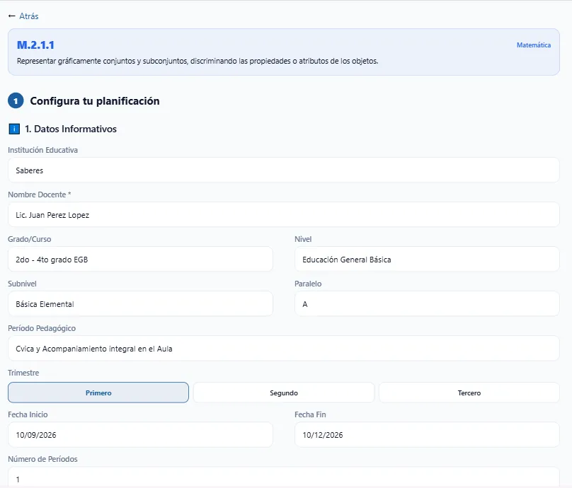

*Figura 19. Formulario del plan diario con la destreza seleccionada.*

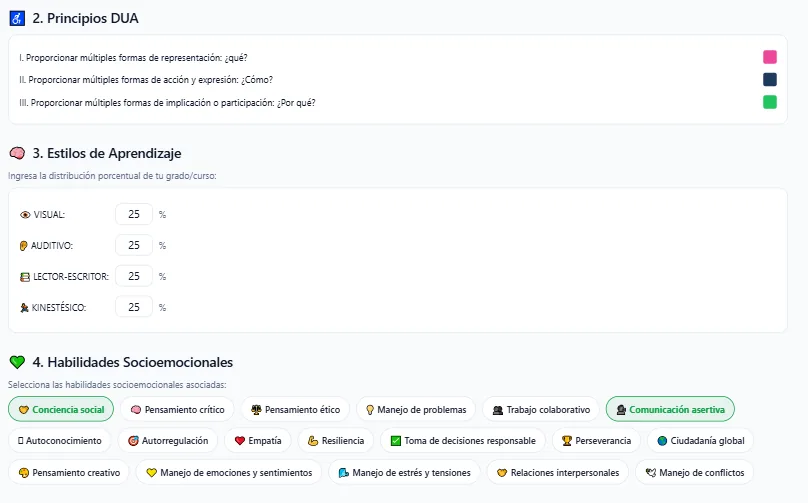

*Figura 20. Datos informativos del plan diario.*

| **Campo** | **Descripción** | **Ejemplo u observación** |
| --- | --- | --- |
| **Institución Educativa**, **Paralelo**, **Nivel** | Datos del encabezado. | Ej: “A”; EGB / BGU |
| **Nombre Docente** * | Único dato obligatorio para guardar. | Si falta: “Por favor ingresa el nombre del docente” |
| **Grado/Curso** y **Subnivel** | El grado se precarga y es editable; el subnivel se toma de la destreza. | Ej: 10mo |
| **Período Pedagógico**, **Trimestre** | Período, si aplica; trimestre Primero, Segundo o Tercero. | Opcionales |
| **Fecha Inicio**, **Fecha Fin**, **Número de Períodos** | Duración de la clase. | DD/MM/AAAA; por defecto 1 período |
| **3. Estilos de Aprendizaje** | Porcentaje del grupo por estilo: visual, auditivo, lector-escritor y kinestésico. | 25 % cada uno por defecto |
| **4. Habilidades** **Socioemocionales** | Selección múltiple. | Empatía, Autorregulación… |
| **5. Tu Tema de Clase** | Tema que desea enseñar. Obligatorio para generar. | Texto libre |
| **Técnicas de Evaluación** | Selección múltiple. | Rúbrica, Lista de Cotejo, Observación… |

1. Escriba el tema de la clase. Si desea otras opciones, haga clic en **Sugerir 2 alternativas con IA** y toque la que prefiera para usarla. El botón requiere que antes haya escrito un tema.

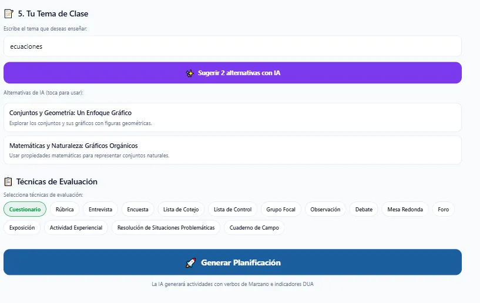

*Figura 21. Sugerencia de temas de clase generada con IA.*

2. Haga clic en **Generar Planificación**. Mientras la IA elabora el plan se muestra “Generando tu planificación...”. Si hay un error, vuelve al formulario con sus datos intactos.

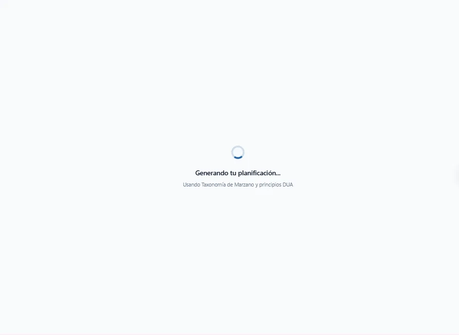

*Figura 22. Pantalla de espera durante la generación con IA.*

### 5.1.2. Qué genera la IA

- Un objetivo de clase y la estructura **ERCA**: **Experiencia** (10 min, 4 actividades), **Reflexión** (10 min, 4), **Conceptualización** (15 min, 5) y **Aplicación** (10 min, 5).
- Actividades iniciadas con un verbo de la Taxonomía de Marzano en infinitivo, acorde con cada fase.
- Los principios DUA que atiende cada actividad, garantizando los tres en cada fase, además de recursos y una evaluación formativa.

Al finalizar, el sistema presenta la pantalla **Planificación Microcurricular**. Puede editar **Objetivo**, **Actividades (editable)**, **Recursos**, **Indicadores de Evaluación**, **Técnicas e Instrumentos**, los campos DUA y **Observaciones**; para cambiar la configuración, haga clic en **Volver a configuración**:

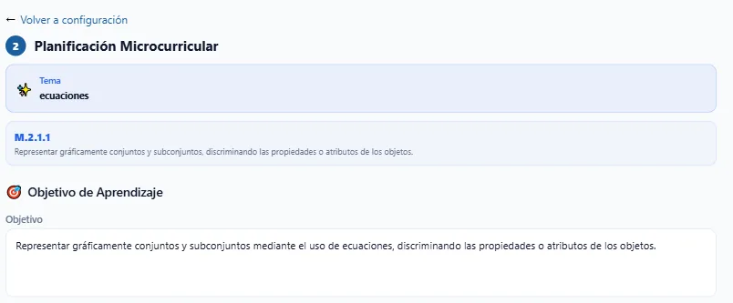

*Figura 23. Resultado del plan diario (1 de 4).*

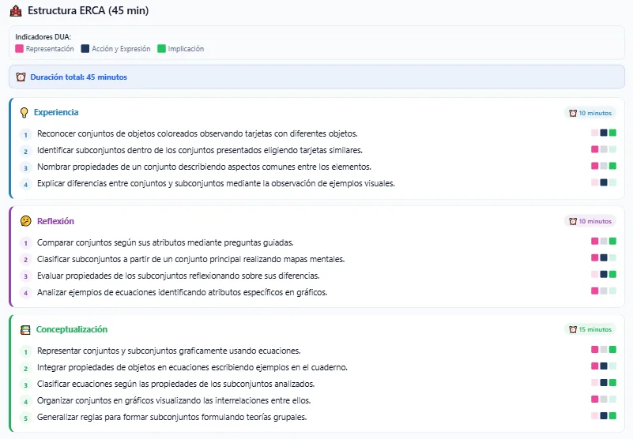

*Figura 24. Resultado del plan diario (2 de 4).*

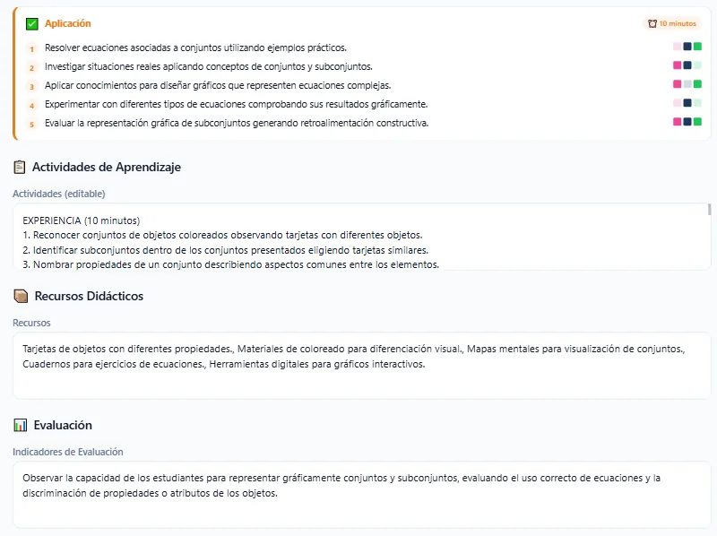

*Figura 25. Resultado del plan diario (3 de 4).*

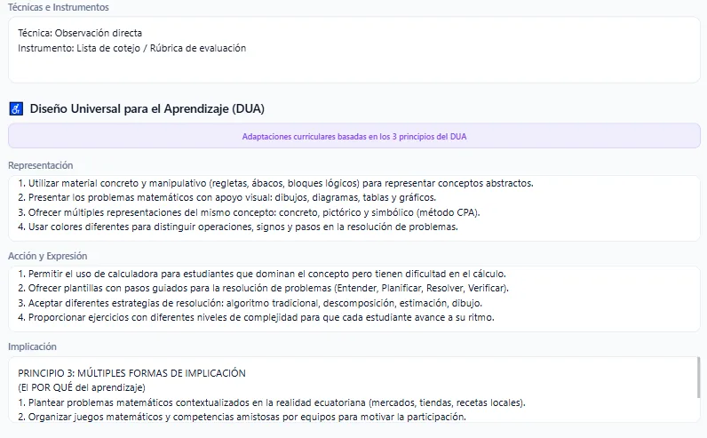

*Figura 26. Resultado del plan diario (4 de 4).*

***El DUA en el plan diario***

El DUA diseña la clase desde el inicio para que todo el grupo pueda aprender. Cada actividad ERCA lleva cuadros de color con los principios que atiende: **representación** (el qué, rosado), **acción y** **expresión** (el cómo, azul) e **implicación** (el porqué, verde). La sección **Diseño Universal para el** **Aprendizaje (DUA)** agrega estrategias generales del área para cada principio, que conviene ajustar a su grupo.

Desde esta pantalla puede guardar con **Guardar Planificación** o guardar y abrir el asistente con **Guardar y crear Adaptación Curricular**:

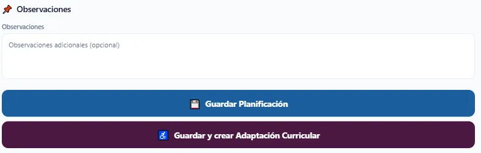

*Figura 27. Opción para guardar y crear la adaptación curricular.*

Al guardar (o con **← Volver a la planificación** desde una adaptación) se muestra la planificación microcurricular completa, con datos informativos, principios DUA, estilos, habilidades, objetivos, criterios de evaluación, destreza, estrategias ERCA, actividades evaluativas, recursos, DUA y observaciones:

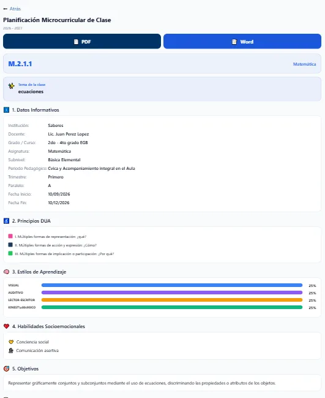

*Figura 28. Planificación microcurricular: datos informativos.*

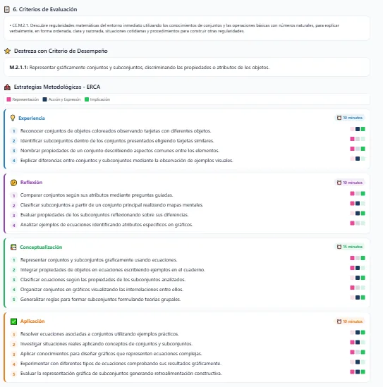

*Figura 29. Planificación microcurricular: objetivos y destrezas.*

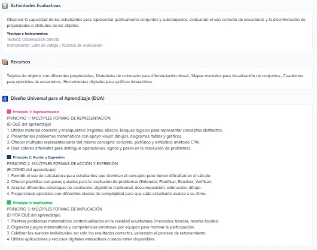

*Figura 30. Planificación microcurricular: actividades de aprendizaje.*

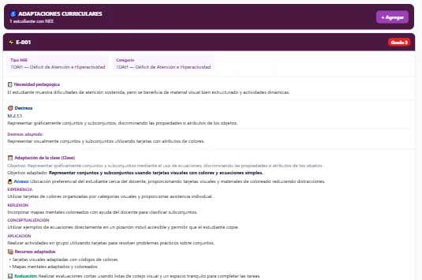

*Figura 31. Planificación microcurricular: evaluación.*

Los botones **PDF** y **Word** exportan el documento. Al final, la sección de adaptaciones curriculares ofrece **+ Agregar** o **Crear adaptación curricular**:

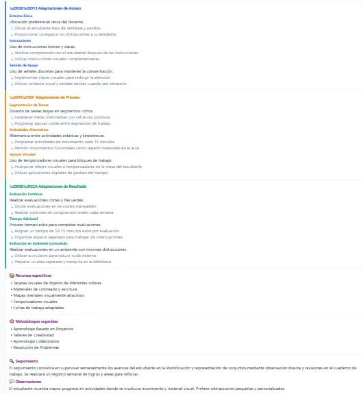

*Figura 32. Planificación microcurricular: opciones de guardado y exportación.*

> **Consejo:** antes de exportar, verifique que objetivo, actividades y evaluación sean coherentes con el indicador oficial de la destreza. La IA propone; la decisión pedagógica es del docente.

### 5.1.3. Adaptación curricular del plan diario

La adaptación ajusta una planificación a las necesidades educativas específicas (NEE) de un estudiante, asociadas o no a discapacidad. El asistente tiene cinco pasos (**Identificacion**, **Grado**, **Perfil**, **Generar**, **Resultado**) y la IA parte de las actividades ERCA, el objetivo y los recursos de la clase vinculada. El Reglamento General a la LOEI, citado en el Currículo Priorizado, dispone que el currículo se adapte a las necesidades y realidades del estudiantado; los Lineamientos 2026-2027 piden que la evaluación diagnóstica considere el estado socioemocional con apoyo del DECE, un buen insumo para el perfil del estudiante.

Los datos de la planificación de origen se cargan automáticamente y aparecen marcados con “✓

planificación”. Solo son editables **Año lectivo**, **Codigo del estudiante** y **Descripcion de la destreza** **(editable)**, que debe tener al menos 10 caracteres.

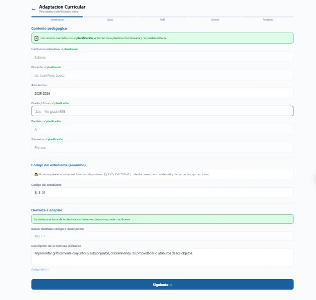

*Figura 33. Datos precargados de la adaptación curricular.*

1. Seleccione el grado de adaptación curricular.

| **Grado** | **Qué se modifica** | **Qué genera la IA** |
| --- | --- | --- |
| **Grado 1 — No** **Significativa** | Acceso: metodología, recursos y organización; no cambian destreza ni criterios. | Adaptaciones de acceso |
| **Grado 2 — Moderada** | Acceso y proceso: actividades, tiempos y agrupamientos; destreza levemente simplificada. | Acceso, proceso, destreza, criterio e indicadores simplificados |
| **Grado 3 — Significativa** | Acceso, proceso y resultado: destreza, criterio e indicadores modificados sustancialmente. | Todo lo anterior más adaptaciones de resultado |

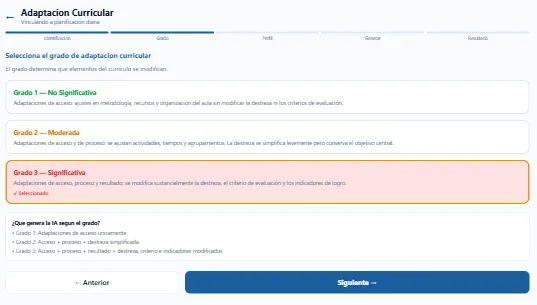

*Figura 34. Selección del grado de adaptación curricular.*

1. Complete el formulario de la situación de NEE del estudiante: **Tipo de NEE** (discapacidad visual, auditiva, motriz o intelectual, TEA, TDAH, dislexia, discalculia, trastorno del lenguaje, altas capacidades, dificultades socioemocionales u otra), **Estilo de aprendizaje predominante**, **Fortalezas del estudiante** * y **Desafios del estudiante** * (obligatorios, mínimo 10 caracteres) y **Apoyos disponibles en el aula**.

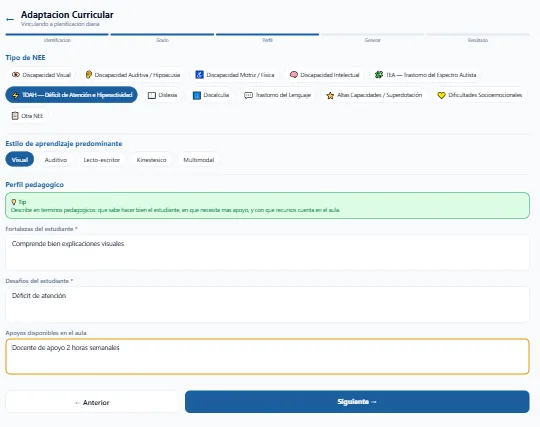

*Figura 35. Formulario de la situación de NEE del estudiante.*

2. Revise el resumen de la adaptación y el recuadro “¿Que generara la IA?”. Para corregir, haga clic en **← Volver**.

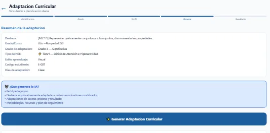

*Figura 36. Resumen previo a la generación de la adaptación.*

3. Haga clic en ✨ **Generar Adaptacion Curricular**. El botón indica “Generando adaptacion...”; el proceso toma entre 15 y 30 segundos.

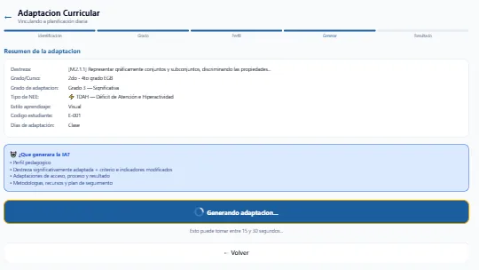

*Figura 37. Botón Generar en proceso.*

Una vez generada, se muestran en modo de lectura el perfil pedagógico, la destreza original y la adaptada (grados 2 y 3), las adaptaciones de acceso, proceso y resultado según el grado, metodologías activas, recursos, plan de seguimiento, adaptaciones por fase ERCA, evaluación adaptada y una rúbrica con cuatro niveles (Siempre Alcanza, Alcanza, Próximo a Alcanzar y No Alcanza). La adaptación queda vinculada al plan y puede descargarse con **Exportar como Word (.docx)**:

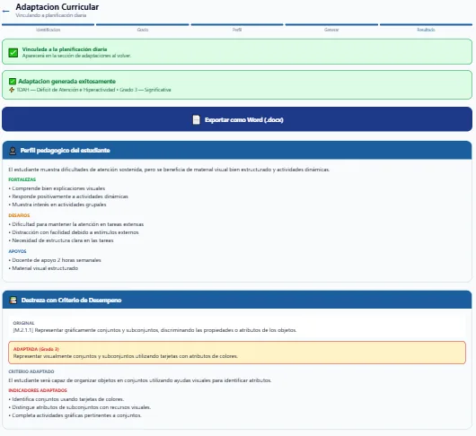

*Figura 38. Resultado de la adaptación curricular (1 de 4).*

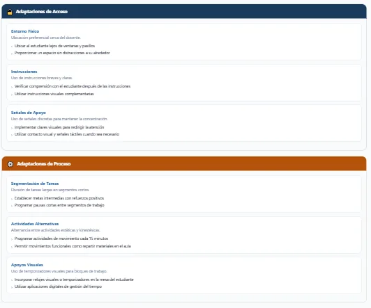

*Figura 39. Resultado de la adaptación curricular (2 de 4).*

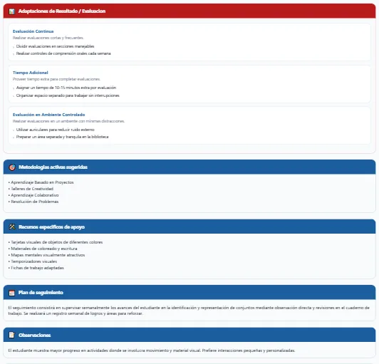

*Figura 40. Resultado de la adaptación curricular (3 de 4).*

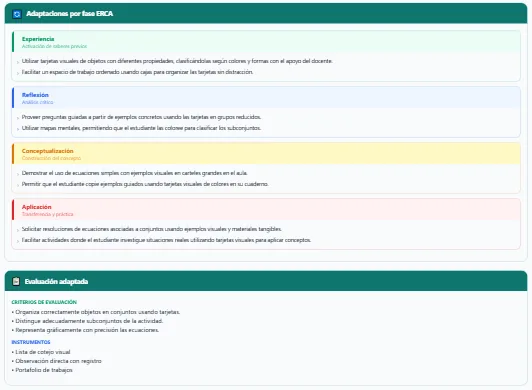

*Figura 41. Resultado de la adaptación curricular (4 de 4).*

Al terminar, puede volver con **← Volver a la planificación** o crear otra con **+ Nueva adaptacion**:

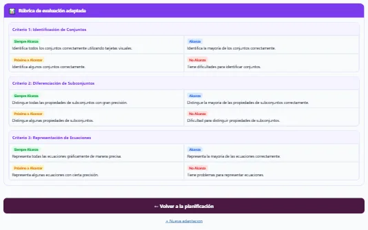

*Figura 42. Opciones para volver a la planificación o crear una nueva adaptación.*

> **Consejo:** por confidencialidad, identifique al estudiante solo con un código interno o sus iniciales, y describa su perfil con lenguaje pedagógico, no clínico.

## 5.2. Plan semanal

El plan semanal reúne las clases de lunes a viernes de una asignatura; cada día admite de 1 a 3 horas y cada hora tiene su propia DCD, tema y plan ERCA. Ruta: **Crear › Plan de aula › Plan semanal**. El formulario consta de dos secciones: datos informativos y configuración por día y hora.

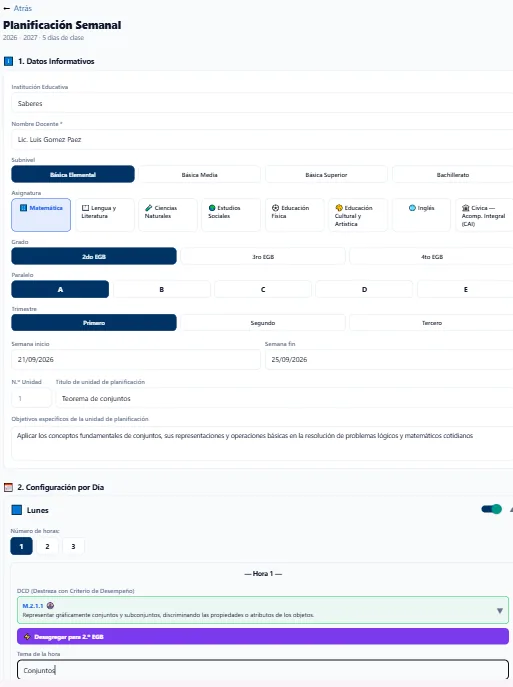

*Figura 43. Formulario del plan semanal: datos informativos y configuración por horas.*

1. Complete los datos informativos: **Institución Educativa**, **Nombre Docente** * (obligatorio), **Subnivel**, **Asignatura**, **Grado**, **Paralelo**, **Trimestre**, **Semana inicio** y **Semana fin** (se precargan con la semana en curso) y los datos de la unidad. En Cívica y Acompañamiento Integral en el Aula se elige además el **Bloque curricular**, que completa la unidad y el criterio del bloque.
2. En cada día, active el interruptor, elija el **Número de horas** y, en cada hora, haga clic en **Seleccionar DCD...** para buscar la destreza por código o descripción dentro del área y subnivel elegidos. Luego escriba el **Tema de la hora** y marque habilidades socioemocionales, metodologías activas y técnicas de evaluación.

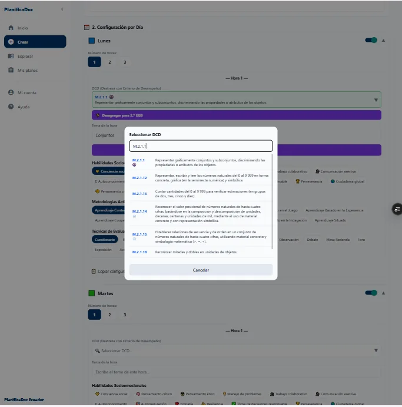

*Figura 44. Configuración de un día con el código de la destreza.*

### 5.2.1. Desagregación por grado

Las DCD se formulan por subnivel, que abarca varios grados. Desagregar gradúa la complejidad de la destreza para su grado sin cambiar su contenido, algo útil también en aulas multigrado, que según los Lineamientos 2026-2027 atienden a estudiantes de distintos grados en un mismo espacio.

1. Para desagregar la destreza, haga clic en **Desagregar para N.º EGB** (o BGU). El botón aparece si la destreza tiene indicador y su subnivel se divide en grados. En el panel, haga clic en ⚡ **Desagregar por grado**.

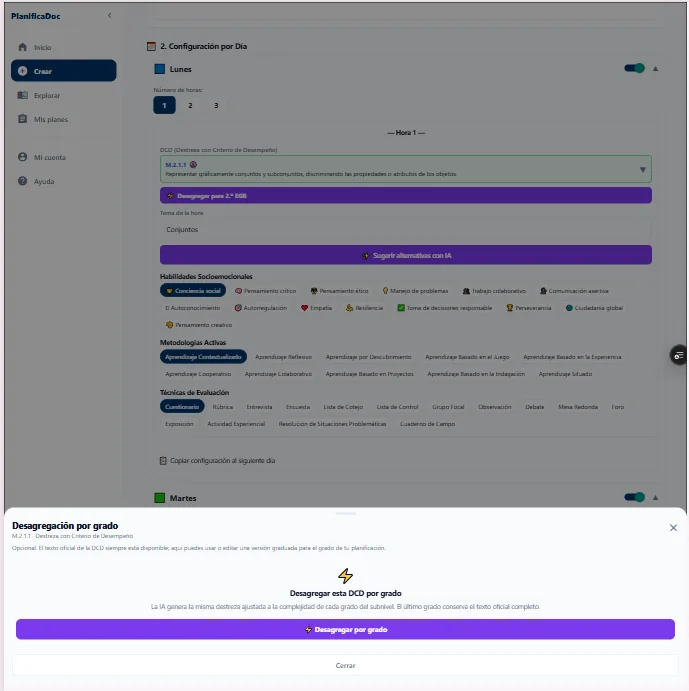

*Figura 45. Opción Desagregar por grado.*

2. Revise las sugerencias: la IA propone una DCD y un indicador graduados por grado según niveles de Marzano; el último grado conserva el texto oficial. Puede usarlas, editarlas con ✏️ **Editar** o aprobarlas con ✓ **Aprobar**, y luego hacer clic en **Usar versión de N° en esta planificación**.

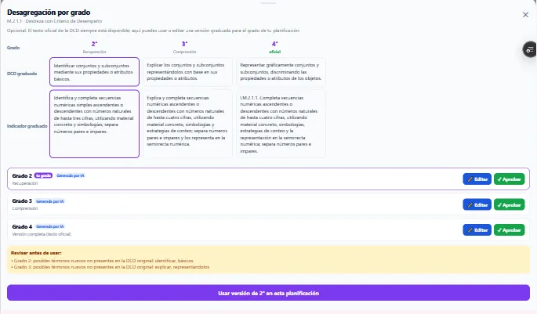

*Figura 46. Sugerencias de desagregación de la destreza.*

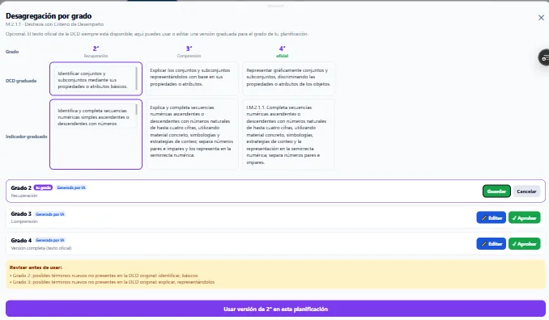

*Figura 47. Desagregación aplicada a la destreza.*

> **Importante:** la desagregación es opcional y no altera el catálogo oficial. La versión graduada aparece en los documentos exportados; para descartarla, haga clic en ↩ Volver a DCD oficial.

3. Opcionalmente, haga clic en **Sugerir alternativas con IA** (con al menos tres caracteres de tema) y elija una propuesta. Para repetir la configuración, haga clic en **Copiar configuración al** **siguiente día**.

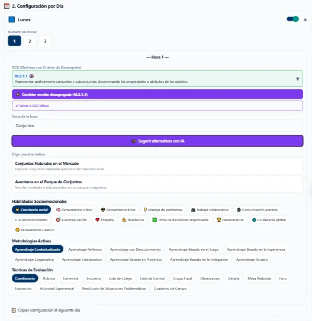

*Figura 48. Sugerencias de temas de clase y opción para copiar el día.*

4. Al completar la semana, haga clic en **Generar Planificación Semanal**. Se requiere al menos un día activo con destreza y tema.

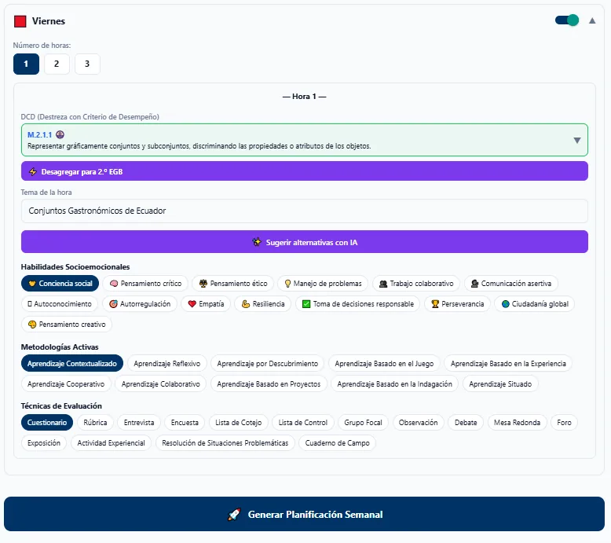

*Figura 49. Botón Generar planificación del plan semanal.*

La IA genera en paralelo cada hora (15 a 40 segundos). El resultado se organiza en pestañas por día, con objetivo, fases ERCA con indicadores DUA, recursos y evaluación formativa derivada de los indicadores oficiales de la destreza. **Regenerar esta hora** rehace una sola hora y **← Editar** vuelve a la configuración:

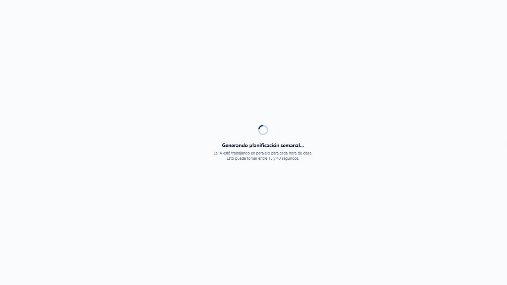

*Figura 50. Pantalla de espera de la generación semanal.*

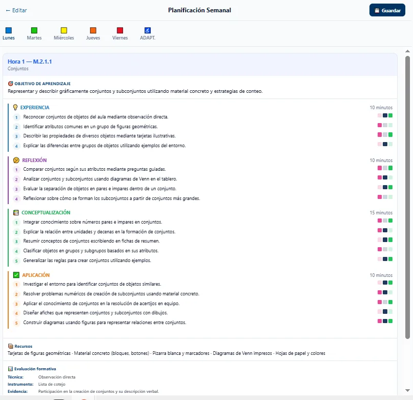

*Figura 51. Resultado del plan semanal (1 de 2).*

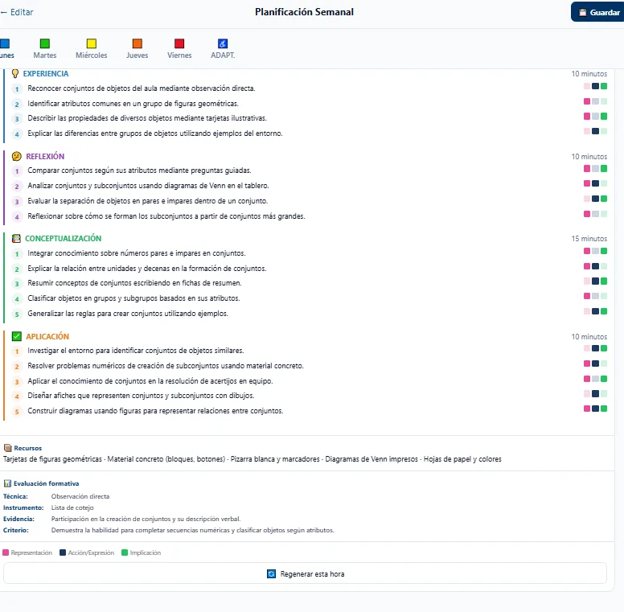

*Figura 52. Resultado del plan semanal (2 de 2).*

Para guardar la planificación con una adaptación curricular, abra la pestaña **ADAPT.** (ícono de adaptaciones curriculares) y elija **Guardar y agregar adaptación** o **Solo guardar (sin adaptaciones)**; en este último caso podrá agregarla más tarde desde la vista de la semana:

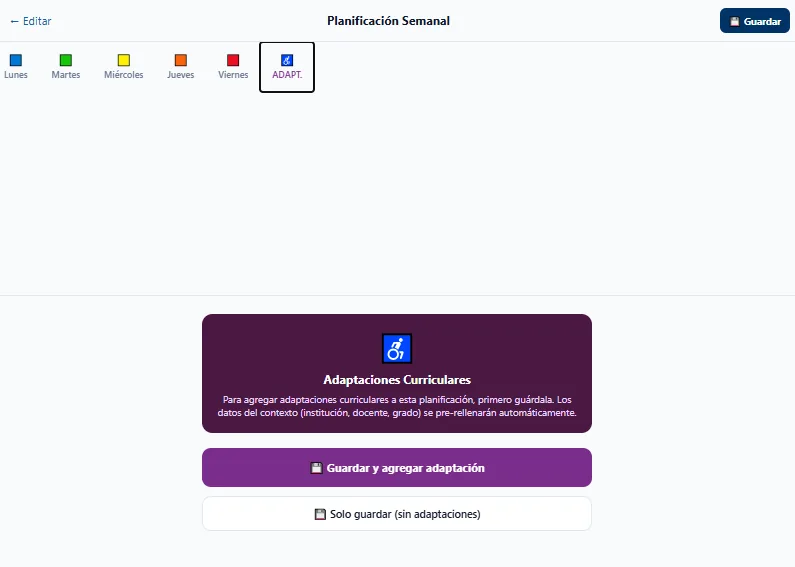

*Figura 53. Opción para guardar con adaptación curricular.*

### 5.2.2. Adaptaciones curriculares del plan semanal

Sigue el mismo asistente del plan diario con un paso adicional, **Dias**, y la destreza se elige porque la semana puede tener varias.

1. Seleccione la destreza que desea adaptar e ingrese el código o las iniciales del estudiante en **Codigo del estudiante**.
2. Elija los días en los que se aplicará la adaptación; solo aparecen los días activos de la semana y debe marcar al menos uno. La IA genera adaptaciones ERCA para cada día elegido.
3. Continúe con los mismos pasos descritos en la adaptación curricular del plan diario.

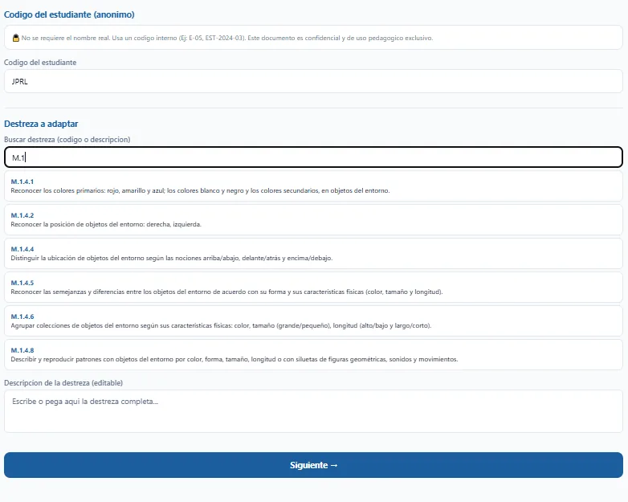

*Figura 54. Selección de la destreza y del estudiante para la adaptación semanal.*

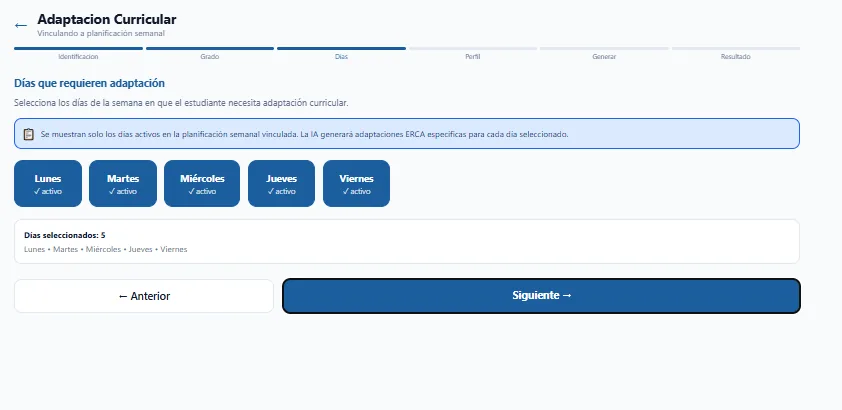

*Figura 55. Selección de los días en que se aplica la adaptación.*

## 5.3. PCA Anual

Ruta: **Crear › Plan de área › PCA Anual**. La Planificación Curricular Anual organiza el área para todo el año lectivo y sigue el Anexo 1 del Instructivo de PCA y Microplanificación 2021 del MINEDUC. Según los Lineamientos de inicio de año lectivo 2026-2027, el año se desarrolla en tres periodos académicos que suman 200 días laborables; la PCA reparte ese tiempo en unidades construidas con las Destrezas con Criterios de Desempeño (DCD) del Currículo Priorizado.

1. Complete **1. Datos informativos**.

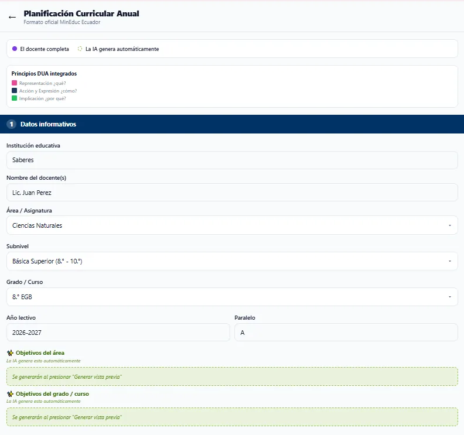

*Figura 56. Formulario de datos informativos del PCA.*

| **Campo** | **Descripción** | **Observación** |
| --- | --- | --- |
| Institución educativa | Nombre de la institución | Obligatorio |
| Nombre del docente(s) | Responsable de la PCA | Obligatorio |
| Área / Asignatura | Área del currículo | Obligatorio |
| Subnivel | Opciones según el área | Obligatorio |
| Grado / Curso | Aparece al elegir el subnivel | Obligatorio |
| Año lectivo / Paralelo | Datos del encabezado | 2026-2027 por defecto |

> Si cambia el área o el subnivel con destrezas ya elegidas, el sistema pide confirmación porque las borrará de todas las unidades.

Los objetivos del área y del grado no se escriben: la IA los redacta según el currículo oficial del subnivel.

1. Revise **2. Distribución del tiempo**. Con la **Carga horaria semanal** (5), las **Semanas de trabajo** (40) y las **Semanas evaluación e imprevistos** (8), el sistema calcula el **Total semanas de clase** (trabajo − evaluación) y el **Total períodos** (semanas de clase × carga horaria). Puede modificar cualquier valor.

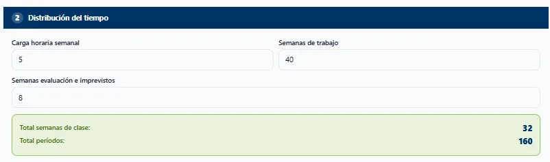

*Figura 57. Distribución del tiempo del PCA.*

2. En **5. Unidades de planificación**, busque por código o palabra clave, marque las DCD de cada unidad e indique la **Duración (semanas)**. Use **+ Agregar unidad** para añadir más.

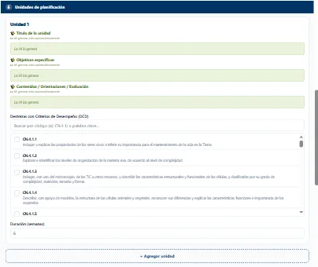

*Figura 58. Unidades de planificación y selección de destrezas con criterios de desempeño.*

> Procure que la suma de las duraciones coincida con el total de semanas de clase; el sistema no lo comprueba.

3. Seleccione las metodologías activas y las técnicas de evaluación; opcionalmente, escriba su bibliografía (APA) y las **Firmas de aprobación**. Luego haga clic en **Generar vista previa de mi** **PCA** (hasta 30 segundos).

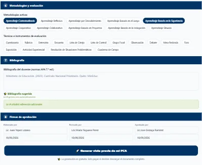

*Figura 59. Botón Generar vista previa de mi PCA.*

La IA genera objetivos, título, objetivos específicos, contenidos, orientaciones metodológicas y criterios de evaluación de cada unidad, además de bibliografía sugerida y observaciones con orientaciones DUA:

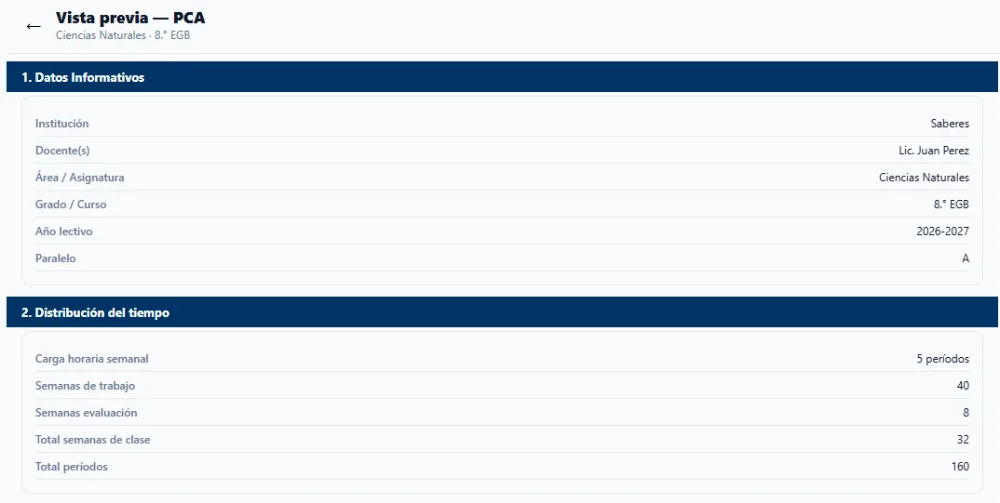

*Figura 60. Resultado del PCA (1 de 4).*

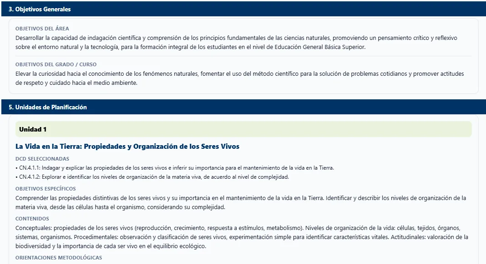

*Figura 61. Resultado del PCA (2 de 4).*

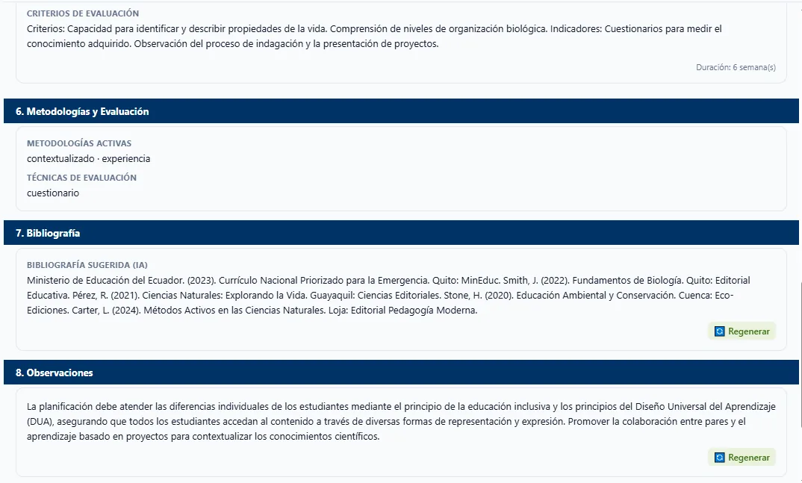

*Figura 62. Resultado del PCA (3 de 4).*

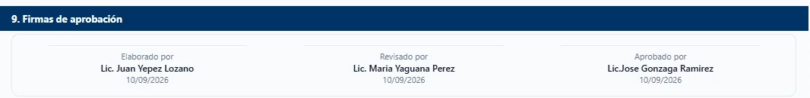

*Figura 63. Resultado del PCA (4 de 4).*

Al desbloquear el documento se habilitan **Regenerar** en cada sección y **Descargar PDF** o **Descargar** **Word**. El Word, en A4 horizontal, incluye la tabla de unidades con los íconos de competencias e inserciones curriculares junto a cada DCD, y las firmas del docente, vicerrector y director:

*Figura 64. Botones de descarga del PCA.*

## 5.4. PCT Trimestral

Ruta: **Crear › Plan de área › PCT Trimestral**. La Planificación Curricular Trimestral concreta un solo trimestre. Es una adaptación institucional del PCA: el MINEDUC no la define como anexo propio, pero los Lineamientos 2026-2027 organizan el año en tres periodos.

1. Complete los datos informativos y elija el **Trimestre** (obligatorio). En Educación Física puede indicar un **Deporte o disciplina (opcional)**.

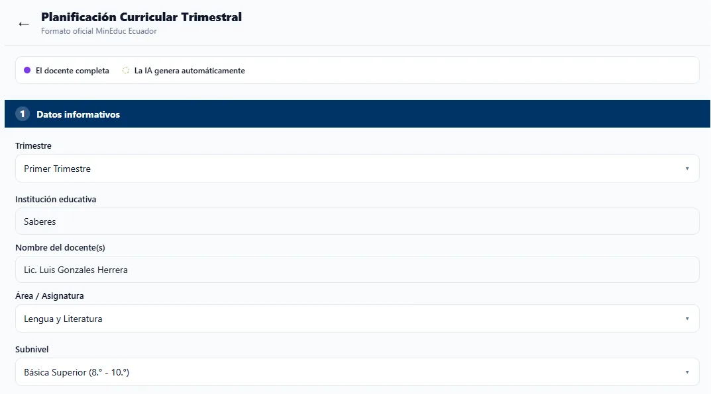

*Figura 65. Formulario del PCT.*

2. Revise la distribución del tiempo, que se calcula como en el PCA (13 semanas del trimestre y 2 de evaluación por defecto).

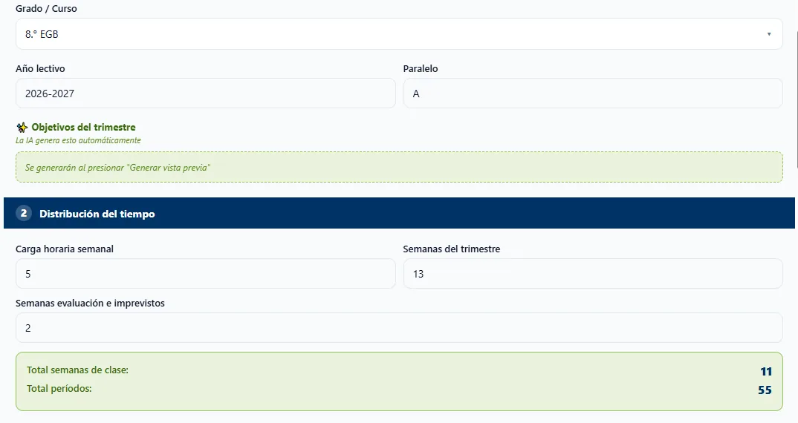

*Figura 66. Distribución del tiempo del PCT.*

3. En cada unidad seleccione las DCD. Para título y objetivos elija **Escribir yo** o **Generar con IA** y haga clic en **Generar título y objetivos**; los demás campos los genera la IA.

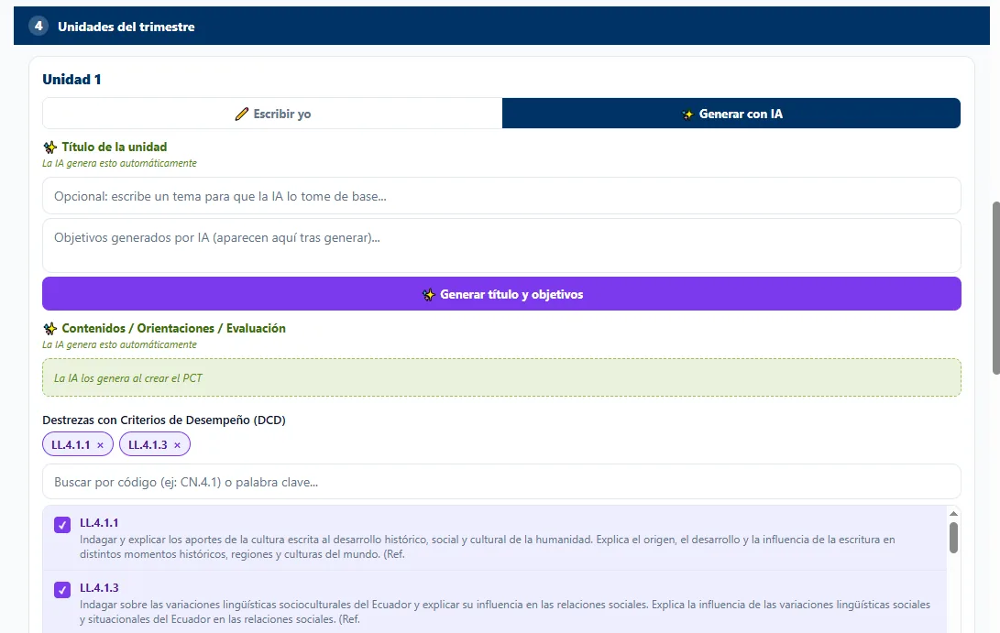

*Figura 67. Selección de destrezas con criterios de desempeño y campos con IA.*

> Si el tema propuesto no concuerda con las destrezas, el sistema muestra “Tema no compatible” y sugiere otro.

4. Elija el modelo pedagógico (**ERCA**: Experiencia, Reflexión, Conceptualización, Aplicación; o **ACC**: Anticipación, Construcción, Consolidación), las metodologías activas y las técnicas e instrumentos de evaluación.

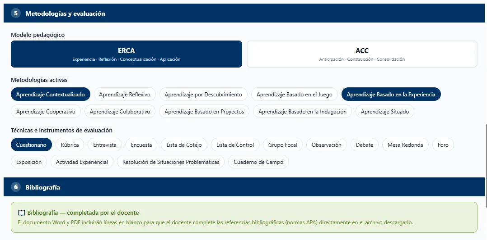

*Figura 68. Modelo pedagógico, metodologías activas y evaluación.*

5. Haga clic en **Generar vista previa de mi PCT**.

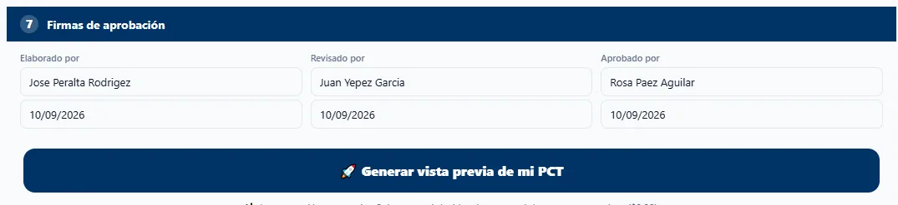

*Figura 69. Botón Generar vista previa de mi PCT.*

La IA redacta dos actividades por fase para cada DCD, graduadas según la taxonomía de Marzano, y de 3 a 5 indicadores por unidad. Tras desbloquear, puede descargar en PDF o Word; la bibliografía y las observaciones se completan en el archivo:

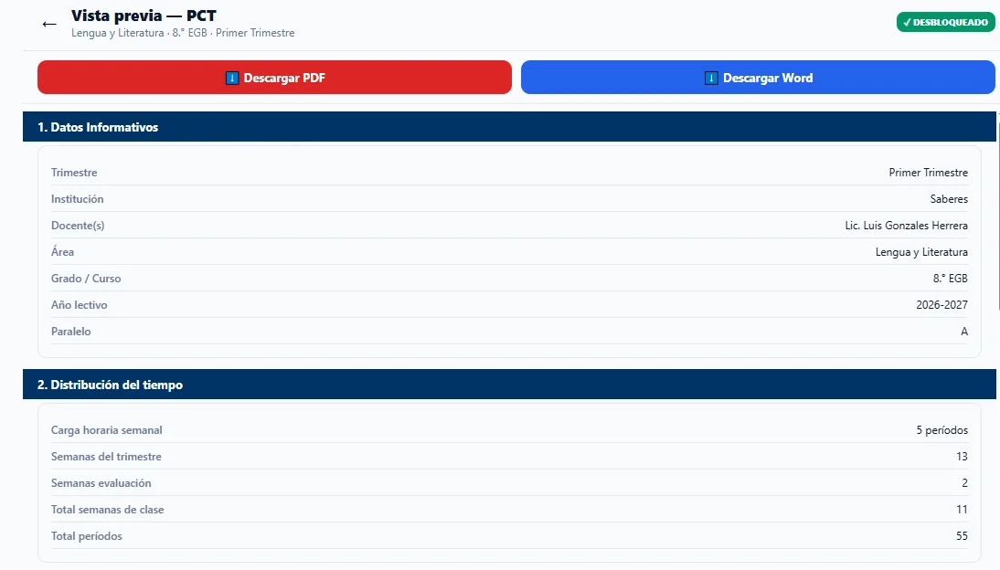

*Figura 70. Resultado del PCT (1 de 3).*

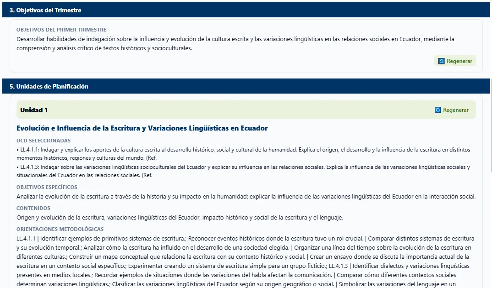

*Figura 71. Resultado del PCT (2 de 3).*

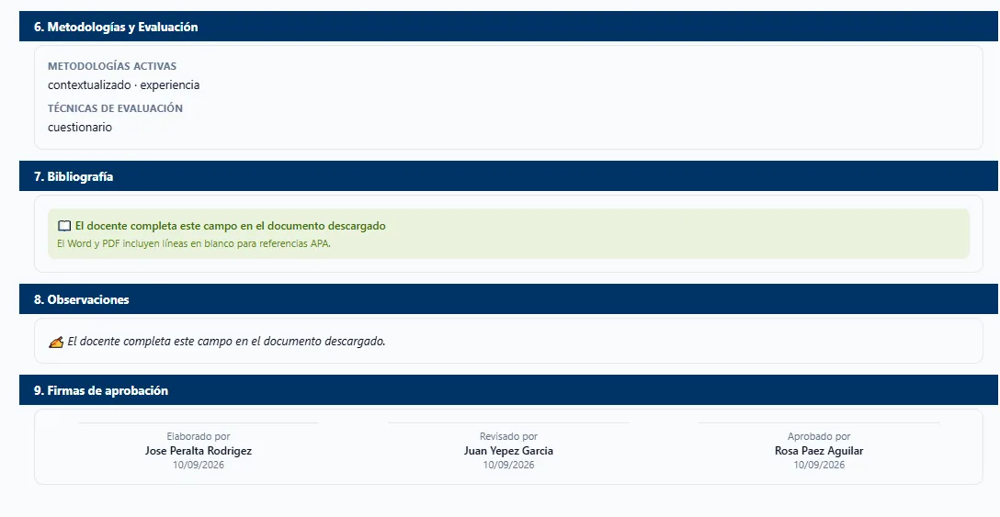

*Figura 72. Resultado del PCT (3 de 3).*

## 5.5. Conecta Nivela y Crea

Ruta: **Crear › Programaciones › Conecta Nivela y Crea**. Este módulo planifica el arranque del año escolar en tres fases: **Conecta** (semana 1: adaptación y diagnóstico), **Nivela** (semanas 2 y 3: nivelación) y **Crea** (semanas 4 y 5: proyecto interdisciplinario).

***Fundamento normativo***

Según los Lineamientos pedagógicos para el inicio del año lectivo 2026-2027 (Sierra-Amazonía), el inicio del año se centra en las asignaturas fundacionales, Lengua y Literatura y Matemática. En la semana 1 se realizan actividades de adaptación y una evaluación diagnóstica que incluye el estado socioemocional, con apoyo del DECE e instrumentos no tradicionales. En las semanas 2 y 3 se nivela a partir de esos resultados y se recomienda la co-nivelación: el estudiante con destrezas más consolidadas acompaña a un compañero, en un aprendizaje bidireccional.

***Modo Plan piloto (Conecta y nivela en 3 semanas)***

En el paso **Identificacion** se encuentra el interruptor **Plan piloto Currículo por Competencias (Sierra-** **Amazonía, Zona 6)**, apagado por defecto. Con el interruptor apagado, el módulo trabaja las cinco semanas descritas (Conecta, Nivela y Crea). Si su institución participa en el Programa Piloto del Currículo Nacional por Competencias, actívelo: el sistema aplica la estrategia “Conecta y nivela: 3 semanas para arrancar con éxito el año escolar” de los Lineamientos Sierra-Amazonía 2026-2027.

| **Aspecto** | **Modo general (interruptor apagado)** | **Modo Plan piloto (interruptor encendido)** |
| --- | --- | --- |
| Duración | 5 semanas: Conecta, Nivela y Crea. | 3 semanas: Conecta y nivela. |
| Semana 1 | Adaptación y diagnóstico académico y socioemocional. | Adaptación lúdica (integración, normas de convivencia, expectativas y bienvenida) y diagnóstico basado en el informe de resultados del año anterior y en las conclusiones de las Juntas de Curso, con instrumentos no tradicionales y preguntas de reflexión. |
| Semanas 2 y 3 | Nivelación de Lengua y Literatura y Matemática con co-nivelación. | Nivelación de las asignaturas fundacionales con co-nivelación, usando textos del año anterior, folletos u hojas de trabajo. |
| Semanas 4 y 5 | Proyecto interdisciplinario (o producto acreditable en BT). | No se planifican: el paso **Semanas 4-5** se omite. |
| Cierre | Rúbrica del proyecto como evaluación formativa. | Fila de **Abordaje curricular**: desde la semana 4 inicia el abordaje del currículo por competencias según los resultados del diagnóstico. |
| Documento | Conecta, Nivela y Crea. | Conecta y nivela — Programa Piloto Currículo Nacional por Competencias (Zona 6). |

> Con el modo piloto activo, el subtítulo de la pantalla cambia a “Programa piloto — 3 semanas (Conecta y nivela)”, el botón de generación se muestra al final del paso Semanas 2-3 con el nombre Generar Plan Conecta y Nivela, y en Mis planes el plan se identifica como “Plan piloto (3 semanas)”.

El asistente tiene seis pasos: **Identificacion**, **Semana 1**, **Semanas 2-3**, **Semanas 4-5**, **Diagnóstico** y **Resultado**. Para avanzar, el sistema exige un grado (y, en Bachillerato Técnico, figura profesional y módulo), al menos una destreza en el diagnóstico académico y al menos una destreza de nivelación.

1. Complete los datos informativos y haga clic en **Siguiente →**.

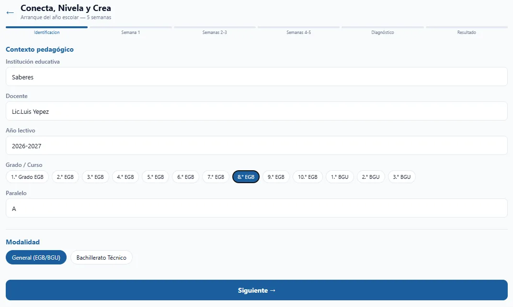

*Figura 73. Paso Identificacion: contexto pedagógico y modalidad.*

| **Campo** | **Descripción** | **Ejemplo u observación** |
| --- | --- | --- |
| **Institución educativa** y **Docente** | Datos que se imprimen en el documento. | Unidad Educativa Saberes |
| **Año lectivo** | Viene precargado y puede editarse. | 2026-2027 |
| **Grado / Curso** | Obligatorio. Determina las destrezas prerrequisito que se sugieren. | 8.° EGB; en BT: 1.° BT a 3.° BT |
| **Modalidad** | **General (EGB/BGU)** o **Bachillerato Técnico**. Al cambiarla se borra el grado. | BT habilita **Figura Profesional** y **Módulo** |
| **Plan piloto Currículo por** **Competencias** | Interruptor que aplica “Conecta y nivela” en 3 semanas según los lineamientos del Programa Piloto Zona 6. | Apagado por defecto (5 semanas) |

Si elige **Bachillerato Técnico**, seleccione la **Figura Profesional** y el **Módulo**; los resultados de aprendizaje del módulo se usarán en el diagnóstico y la nivelación técnica. Si el módulo no tiene catálogo técnico, el sistema lo advierte y la IA no inventará criterios.

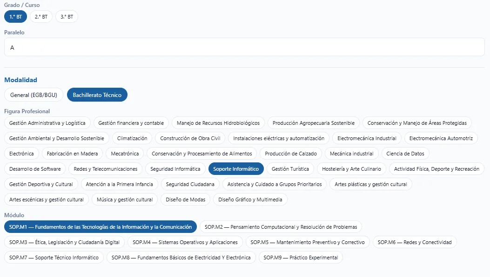

*Figura 74. Selección de Bachillerato Técnico, figura profesional y módulo.*

***Semana 1***

1. Complete **Metodología declarada**, **Actividades de adaptación** y **Técnica + instrumento** (uno por línea).
2. En **Diagnóstico académico**, abra **Agregar destreza de Lengua y Literatura**, seleccione las destrezas y haga clic en **Listo**.
3. Repita con **Agregar destreza de Matemática**.
4. En **Diagnóstico socioemocional**, marque las habilidades a observar y haga clic en **Sugerir con IA** **(técnicas + nota DECE)**; la nota DECE y las preguntas de reflexión propuestas son editables.

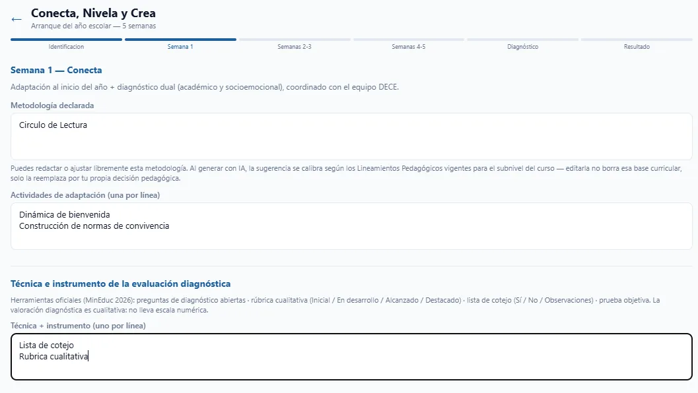

*Figura 75. Semana 1: metodología, actividades de adaptación y técnica e instrumento de diagnóstico.*

La pantalla recuerda las herramientas oficiales de diagnóstico: preguntas abiertas, rúbrica cualitativa, lista de cotejo y prueba objetiva; la valoración diagnóstica es cualitativa. Si deja vacías la metodología, las actividades o la técnica, la IA las propone al generar el plan. El buscador muestra primero las destrezas del **nivel prerrequisito**, lo que el estudiante debería traer del subnivel anterior; escriba tres caracteres o más para buscar otras.

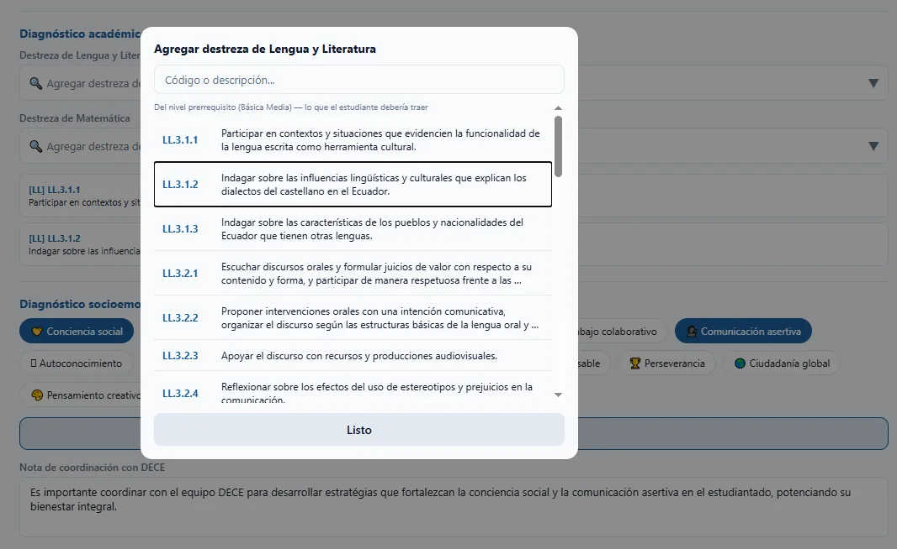

*Figura 76. Selección de destrezas de Lengua y Literatura del nivel prerrequisito.*

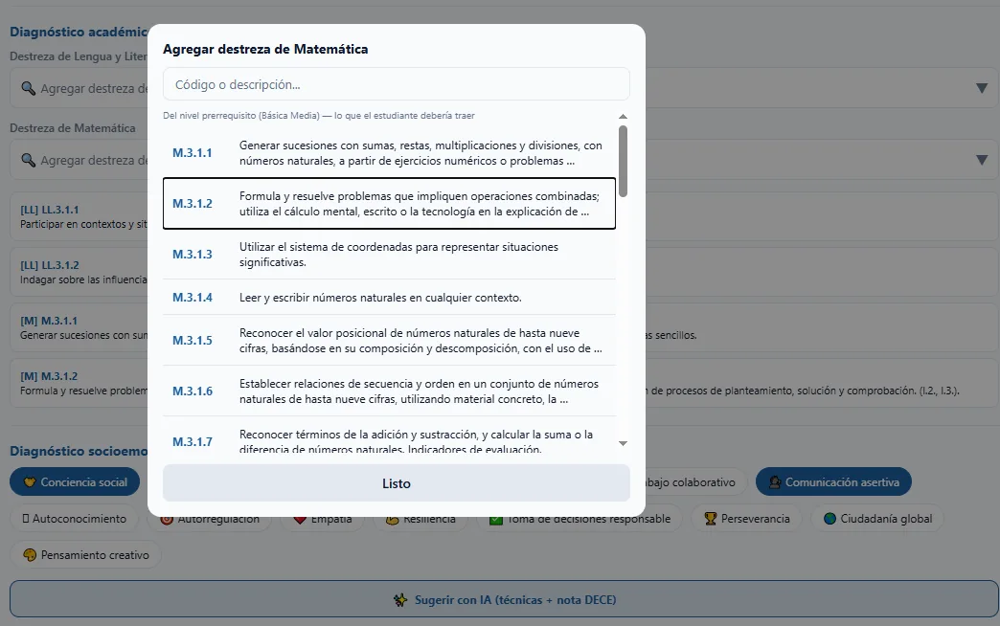

*Figura 77. Selección de destrezas de Matemática del nivel prerrequisito.*

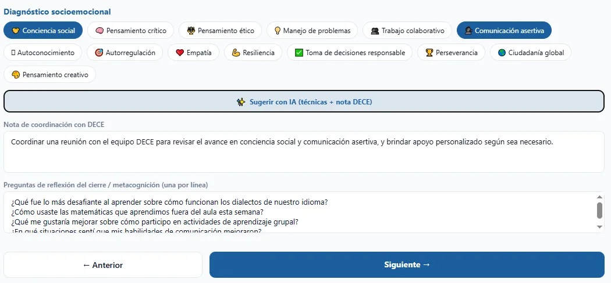

*Figura 78. Diagnóstico socioemocional, nota DECE y preguntas de reflexión.*

> Sugerir con IA (técnicas + nota DECE) reemplaza lo que haya escrito en Nota de coordinación con DECE y en Preguntas de reflexión del cierre.

***Semanas 2 y 3***

1. Elija **Semana 2 — base** o **Semana 3 — consolidación** y seleccione las destrezas de Lengua y Literatura y de Matemática para cada semana. Puede quitar una destreza con la ✕.

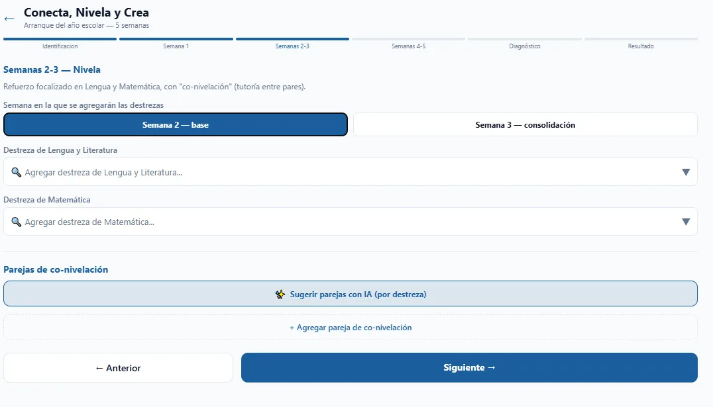

*Figura 79. Paso Semanas 2-3: selección de la semana y buscadores de destrezas.*

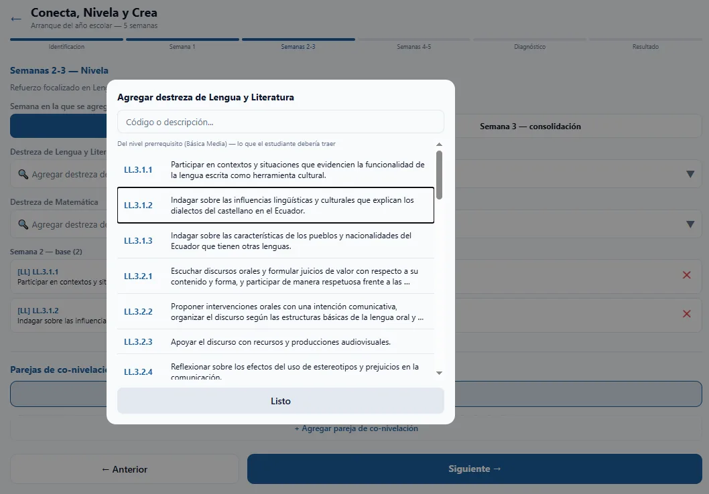

*Figura 80. Destrezas de Lengua y Literatura para la nivelación.*

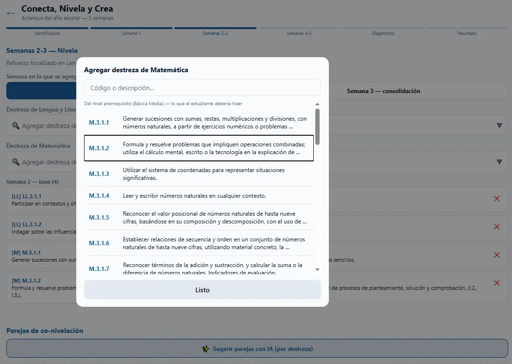

*Figura 81. Destrezas de Matemática para la nivelación.*

Priorice las destrezas con mayores dificultades en el diagnóstico. Si una semana queda vacía, la IA la completa al generar el plan.

En Bachillerato Técnico se trabajan, además, los aspectos técnicos: en la semana 1, **Reconocimiento** **de espacios técnicos** (talleres, laboratorios, granjas) y los **Criterios técnicos del módulo**, que se agregan al diagnóstico con un toque; en las semanas 2 y 3, la sección **Nivelación técnica**.

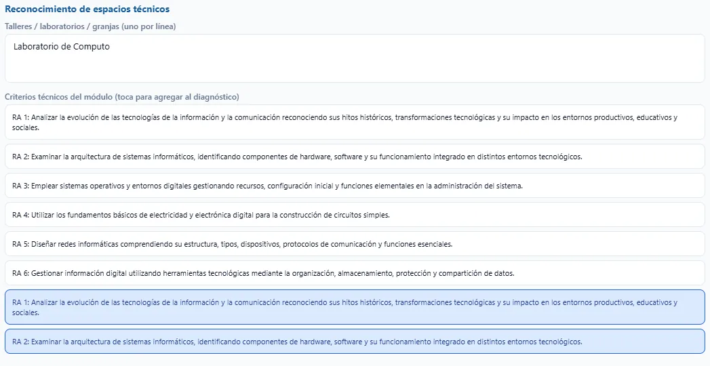

*Figura 82. Reconocimiento de espacios técnicos y criterios del módulo en Bachillerato Técnico.*

1. Haga clic en **Sugerir parejas con IA (por destreza)** y registre, en cada tarjeta, el **Estudiante que** **apoya** y el **Estudiante apoyado**. Use **+ Agregar pareja de co-nivelación** para parejas adicionales.

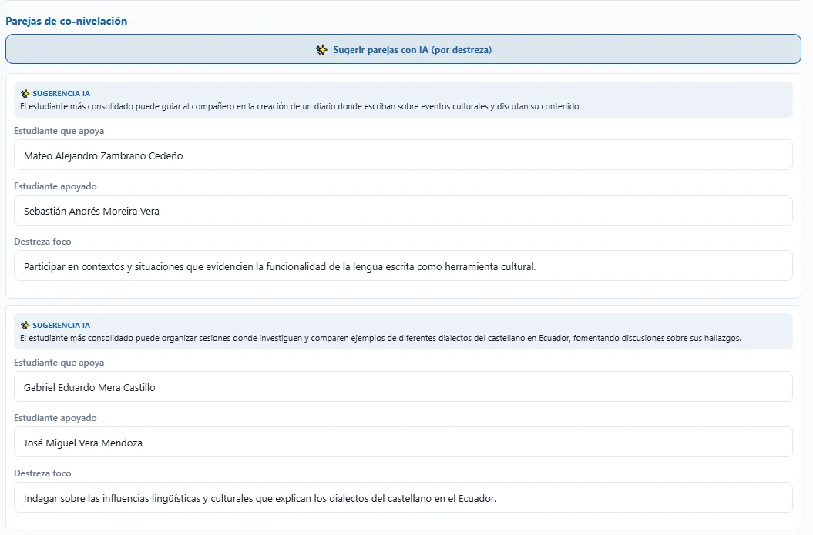

*Figura 83. Sugerencias de la IA para las parejas de co-nivelación.*

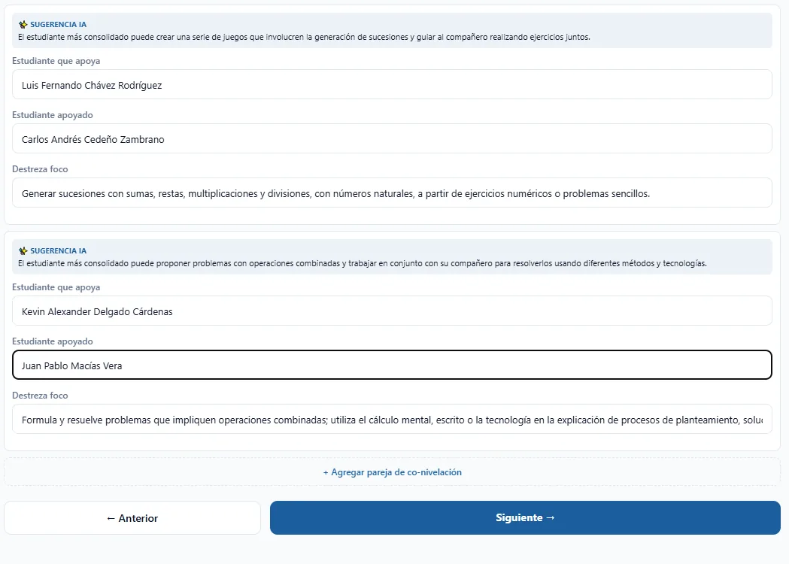

*Figura 84. Registro de los estudiantes emparejados por destreza.*

> La IA propone una pareja por destreza con el enfoque de la tutoría, pero no inventa nombres. Forme las parejas según el diagnóstico.

***Semanas 4 y 5: proyecto***

La pantalla advierte que el proyecto “constituye formalmente una evaluación cualitativa y formativa oficial”. La semana 4 se dedica a planificar y elaborar un producto intermedio, y la semana 5 a socializar el producto final y reflexionar.

1. Complete el proyecto según el cronograma de su régimen y zona. Puede redactarlo o usar **Sugerir proyecto con IA**, que solo rellena los campos vacíos.
2. En **Destrezas a reforzar**, marque las destrezas del diagnóstico de la semana 1 que trabajará el proyecto.

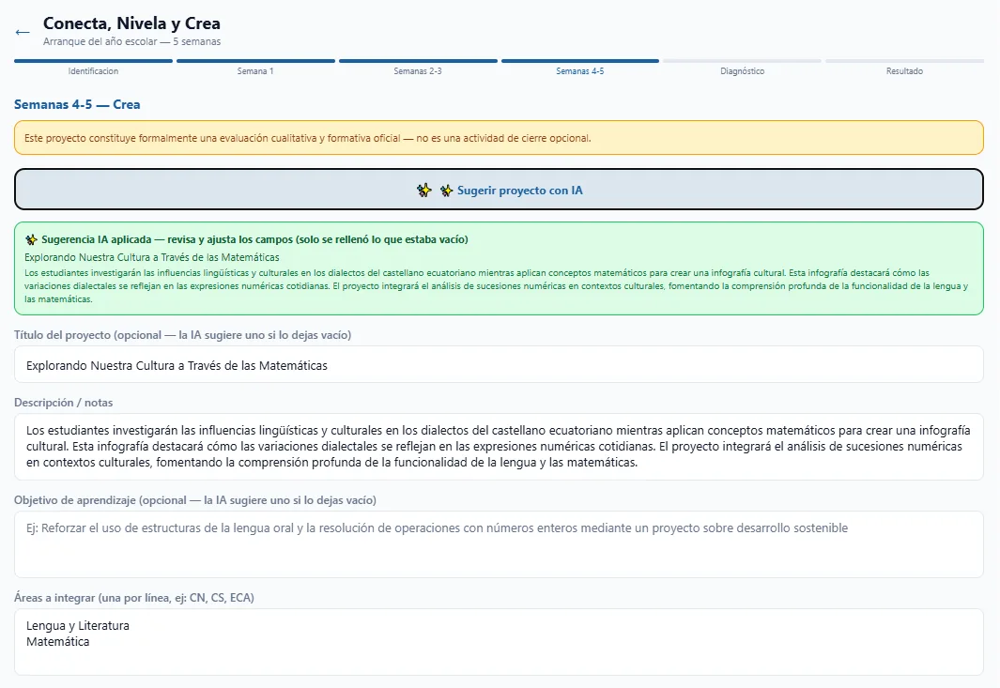

*Figura 85. Semanas 4-5: sugerencia de la IA, título, descripción y áreas a integrar.*

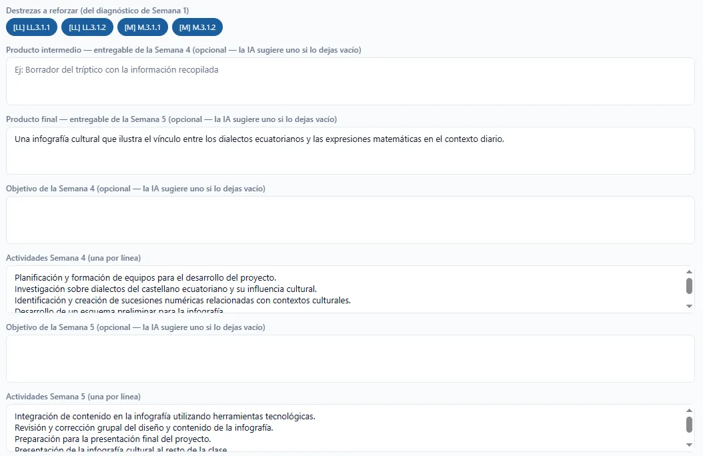

*Figura 86. Destrezas a reforzar, productos, objetivos y actividades de las semanas 4 y 5.*

| **Campo** | **Descripción** |
| --- | --- |
| **Título**, **Descripción / notas** y **Objetivo de** **aprendizaje** | Identidad y propósito del proyecto. Si quedan vacíos, la IA los sugiere. |
| **Áreas a integrar** | Una por línea, por ejemplo: CN, CS, ECA. |
| **Producto intermedio** y **Producto final** | Entregables de las semanas 4 y 5. |
| **Objetivo** y **Actividades** de cada semana | Metas y actividades, una por línea. |
| **Compromisos** y **Preguntas de** **autoevaluación** | Cierre reflexivo y metacognición. |

La **Rúbrica del proyecto (vista previa)** se deriva de las destrezas a reforzar, con sus indicadores reales del catálogo, y usa la escala Avanzado (10-9), Intermedio (8-7), Básico (6-5) y En Desarrollo (4-1) al calificar.

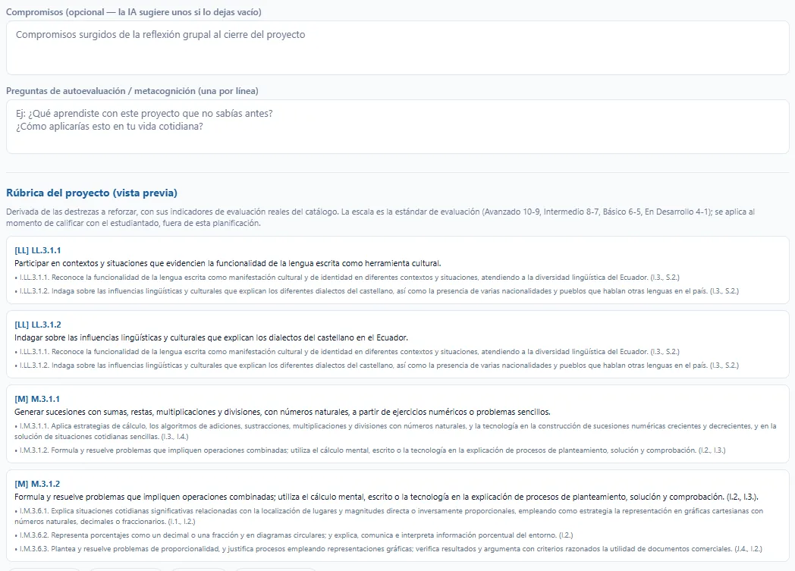

*Figura 87. Compromisos, autoevaluación y rúbrica del proyecto derivada de las destrezas.*

En Bachillerato Técnico, el proyecto se sustituye por un **producto acreditable**: elija su tipo (por ejemplo, maqueta, software básico o plan de negocio) y describa sus actividades. En la nivelación técnica, para cada resultado de aprendizaje indique la semana, la actividad y la **Articulación con** **Matemática**.

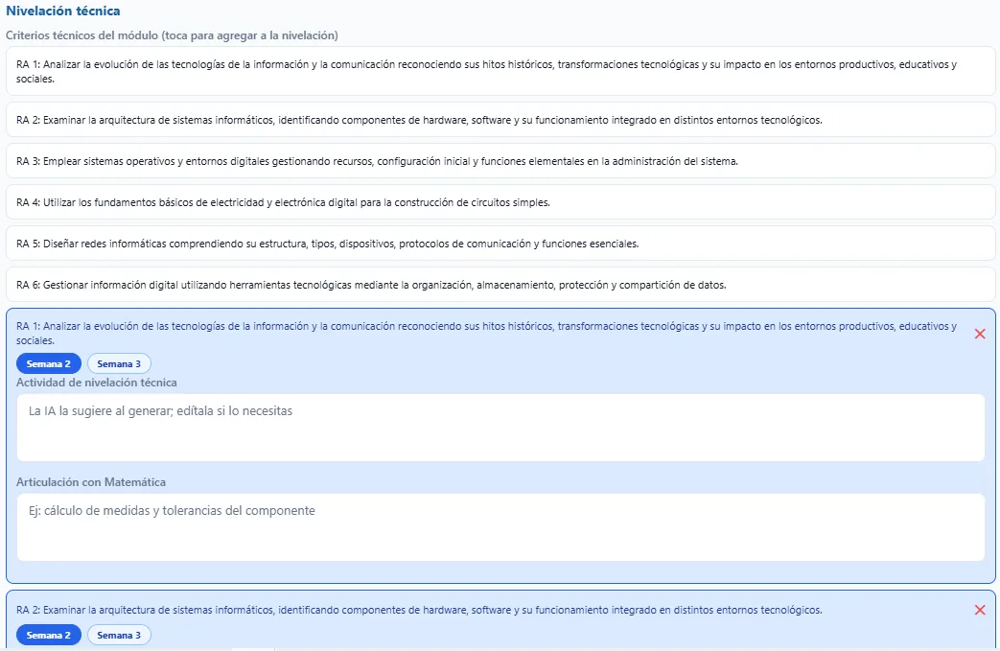

*Figura 88. Nivelación técnica por resultados de aprendizaje del módulo en Bachillerato Técnico.*

1. Haga clic en **Generar Plan Conecta, Nivela y Crea**. El plan se guarda y el asistente pasa al paso **Diagnóstico**.

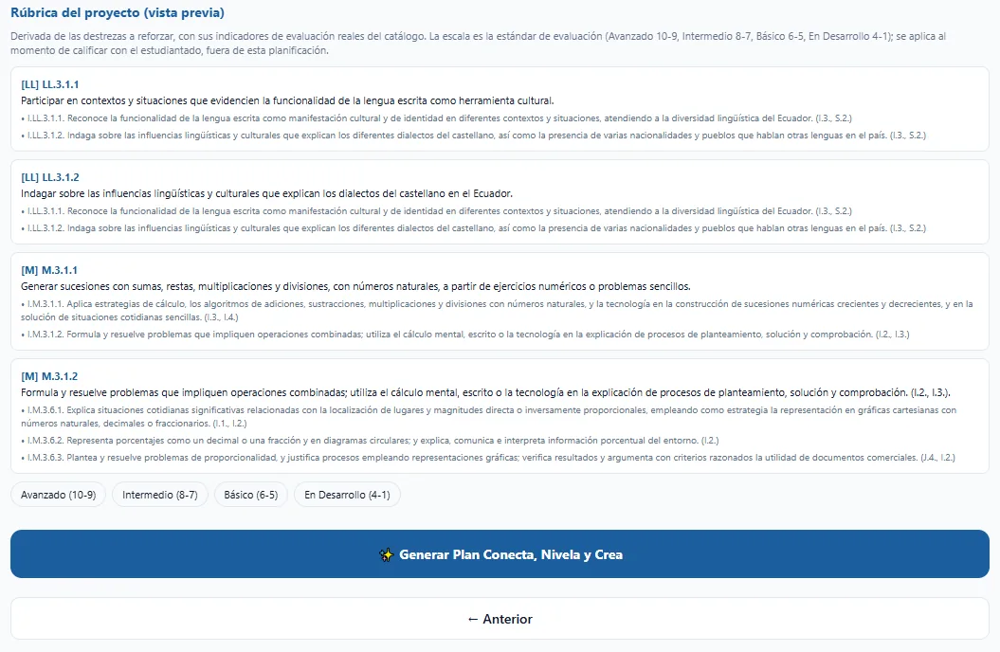

*Figura 89. Vista previa de la rúbrica y botón Generar Plan Conecta, Nivela y Crea.*

La IA elabora el cronograma y completa solo los campos vacíos, incluidos los indicadores DUA de las actividades de la semana 1; nunca sobrescribe lo que usted escribió. En **Diagnóstico** puede crear una evaluación o vincular una ya aplicada con **Vincular a Semana 1**. Al finalizar se muestra el resumen, desde el cual puede descargar la planificación en **Word** o **PDF**, abrir **Ver plan guardado** e imprimir la prueba diagnóstica:

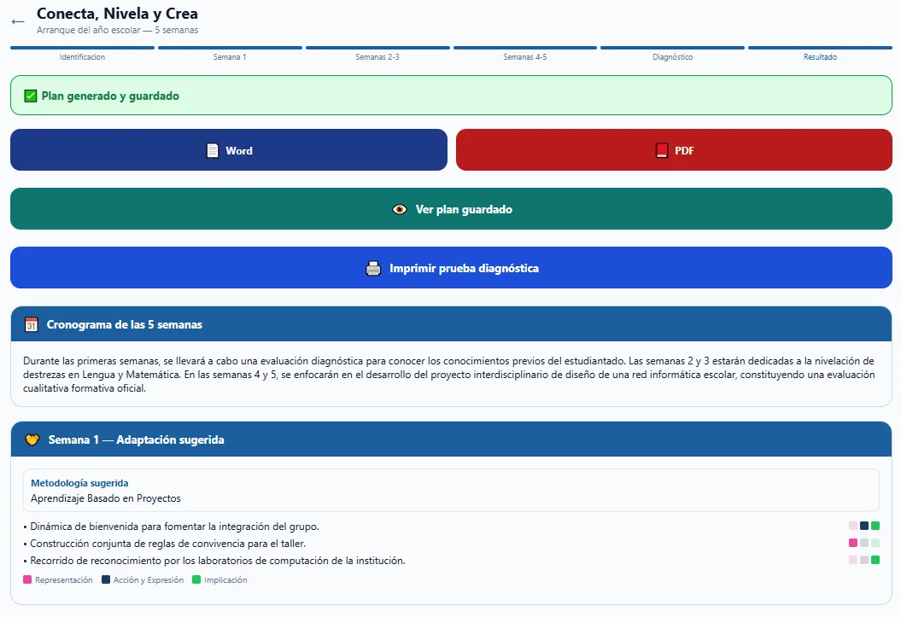

*Figura 90. Resultado: exportación, plan guardado, cronograma y adaptación sugerida.*

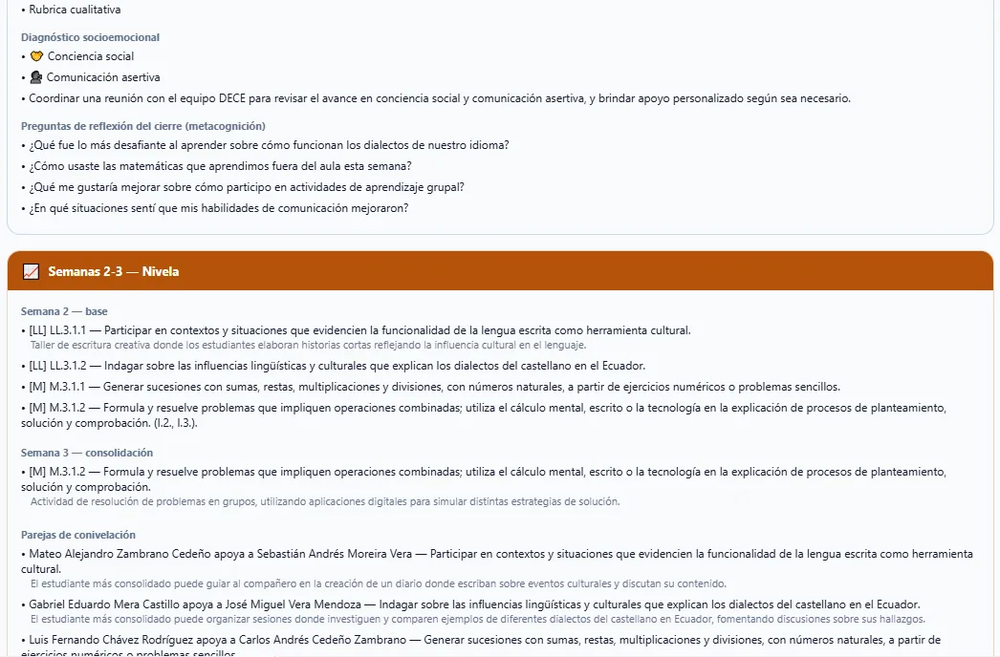

*Figura 91. Resumen del plan: diagnóstico socioemocional, reflexión y fase Nivela.*

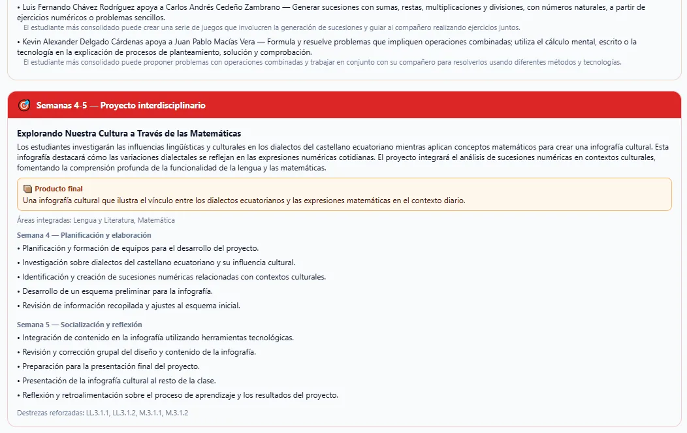

*Figura 92. Resumen del plan: parejas de co-nivelación y proyecto interdisciplinario.*

## 5.6. Evaluación diagnóstica

La evaluación diagnóstica permite conocer el punto de partida del estudiantado. El documento Herramientas sugeridas para la evaluación diagnóstica (MINEDUC, 2026) la define como una valoración cualitativa previa al abordaje curricular, que sirve para detectar a tiempo necesidades de refuerzo pedagógico, y recomienda evitar los ítems de simple memorización. Puede crearse de dos maneras:

- Desde **Conecta Nivela y Crea**, con los datos y destrezas precargados y el área limitada a Lengua y Literatura o Matemática (se recomienda una prueba por área).
- De forma independiente, desde **Crear › Contextuales › Evaluación diagnóstica**, completando el año lectivo, el grado y el paralelo.

En el paso **Contexto** complete el nombre de la evaluación (puede usar **Generar nombre con IA**), el área, la fecha, la duración, las instrucciones y el puntaje total, además de los umbrales **Dominado ≥** **(%)** (por defecto, 70) y **Refuerzo < (%)** (por defecto, 40). Luego haga clic en **Continuar ›**.

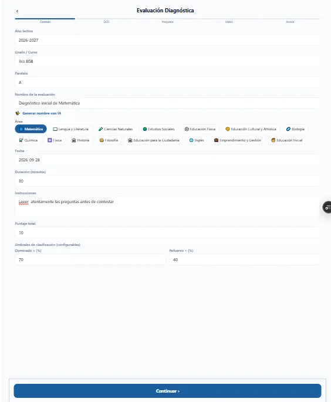

*Figura 93. Paso Contexto de la Evaluación diagnóstica iniciada desde Crear.*

| **Nivel de logro** | **Regla de cálculo** | **Valores por defecto** |
| --- | --- | --- |
| Dominado | Logro mayor o igual que **Dominado ≥ (%)** | 70 % o más |
| En proceso | Logro entre ambos umbrales | De 40 % a menos de 70 % |
| Requiere refuerzo | Logro menor que **Refuerzo < (%)** | Menos de 40 % |

El logro se calcula por estudiante y destreza como el porcentaje de preguntas acertadas; las no respondidas cuentan como incorrectas. En el curso, cada destreza toma el nivel de la mayoría de los estudiantes.

El proceso consta de cinco pasos: **Contexto**, **DCD**, **Preguntas**, **Matriz** y **Revisar**.

1. En el paso **Diagnóstico** de Conecta Nivela y Crea, haga clic en **Crear evaluación diagnóstica**.

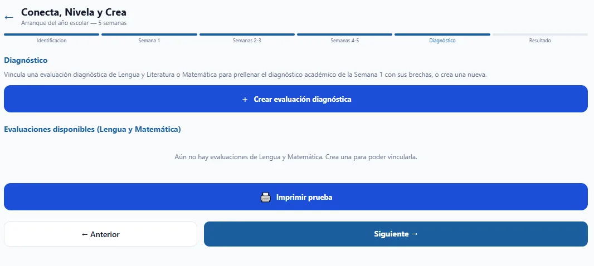

*Figura 94. Botón Crear evaluación diagnóstica en el paso Diagnóstico.*

2. Elija la asignatura y defina los parámetros de la prueba: duración e instrucciones para los estudiantes. Haga clic en **Continuar ›**.

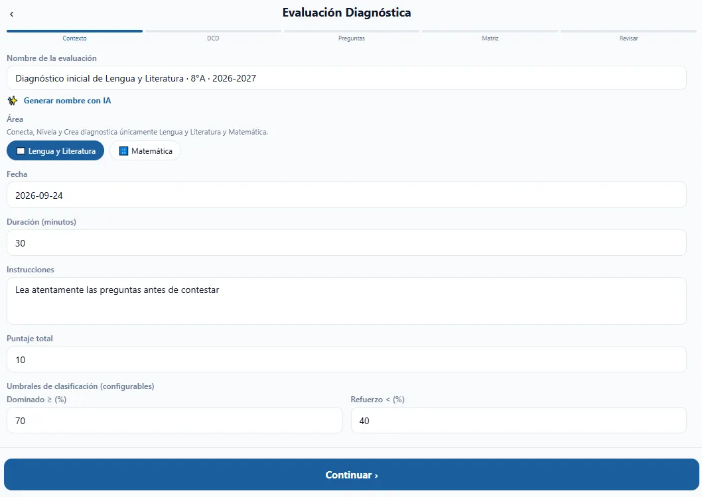

*Figura 95. Paso Contexto con el área limitada a Lengua y Literatura y Matemática.*

3. Revise las destrezas preseleccionadas desde el plan. Si necesita más, agréguelas y haga clic en **Continuar ›**.

Por defecto se ofrece el nivel **Prerrequisito (arrastre)**, y puede añadir el **Nivel actual del curso**.

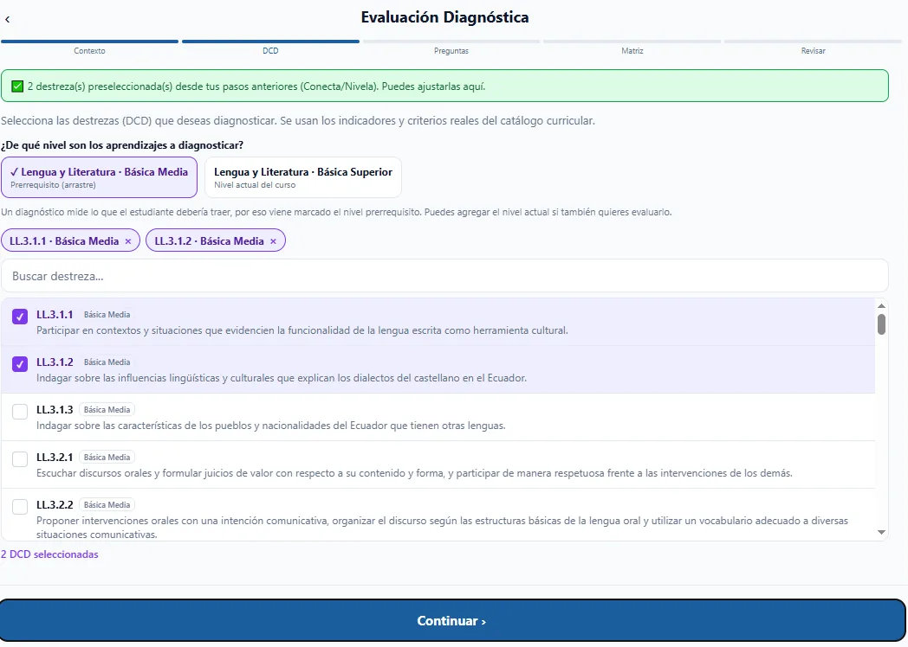

*Figura 96. Selección de las destrezas (DCD) a diagnosticar.*

1. Haga clic en **Sugerir preguntas con IA** o en **+ Crear pregunta manualmente**.

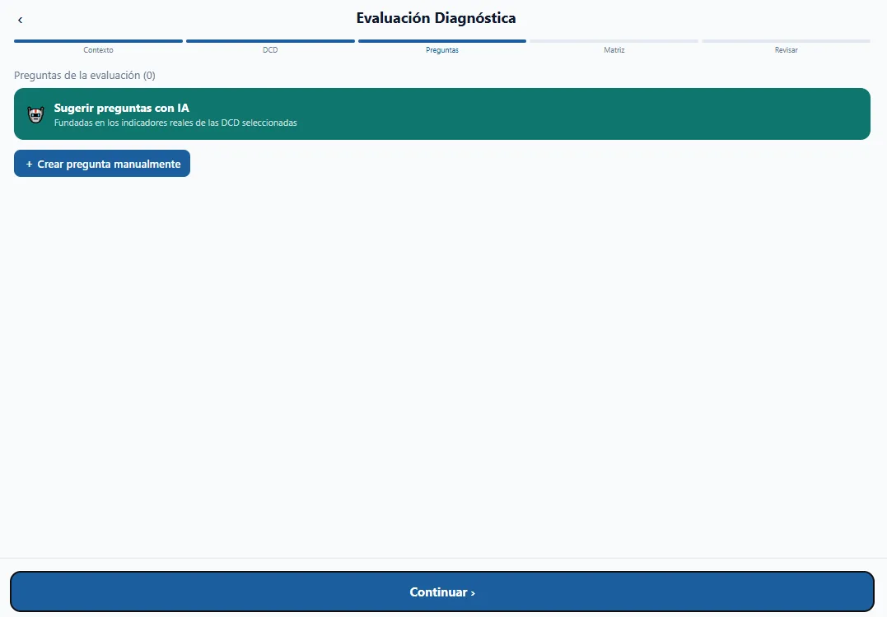

*Figura 97. Paso Preguntas con las opciones de IA y de creación manual.*

La IA propone dos preguntas por destreza, basadas en sus indicadores: una objetiva (selección múltiple o verdadero/falso) y otra abierta, calibrada con la taxonomía de Marzano, cada una con retroalimentación. Algunas opciones pueden ser visuales. Las preguntas manuales requieren enunciado y destreza asociada, y se guardan en su banco de preguntas.

1. Marque las preguntas que desea usar y haga clic en **Incorporar seleccionadas**.

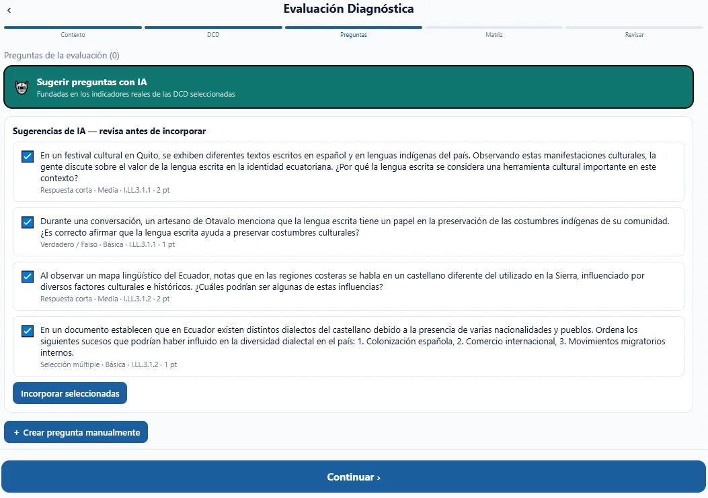

*Figura 98. Sugerencias de la IA marcadas para incorporar.*

2. Revise la distribución de preguntas por destreza. Puede moverlas entre destrezas y ajustar los puntajes.

La matriz compara la suma de puntajes con el puntaje total, en verde si coinciden y en rojo si no.

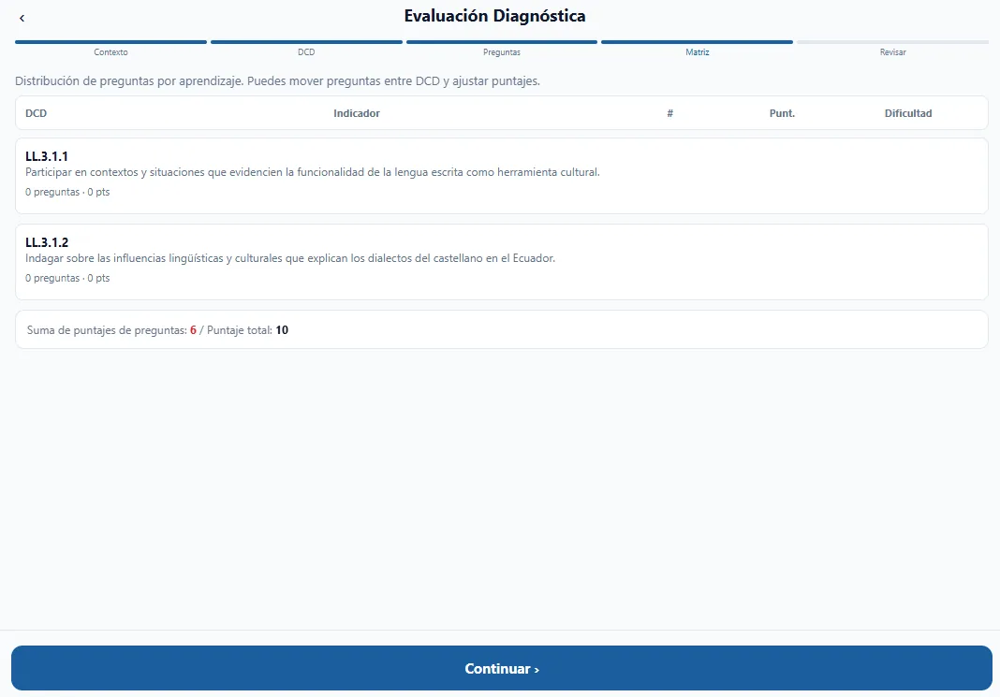

*Figura 99. Matriz de distribución de preguntas y puntajes por destreza.*

1. Revise el resumen y haga clic en **Guardar**.

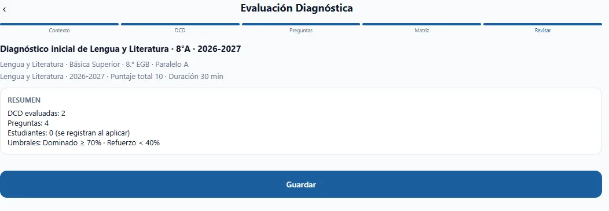

*Figura 100. Resumen de la evaluación diagnóstica antes de guardar.*

> Desde Crear, el paso final ofrece Guardar borrador y Publicar evaluación; para publicar, la suma de puntajes debe coincidir con el puntaje total.

Las pruebas guardadas se visualizan en la siguiente pantalla; mientras no estén aplicadas muestran “Debe ser aplicada primero para vincular sus resultados”:

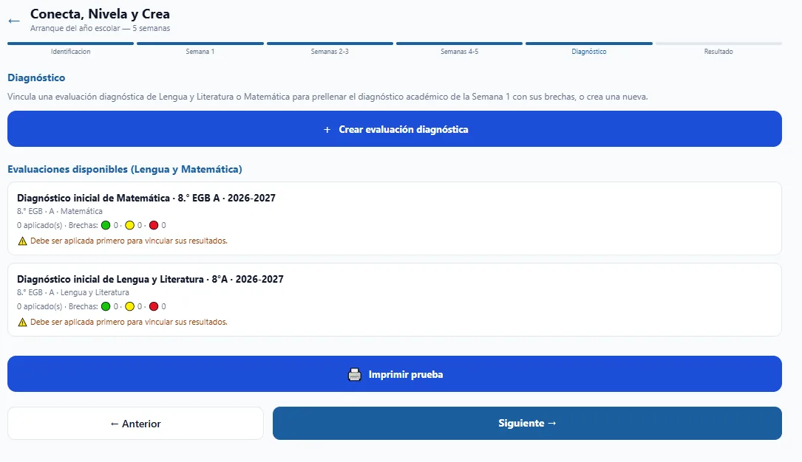

*Figura 101. Pruebas diagnósticas guardadas en el paso Diagnóstico.*

Al hacer clic en **Imprimir prueba** se despliega el listado de pruebas para visualizarlas (**Ver**) o imprimirlas con el icono de impresora; active **Clave de respuestas** si desea la versión con las respuestas correctas. Desde el detalle de la evaluación puede exportarla en **Word**, que incluye las preguntas con sus opciones visuales, registrar las respuestas de los estudiantes, ver las recomendaciones y enviar el diagnóstico a un plan con **→ CNC**.

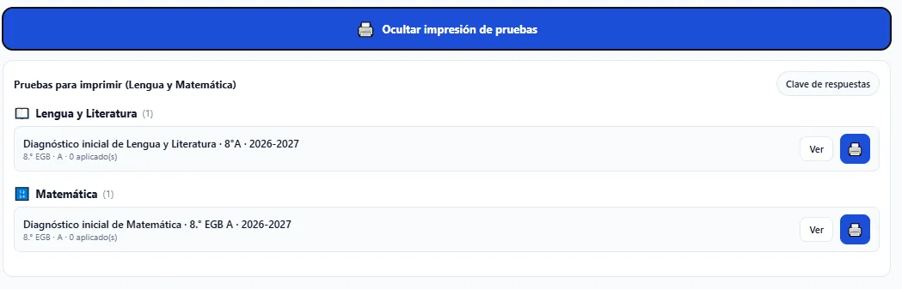

*Figura 102. Listado de pruebas para visualizar o imprimir.*

## 5.7. Proyecto Interdisciplinar

Ruta: **Crear › Programaciones › Proyecto Interdisciplinar**.

El módulo Proyecto Interdisciplinar permite planificar un proyecto que integra dos o más áreas o asignaturas alrededor de un producto final común. En lugar de planificar cada asignatura por separado, el docente (o el equipo de docentes) elige los elementos curriculares de cada área que el proyecto va a movilizar, y la aplicación organiza las actividades del proyecto en tres fases: **Planificación**, **Gestión** y **Evaluación**.

### 5.7.1. Fundamento normativo

Según los Lineamientos pedagógicos de inicio de año lectivo Sierra-Amazonía 2026-2027, en el Bachillerato en Ciencias la integración de los aprendizajes se logra articulando las áreas del conocimiento mediante proyectos interdisciplinarios que permiten comprender y resolver situaciones complejas; el mismo documento señala que la Guía Docente del Programa Piloto incluye orientaciones sobre proyectos interdisciplinarios. Las Generalidades del Currículo Nacional por Competencias (EGB y BG) destacan, además, el aprendizaje interdisciplinar y las conexiones interdisciplinarias como un rasgo del nuevo currículo, y la presentación oficial sobre el currículo por competencias incluye los proyectos interdisciplinarios entre sus recursos educativos, junto a metodologías activas como el aprendizaje basado en proyectos.

La aplicación ofrece dos bases curriculares, que se eligen al crear el proyecto y no pueden mezclarse dentro del mismo proyecto:

| **Base curricular** | **Cuándo usarla** | **Observación** |
| --- | --- | --- |
| Destrezas con criterios de desempeño | Instituciones que trabajan con el currículo de destrezas (Currículo Priorizado vigente). | La aplicación indica que sigue el instructivo oficial de Proyecto Interdisciplinar (EGB Superior/BGU). |
| Competencias específicas (CNC) | Instituciones del Programa Piloto del Currículo Nacional por Competencias (Zona 6). | La propia aplicación advierte que aún no hay un formato oficial publicado de Proyecto Interdisciplinar para este currículo. |

### 5.7.2. Pantalla de proyectos

Al ingresar al módulo se muestra el listado de sus proyectos interdisciplinarios. Cada tarjeta presenta el título, la base curricular (**Destrezas** o **Competencias (CNC)**), la institución y el estado (**Borrador** o **Generado**). Desde cada tarjeta puede usar **Abrir**, **Duplicar** o **Eliminar**. El cuadro de búsqueda permite filtrar por título, área o código curricular.

1. Haga clic en **Nuevo Proyecto Interdisciplinar**.

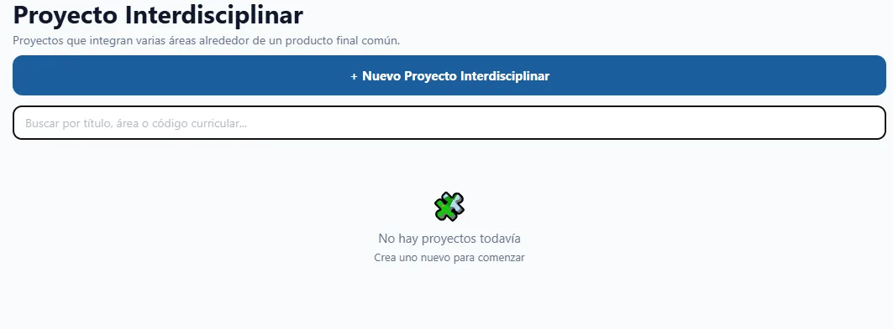

*Figura 103. Botón Nuevo Proyecto Interdisciplinar.*

2. En la pantalla **Nuevo Proyecto Interdisciplinar**, elija la base curricular del proyecto: **Destrezas** **con criterios de desempeño** o **Competencias específicas (CNC)**.

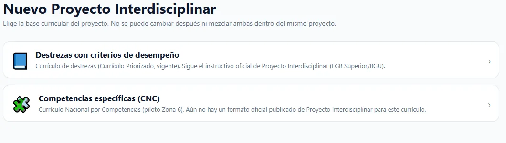

*Figura 104. Selección de la base curricular del proyecto interdisciplinario.*

> La base curricular no se puede cambiar después de creado el proyecto, ni se pueden combinar destrezas y competencias específicas en un mismo proyecto. Si se equivocó de base, cree un proyecto nuevo.

### 5.7.3. Proyecto por destrezas con criterios de desempeño

El formulario se organiza en secciones: **Contexto curricular**, **Proyecto**, **Información institucional** y **Competencias de varias asignaturas**. Solo unos pocos campos son obligatorios; los demás son opcionales porque la IA los completa si se dejan vacíos.

1. En **Contexto curricular**, elija el **Subnivel** (Básica Elemental, Básica Media, Básica Superior o Bachillerato) y el **Grado**.
2. En la sección **Proyecto**, complete los datos del proyecto según la tabla siguiente.

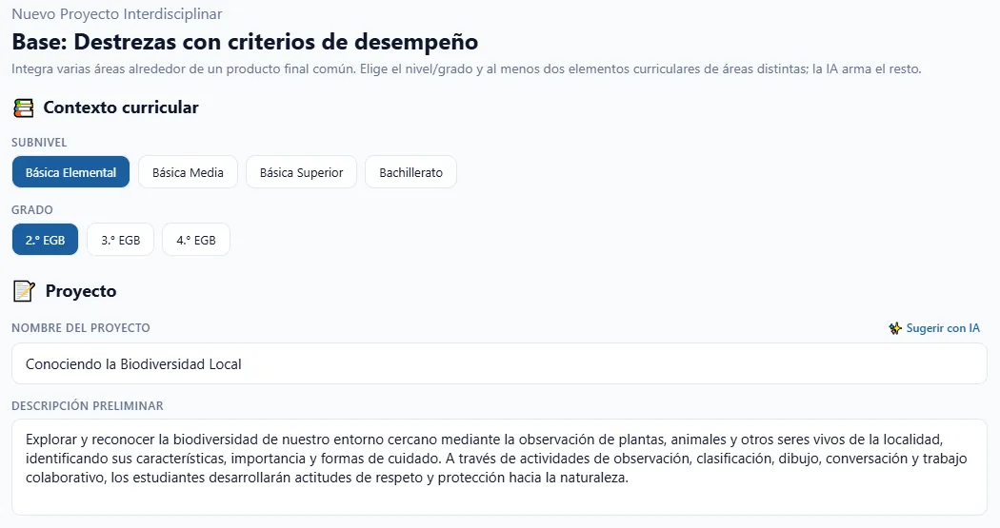

*Figura 105. Datos del proyecto por destrezas (1 de 2).*

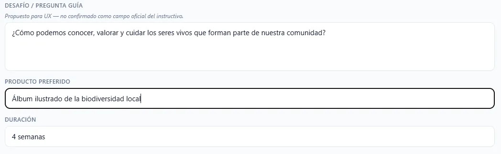

*Figura 106. Datos del proyecto por destrezas (2 de 2).*

***Descripción de los campos del proyecto***

| **Campo** | **Descripción** | **Ejemplo u observación** |
| --- | --- | --- |
| Subnivel / Grado | Contexto curricular del proyecto. Determina qué destrezas aparecen en el catálogo. | Básica Superior, 9.º. Si lo cambia después de elegir destrezas, se quitan las que no pertenecen al nuevo grado. |
| Nombre del proyecto | Título del proyecto. Incluye el botón **Sugerir con IA**. | “Guardianes del patrimonio natural y cultural”. |
| Descripción preliminar | Descripción breve de la situación o contexto del proyecto. | Opcional; si la deja vacía, la IA la redacta. |
| Desafío / pregunta guía | Pregunta abierta que orienta la indagación de los estudiantes. | Opcional. La aplicación aclara que es un campo propuesto para facilitar el trabajo, no confirmado como campo oficial del instructivo. |
| Producto preferido | Producto final tangible y evaluable en el que confluyen las áreas. | Opcional. Ej.: stand, dossier, podcast. |
| Duración | Tiempo previsto para el proyecto. | Obligatorio para generar. Ej.: 4 semanas, 1 trimestre. |

1. En **Información institucional**, escriba el nombre de la **Institución** (obligatorio) y los **Docentes** **participantes**, un nombre por línea.

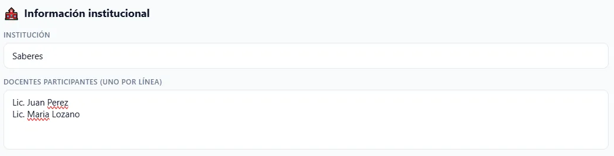

*Figura 107. Información institucional del proyecto.*

2. En **Competencias de varias asignaturas**, busque las destrezas por código, área o texto en el cuadro de búsqueda y marque la casilla de cada una que desee incluir. Las destrezas seleccionadas aparecen como etiquetas en la parte superior; para quitar una, haga clic en la **×** de su etiqueta.
3. Verifique el contador bajo el título de la sección, que indica cuántos elementos y cuántas áreas distintas ha seleccionado.
4. Haga clic en **Generar planificación**.

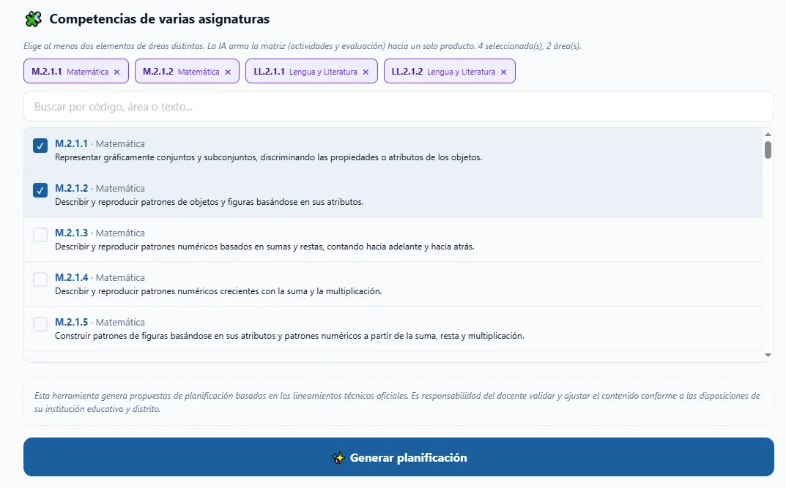

*Figura 108. Selección de destrezas de varias asignaturas.*

***Validaciones del sistema***

- Debe elegir al menos dos elementos curriculares de al menos dos áreas distintas; de lo contrario aparece el aviso “Faltan competencias”.
- La **Duración** y la **Institución** son obligatorias; si faltan, aparece el aviso “Faltan datos”.
- Si cambia el subnivel o el grado después de elegir destrezas, el sistema quita las que no correspondan y muestra el aviso “Elementos quitados”.
- Puede usar **Guardar borrador** (barra inferior) en cualquier momento para guardar lo avanzado sin generar.

Durante la generación el botón muestra “Generando…”. La IA respeta los campos que usted ya escribió (título, descripción, pregunta guía y producto) y completa los que dejó vacíos; no modifica ni inventa códigos curriculares, solo usa las destrezas que usted seleccionó. Al terminar aparece el mensaje “Proyecto generado” y el proyecto queda en estado **Generado**.

El sistema genera el proyecto con los siguientes elementos:

- **Objetivo general**: una oración en infinitivo que integra las áreas elegidas.
- **Actividades por fase**: dos actividades en cada fase (**Planificación**, **Gestión** y **Evaluación**), cada una con la actividad, los **Recursos**, la **Evidencia** que produce y su **Evaluación**.
- **Instrumento de evaluación** por actividad (lista de cotejo, rúbrica, escala de valoración, guía de observación, portafolio, etc.) con dos o tres criterios a valorar.
- **Evaluación general** del proyecto, orientada a rúbrica y/o portafolio.

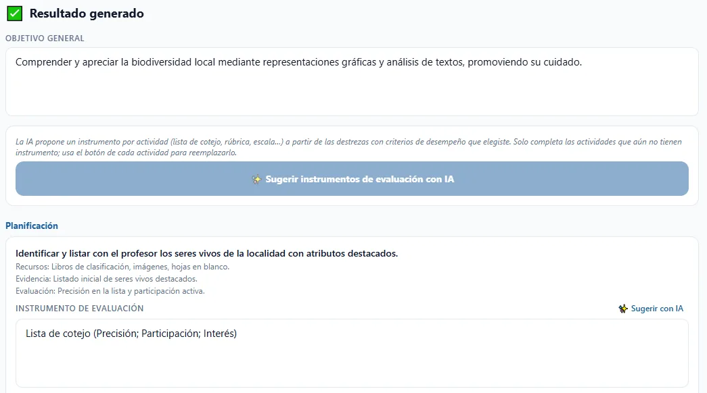

*Figura 109. Resultado del proyecto por destrezas (1 de 2).*

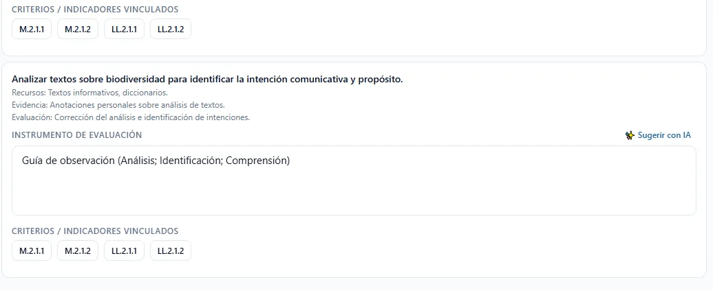

*Figura 110. Resultado del proyecto por destrezas (2 de 2).*

Todos los campos del resultado son editables. En cada actividad puede modificar el **Instrumento de** **evaluación** y marcar o desmarcar, en **Criterios / indicadores vinculados**, los códigos de las destrezas que esa actividad evalúa:

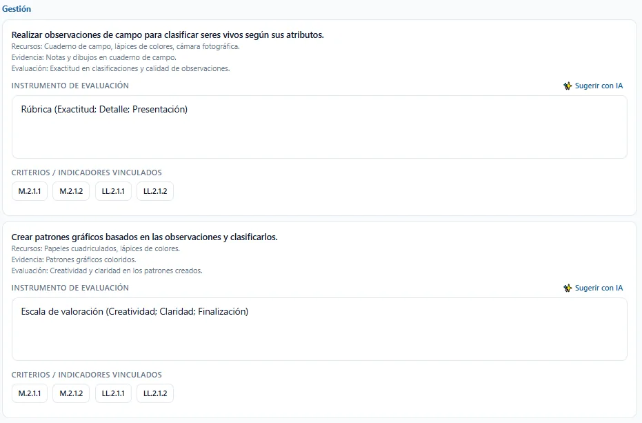

*Figura 111. Edición de criterios e indicadores vinculados a cada actividad.*

1. Para completar los instrumentos que falten, haga clic en **Sugerir instrumentos de evaluación** **con IA**; la IA solo completa las actividades que aún no tienen instrumento.
2. Para reemplazar el instrumento de una actividad concreta, haga clic en **Sugerir con IA** junto al campo **Instrumento de evaluación** de esa actividad.

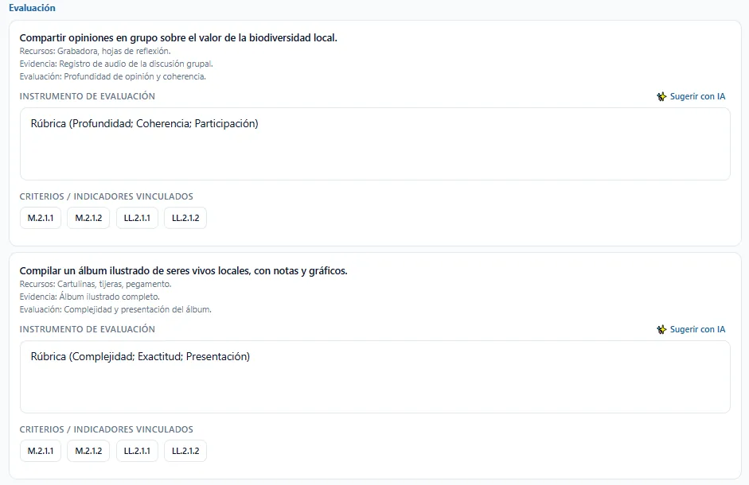

*Figura 112. Edición de instrumentos de evaluación.*

> La IA varía el tipo de instrumento según la evidencia de cada actividad. Revise que el instrumento permita observar realmente lo que declara la destreza y ajuste los criterios a la realidad de su grupo.

Finalmente, exporte el proyecto:

1. Haga clic en **Exportar a Word** o en **Exportar a PDF**. En la versión web, el PDF se abre en una ventana nueva; si no la ve, revise el bloqueador de ventanas emergentes del navegador.

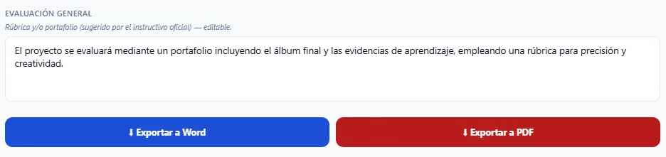

*Figura 113. Exportación del proyecto.*

> Las propuestas de la IA se basan en los lineamientos técnicos oficiales, pero es responsabilidad del docente validarlas y ajustarlas conforme a las disposiciones de su institución educativa y de su distrito, tal como indica el aviso que aparece junto al botón de generación.

### 5.7.4. Proyecto por competencias específicas

Este tipo de proyecto integra varias áreas alrededor de un producto final común, pero toma como base las competencias específicas del Currículo Nacional por Competencias (CNC). Según las Generalidades del Currículo Nacional por Competencias, la competencia específica es un desempeño observable que integra conocimientos, habilidades, actitudes y valores, y concreta las siete competencias clave del Sistema Nacional de Educación para cada área y subnivel. El formulario y el resultado son los mismos que en el proyecto por destrezas; solo cambia el contexto curricular y el catálogo de elementos.

1. En **Contexto curricular**, elija el **Nivel** (ELEMENTAL, MEDIA, SUPERIOR o BACHILLERATO) y el **Grado**.
2. Seleccione al menos dos competencias específicas de áreas distintas en el catálogo; la IA elabora el resto.

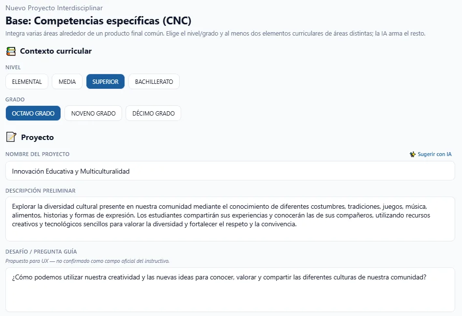

*Figura 114. Selección del nivel y elementos curriculares.*

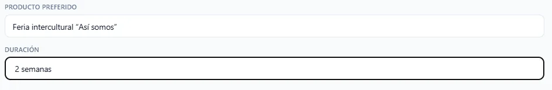

*Figura 115. Competencias específicas de áreas distintas.*

Las competencias se identifican con su código oficial. Según las Generalidades del CNC, un código como CE.LL.2.1 indica: CE (competencia específica), el área (LL, Lengua y Literatura), el número del subnivel (2, Elemental) y el número de la competencia. Use este código para buscar rápidamente en el catálogo.

1. Complete los datos del proyecto (nombre, descripción preliminar, pregunta guía, producto preferido y **Duración**) y los datos institucionales (**Institución** y **Docentes participantes**).

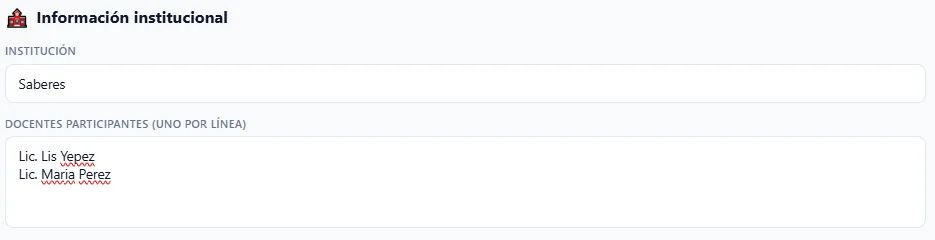

*Figura 116. Datos institucionales del proyecto por competencias.*

2. Revise las competencias seleccionadas y haga clic en **Generar planificación**.

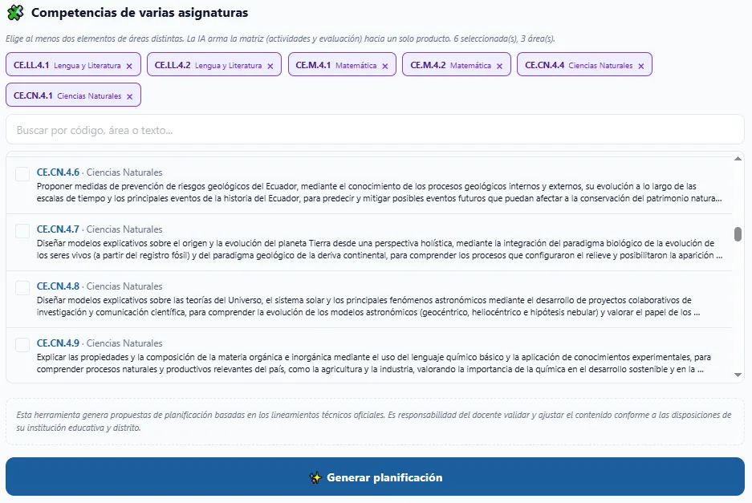

*Figura 117. Selección de competencias.*

Se aplican las mismas validaciones que en el proyecto por destrezas: al menos dos elementos de dos áreas distintas, y la duración y la institución completas. El sistema presenta el resultado con el objetivo general, las actividades de las tres fases, sus instrumentos de evaluación y la evaluación general, todos editables:

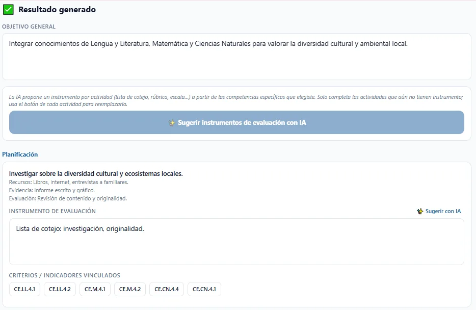

*Figura 118. Resultado del proyecto por competencias (1 de 4).*

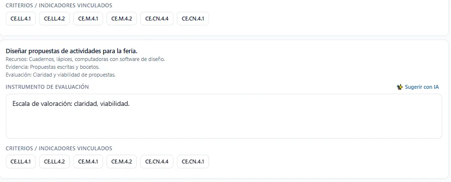

*Figura 119. Resultado del proyecto por competencias (2 de 4).*

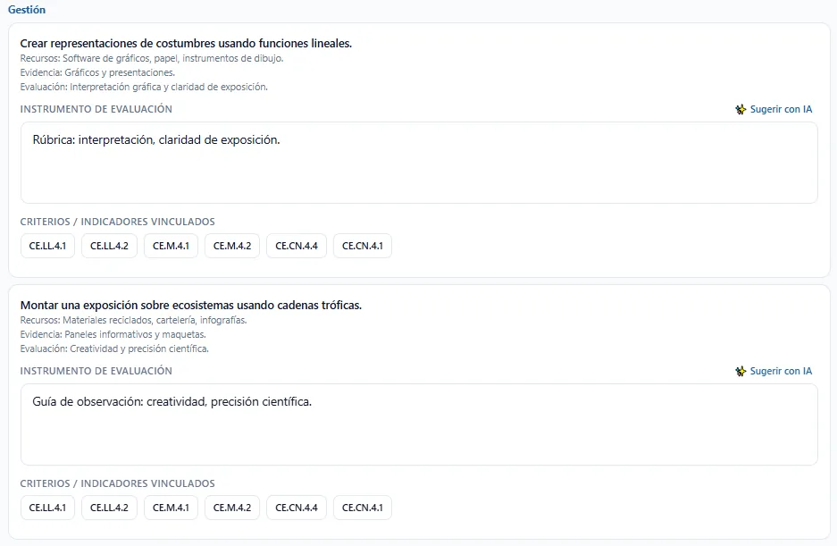

*Figura 120. Resultado del proyecto por competencias (3 de 4).*

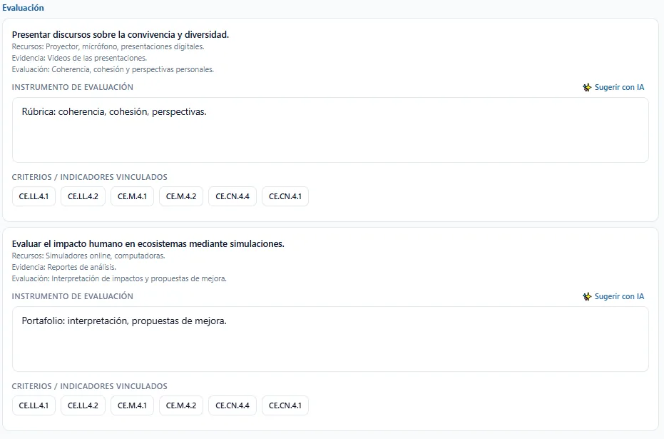

*Figura 121. Resultado del proyecto por competencias (4 de 4).*

> Elija competencias que realmente converjan en un mismo producto y formule la pregunta guía a partir de una situación real del entorno de los estudiantes; la integración debe ser genuina y no una suma de actividades aisladas por área.

Finalmente, exporte el proyecto:

1. Haga clic en **Exportar a Word** o en **Exportar a PDF**.

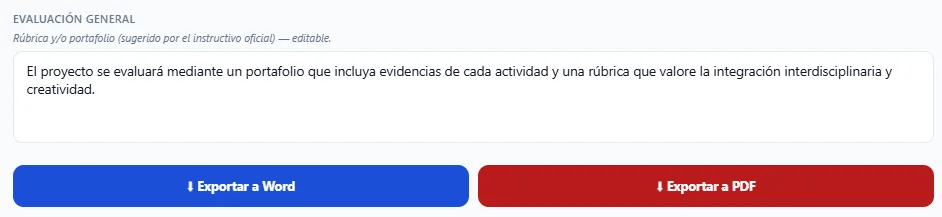

*Figura 122. Exportación del proyecto por competencias.*

> Como aún no existe un formato oficial de Proyecto Interdisciplinar para el Currículo Nacional por Competencias, verifique con la autoridad o la comisión pedagógica de su institución el formato que debe presentar.

## 5.8. Bachillerato Técnico

Ruta: **Crear › Programaciones › Bachillerato Técnico**. Permite elaborar la planificación de una unidad de trabajo dentro de un módulo formativo de una figura profesional del Bachillerato Técnico.

### 5.8.1. Fundamento normativo

El Bachillerato Técnico organiza su oferta en áreas, familias profesionales y figuras profesionales. El Acuerdo Ministerial Nro. MINEDUC-MINEDUC-2025-00031-A, que regula el Bachillerato Técnico para personas jóvenes, adultas y adultas mayores con escolaridad inconclusa, distribuye las figuras en tres áreas (Técnica, Deportes y salud, Artística) y define el período pedagógico como la unidad mínima de tiempo de enseñanza. El mismo acuerdo establece el módulo de Formación en Centros de Trabajo (FCT) para la formación práctica del estudiantado. La aplicación usa estas mismas tres áreas para organizar su catálogo.

Cada figura profesional se estructura en módulos formativos. Según la caracterización oficial de las familias profesionales, cada módulo se vincula con una unidad de competencia (UC), que se desagrega en elementos de competencia (EC) y estos en criterios de desempeño (CD). Algunos módulos se expresan, en cambio, mediante resultados de aprendizaje (RA) con sus criterios de evaluación (CE). La planificación que genera la aplicación se ancla exclusivamente en esos criterios.

1. En la pantalla **Bachillerato Técnico**, haga clic en la pestaña del área de la figura profesional: **Técnica**, **Deportes y Salud** o **Artística**.

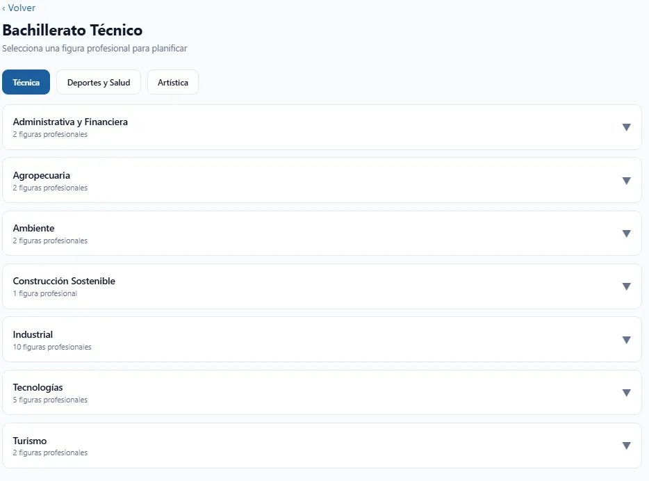

*Figura 123. Selección del área técnica.*

2. Haga clic en la familia profesional para desplegarla y luego haga clic en la tarjeta de la figura profesional.

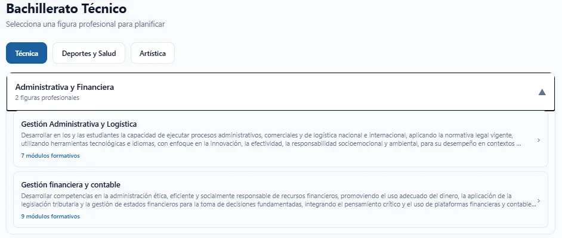

*Figura 124. Selección de la figura profesional.*

Se abre el asistente de planificación de la figura, con una barra de progreso de cinco pasos: **Módulo**, **Competencia**, **Unidad**, **Generar** y **Resultado**. Use **Siguiente →** y **← Anterior** para moverse entre pasos.

1. En **Selecciona el módulo formativo**, haga clic en el módulo que desea planificar. Bajo el nombre de cada módulo se indica su categoría y el año en que se cursa.

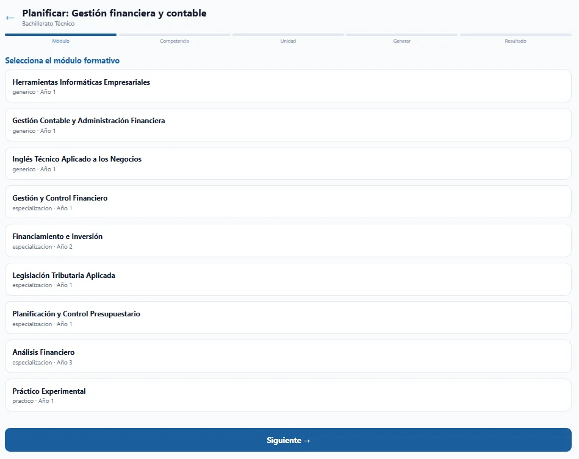

*Figura 125. Selección del módulo formativo.*

2. En **Unidad(es) de Competencia**, marque una o varias unidades de competencia; debajo de cada una se listan sus elementos de competencia.
3. En **Resultado(s) de Aprendizaje**, marque los resultados de aprendizaje que correspondan, si el módulo los tiene.
4. Haga clic en **Siguiente →**.

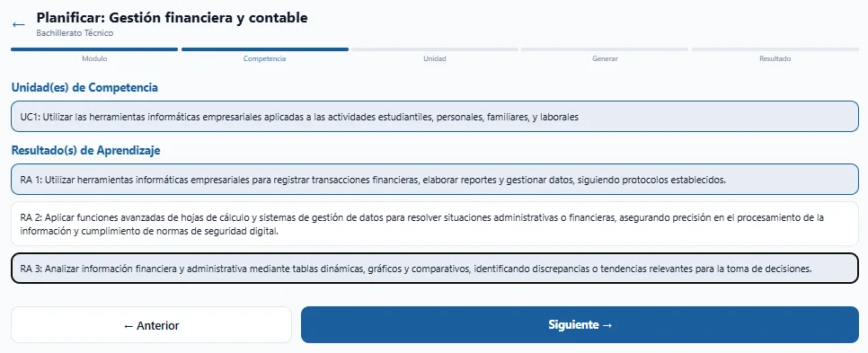

*Figura 126. Unidad de competencia y resultados de aprendizaje.*

> Si un módulo no tiene unidades de competencia, la aplicación lo indica y solo muestra resultados de aprendizaje, y viceversa. Debe seleccionar al menos una unidad de competencia o un resultado de aprendizaje para continuar; los criterios de esos elementos son los que usará la IA.

5. Complete los datos institucionales y de la unidad de trabajo según la tabla siguiente y haga clic en **Siguiente →**.

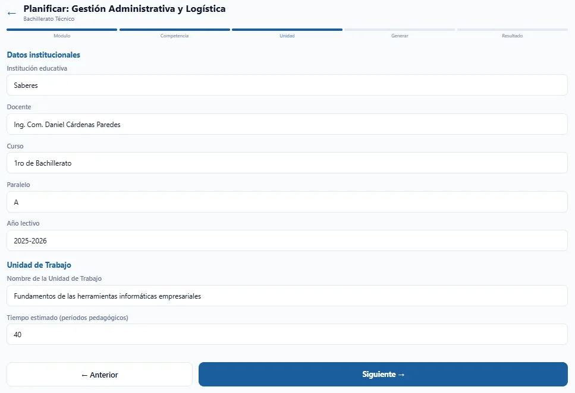

*Figura 127. Datos institucionales y de la unidad de trabajo.*

***Descripción de los campos***

| **Campo** | **Descripción** | **Ejemplo u observación** |
| --- | --- | --- |
| Institución educativa | Nombre de la unidad educativa. | Aparece en el encabezado del documento. |
| Docente | Nombre del docente responsable del módulo. |  |
| Curso | Curso del Bachillerato Técnico. | Ej.: 1ro de Bachillerato. |
| Paralelo | Paralelo del curso. | Ej.: A. |
| Año lectivo | Periodo lectivo de la planificación. | Viene precargado; corríjalo si no corresponde a su año lectivo. |
| Nombre de la Unidad de Trabajo | Título de la unidad que va a planificar. | Obligatorio: sin él no se puede avanzar. |
| Tiempo estimado (periodos pedagógicos) | Número de períodos pedagógicos previstos para la unidad. | Valor numérico. Si lo deja vacío, la generación usa 10 períodos. |

1. En el paso **Generar**, revise el **Resumen**: módulo, unidad de trabajo y número de criterios seleccionados.
2. Haga clic en **Generar Unidad de Trabajo**. La generación puede tardar entre 15 y 30 segundos.

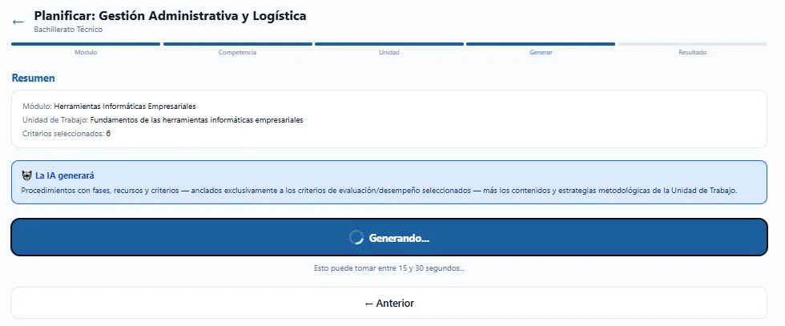

*Figura 128. Generación de la planificación de Bachillerato Técnico.*

La IA genera tres procedimientos, cada uno con nombre, objetivo, tiempo, fases de la actividad (de dos a cinco), recursos, y técnica e instrumento de evaluación; además, los **Contenidos** (conceptuales, procedimentales y actitudinales) y las **Estrategias metodológicas** de la unidad. Los procedimientos se derivan exclusivamente de los criterios de desempeño o de evaluación seleccionados, y cada uno queda vinculado a esos criterios.

El sistema presenta el resultado bajo el mensaje “Unidad de Trabajo generada”:

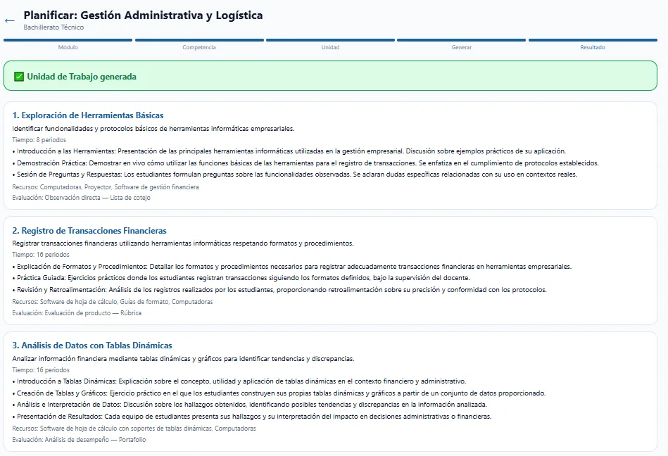

*Figura 129. Resultado de la planificación de Bachillerato Técnico.*

En esta pantalla el resultado se muestra para revisión y no tiene campos de edición. Si necesita otro enfoque, vuelva con **← Anterior**, ajuste la selección o los datos y genere de nuevo; los ajustes finos puede hacerlos en el documento Word exportado.

1. Haga clic en **Guardar planificación**. Aparece el mensaje “Planificación BT guardada” y el botón cambia a ✓ **Guardado — actualizar**, que puede usar para guardar de nuevo si hace cambios.
2. Haga clic en **Exportar como Word (.docx)** o en **Exportar como PDF**.

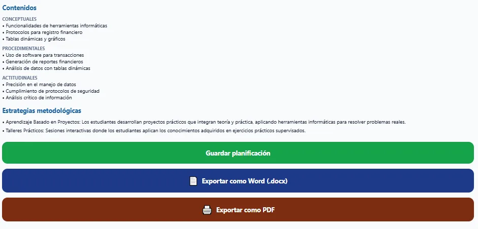

*Figura 130. Guardado y exportación de la planificación técnica.*

***Recomendaciones pedagógicas***

- Seleccione solo las unidades de competencia o resultados de aprendizaje que realmente trabajará en la unidad; cuantos más criterios elija, más amplia será la unidad de trabajo.
- Ajuste el tiempo estimado a la carga horaria real del módulo en su institución.
- Según los Lineamientos 2026-2027, en el Bachillerato Técnico predomina el aprender haciendo mediante talleres, laboratorios, simulaciones y experiencias en contextos reales; verifique que los procedimientos generados puedan ejecutarse con los recursos de su taller o laboratorio.

## 5.9. Currículo por Competencias

Ruta: **Crear › Currículo › Currículo por Competencias**. Responde al Programa Piloto del Currículo Nacional por Competencias del régimen Sierra-Amazonía. La pantalla del módulo se identifica como “Planificaciones por competencias — Plan Piloto” y lista las planificaciones creadas, con filtros por tipo.

### 5.9.1. Fundamento normativo

Según los Lineamientos pedagógicos de inicio de año lectivo Sierra-Amazonía 2026-2027, las instituciones educativas fiscales interculturales de la Zona 6 forman parte del Programa Piloto para la implementación del Currículo Nacional por Competencias. Las Generalidades del currículo por competencias (para EGB y BG, y para Inicial y Preparatoria) explican su estructura:

- **Competencias clave**: siete competencias del Sistema Nacional de Educación (comunicativa; matemática y en ciencia y tecnología; ciudadana, identidad y conciencia cultural; digital; socioemocional; de expresiones culturales y artísticas; y de innovación y transformación).
- **Competencias específicas**: concretan las competencias clave en aprendizajes esperados para cada área o currículo integrado y cada subnivel.
- **Indicadores de evaluación**: enunciados observables y verificables del nivel de desempeño esperado en cada competencia específica.
- **Saberes**: declarativos, procedimentales y actitudinales, que sustentan el desarrollo de la competencia.
- **Orientaciones metodológicas** y **conexiones interdisciplinarias**, que orientan la planificación de experiencias y situaciones de aprendizaje.
1. Haga clic en **Nueva Planificación**.

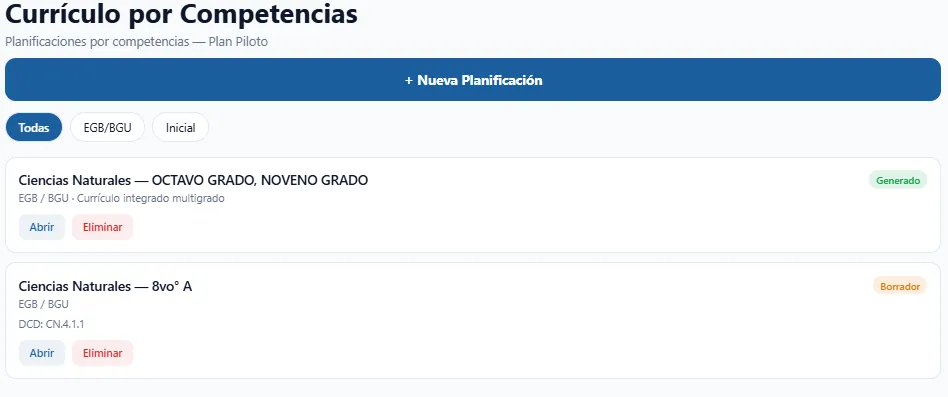

*Figura 131. Botón Nueva Planificación.*

2. En la pantalla **Nueva Planificación**, elija el tipo de planificación: **Inicial / Preparatoria** o **Currículo Integrado (EGB / BGU)**.

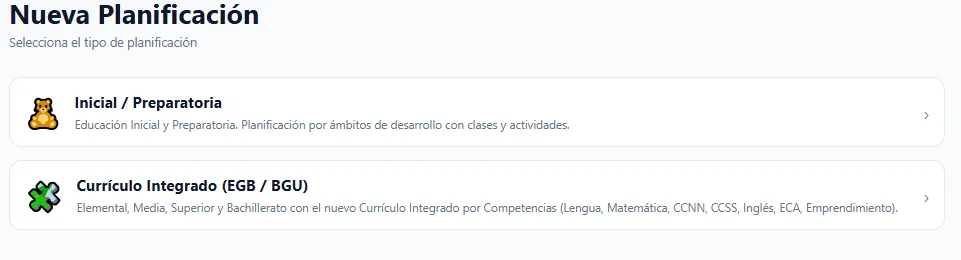

*Figura 132. Selección del tipo de planificación.*

### 5.9.2. Inicial y Preparatoria

Este flujo corresponde a la planificación de Educación Inicial con el currículo integrado por ámbitos de desarrollo y aprendizaje. La pantalla se identifica como “Módulo experimental · Fase piloto (Zona 6)” y genera una planificación microcurricular multigrado. Según los Lineamientos 2026-2027, en Inicial se usa el Currículo Nacional por Competencias con la metodología juego-trabajo, y la planificación se concreta en experiencias de aprendizaje significativas y contextualizadas.

El asistente tiene cuatro pasos: **Contexto curricular**, **Competencias específicas**, **Datos administrativos** y **Generar**.

1. En **Contexto curricular**, seleccione en **Grados del aula** uno o ambos grados: **Inicial 3-4 años** e **Inicial 4-5 años**. Cada grado seleccionado será una columna de la planificación multigrado.

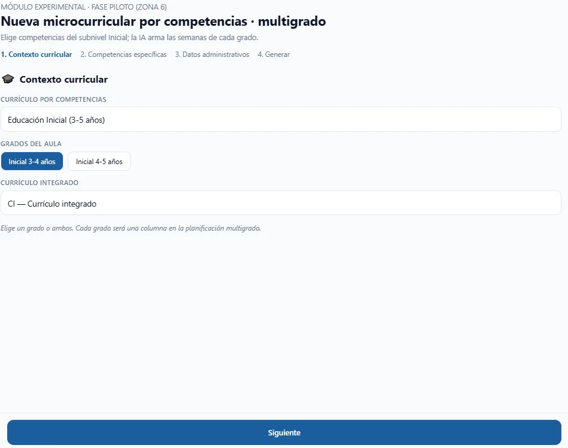

*Figura 133. Selección del grado de Inicial.*

2. En **Competencias específicas**, busque por código o texto y haga clic en cada competencia para agregarla. Debe elegir al menos una para poder avanzar.

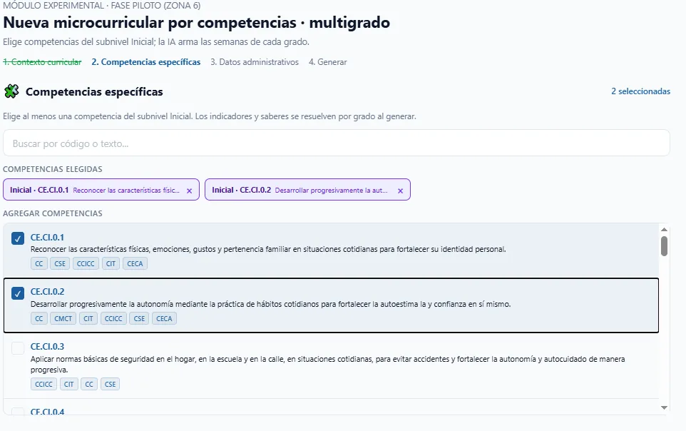

*Figura 134. Selección de competencias.*

Las competencias de este currículo usan el código CI (Currículo Integrado), por ejemplo CE.CI.1.1. Según las Generalidades del currículo por competencias de Inicial y Preparatoria, en los saberes el código indica también el subnivel, el ámbito de desarrollo y aprendizaje, y el tipo de saber. Los indicadores y saberes de cada competencia se resuelven por grado al generar la planificación.

1. En **Datos administrativos**, complete los datos institucionales y los de la situación de aprendizaje según la tabla siguiente.

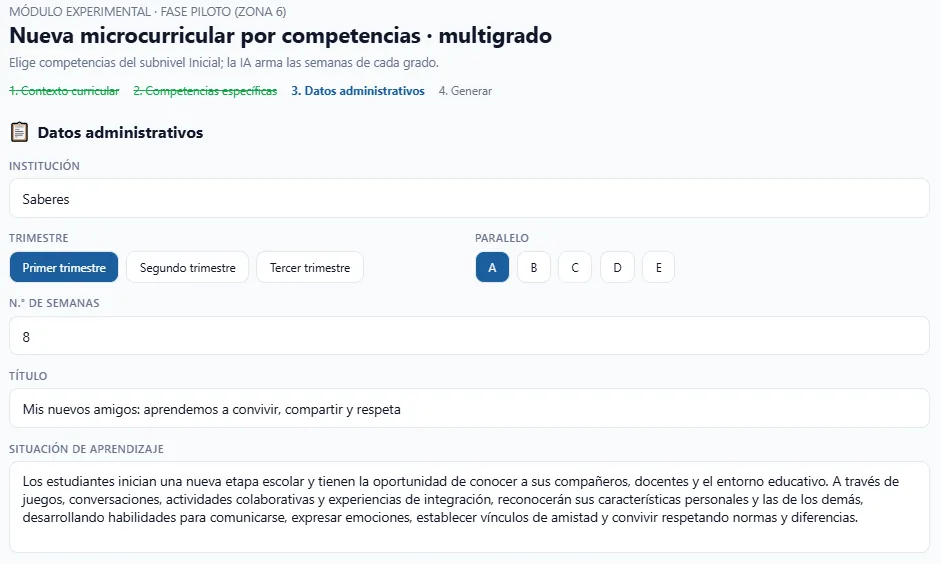

*Figura 135. Datos institucionales.*

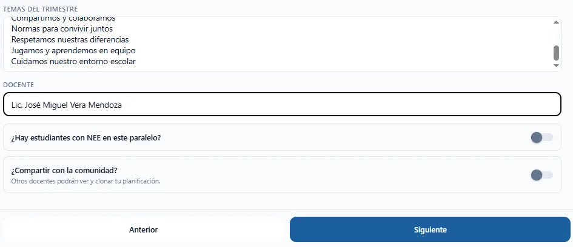

*Figura 136. Datos de la situación de aprendizaje.*

***Descripción de los campos***

| **Campo** | **Descripción** | **Ejemplo u observación** |
| --- | --- | --- |
| Institución | Nombre de la unidad educativa. |  |
| Trimestre | Trimestre que se planifica. | Primer, Segundo o Tercer trimestre. |
| Paralelo | Paralelo del aula. | A, B, C, D o E. |
| N.° de semanas | Semanas de clase que cubre la planificación. | Valor numérico. |
| Título | Nombre de la situación o experiencia de aprendizaje. | Ej.: Mis nuevos amigos; Explorando la naturaleza. |
| Situación de aprendizaje | Descripción de la situación que da sentido a las actividades. | Opcional. |
| Temas del trimestre | Un tema por línea; cada tema se convierte en una clase. | Opcional. Ej.: Mis emociones; Mi familia. |
| Docente | Nombre del docente. |  |

En esta pantalla también se encuentran dos interruptores, disponibles igualmente en el currículo integrado de EGB y BGU:

- **¿Hay estudiantes con NEE en este paralelo?**: al guardar la planificación con esta opción activa, el sistema pregunta si desea crear una adaptación curricular individual para cada estudiante con necesidades educativas específicas y abre el módulo **Adaptación curricular** con los datos de esta planificación precargados (institución, docente, grado, paralelo, trimestre y la competencia o destreza de referencia), todos editables. En la vista del plan guardado aparece además el botón **Crear adaptación curricular (NEE)**.
- **¿Compartir con la comunidad?**: publica la planificación en la pestaña **Comunidad** para que otros docentes puedan consultarla y duplicarla. Otros docentes podrán ver y duplicar esta planificación sin sus datos personales ni los de su institución.
1. Haga clic en **Siguiente**.
2. En **Generar**, revise el **Resumen** (grado, trimestre, paralelo, semanas, competencias y título).
3. Haga clic en **Generar planificación**.

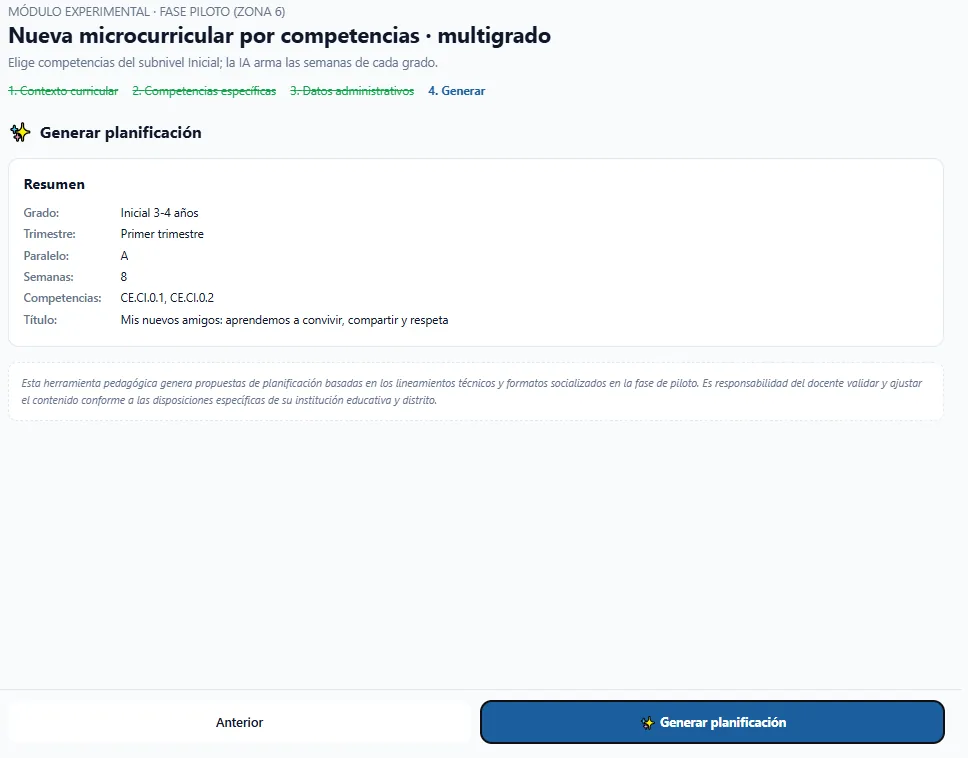

*Figura 137. Resumen previo a la generación.*

La planificación queda guardada y se abre su vista de detalle. Desde allí puede **Editar**, exportar en **Word** o **PDF**, o **Eliminar** la planificación. El documento Word de Inicial se genera en formato multigrado, en hoja A4 horizontal, con los indicadores y saberes de cada competencia resueltos por grado:

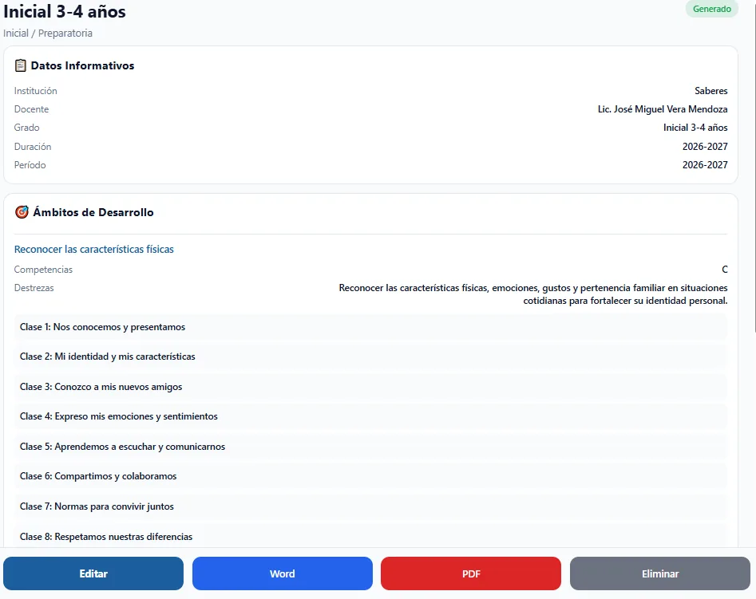

*Figura 138. Resultado del currículo por competencias de Inicial.*

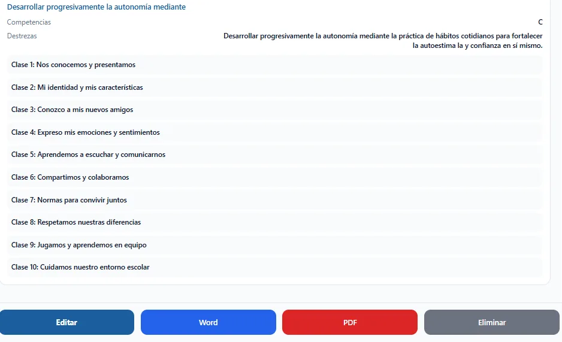

*Figura 139. Opciones de exportación.*

> Si deja vacíos los temas del trimestre, el sistema crea una sola clase a partir del título. Escriba los temas si desea que la planificación tenga una clase por tema.

### 5.9.3. Currículo integrado: EGB y BGU

Este flujo corresponde a la planificación de Educación General Básica (Elemental, Media y Superior) y Bachillerato con el Currículo Integrado por Competencias, por asignatura: Lengua y Literatura, Matemática, Ciencias Naturales, Ciencias Sociales, Inglés, Educación Cultural y Artística, y Emprendimiento y Gestión. Preparatoria no aparece aquí porque su currículo integrado se organiza por ámbitos y no por asignatura.

El asistente tiene cuatro pasos: **Contexto**, **Competencias**, **Datos** y **Generar**.

1. En **Contexto curricular**, elija la **Planificación**: **Un solo grado** o **Multigrado**.
2. Elija la **Materia**, el **Nivel** y, si planifica un solo grado, el **Grado / Curso**.

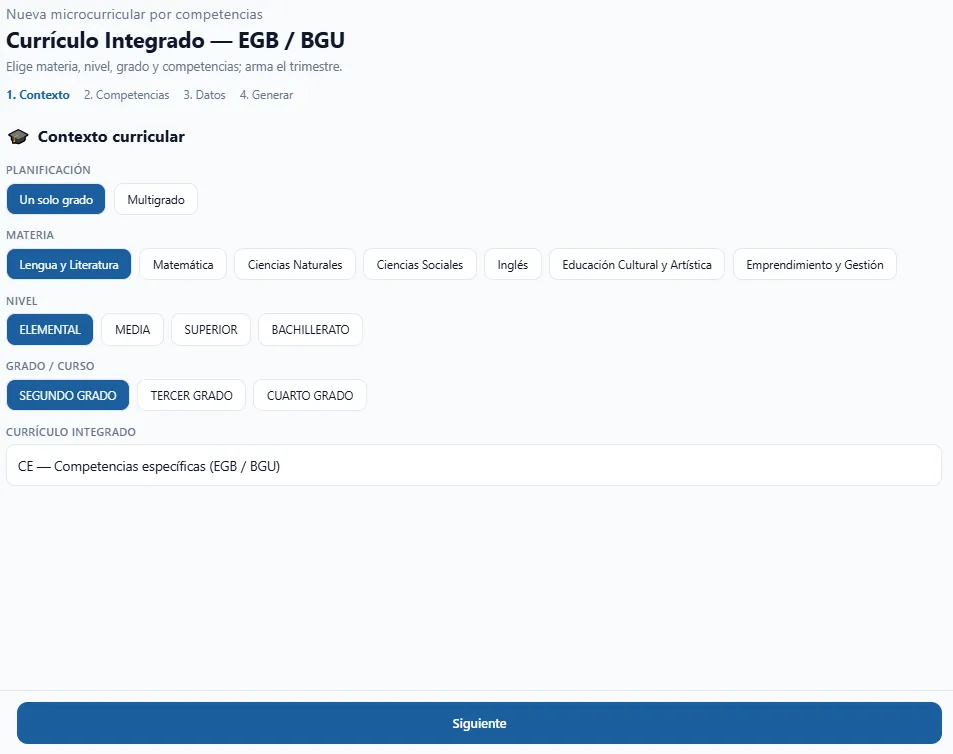

*Figura 140. Datos del currículo integrado EGB/BGU.*

> La modalidad Multigrado combina dos o más grados del mismo subnivel en una sola planificación, para aulas multigrado. En ese caso los grados se eligen en el paso siguiente.

3. En **Competencias específicas**, busque por código o texto y agregue las competencias específicas que trabajará. En modalidad multigrado, elija dos o más grados y al menos una competencia específica que cubra a todos.

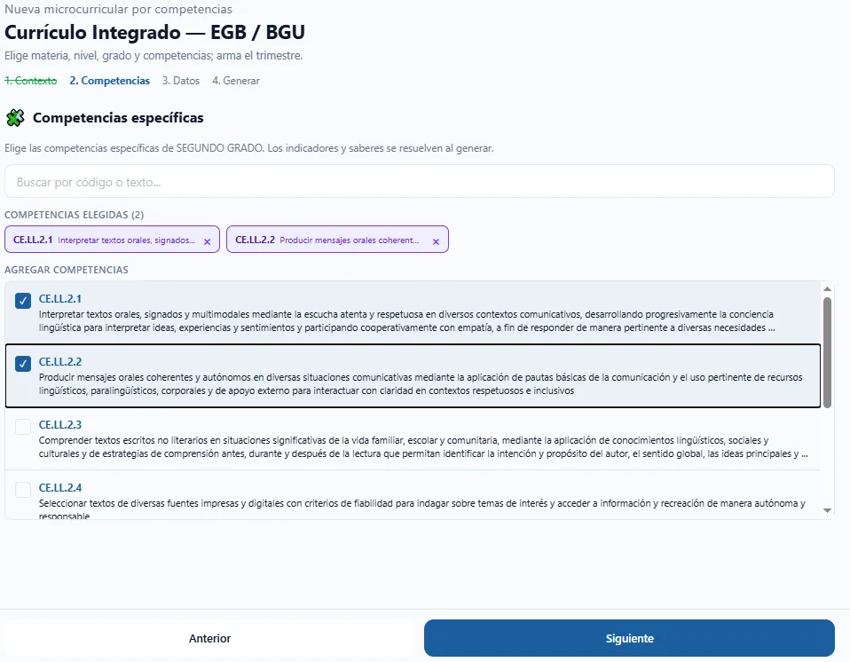

*Figura 141. Selección de competencias específicas.*

En modalidad multigrado, el sistema muestra para cada grado el bloque curricular resuelto automáticamente desde el catálogo oficial (**Indicadores de evaluación**, **Saberes declarativos**, **Saberes** **procedimentales** y **Saberes actitudinales**, un ítem por línea). Puede editarlo antes de generar.

1. En **Datos administrativos**, complete los datos informativos y la situación de aprendizaje según la tabla siguiente.

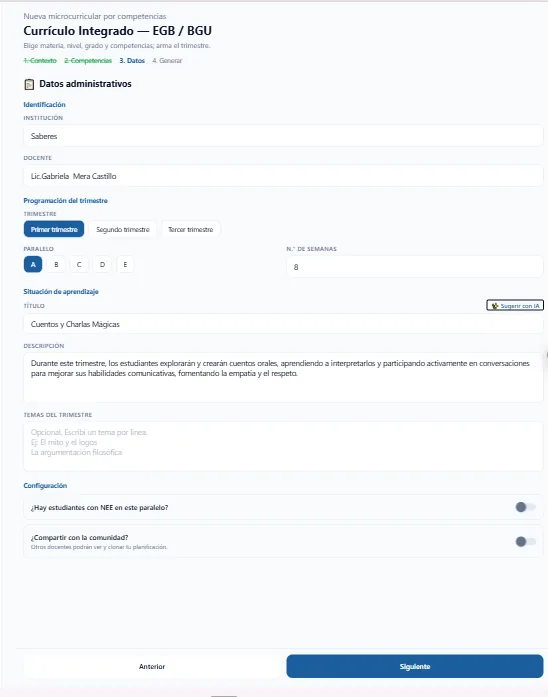

*Figura 142. Datos informativos y situación de aprendizaje.*

***Descripción de los campos***

| **Campo** | **Descripción** | **Ejemplo u observación** |
| --- | --- | --- |
| Institución | Nombre de la unidad educativa. |  |
| Docente | Nombre del docente. |  |
| Trimestre | Trimestre que se planifica. | Primer, Segundo o Tercer trimestre. |
| Paralelo | Paralelo del curso. | A, B, C, D o E. |
| N.° de semanas | Semanas de clase que cubre la planificación. | Valor numérico. |
| Título | Título de la situación de aprendizaje. Incluye el botón **Sugerir con IA**, que se activa cuando hay competencias seleccionadas. | Ej.: Pensamiento crítico, voz ética y creación. |
| Descripción | Descripción de la situación de aprendizaje. | Opcional; si la deja vacía, se redacta a partir de las competencias o de la sugerencia de la IA. |
| Temas del trimestre | Un tema por línea. | Opcional. |

1. Haga clic en **Siguiente** y revise el **Resumen** (materia, nivel o subnivel, grado o grados, trimestre, paralelo, semanas, competencias y título).
2. En modalidad multigrado, haga clic en **Generar con IA** para crear el contenido semanal: un tema común por semana y una actividad diferenciada por grado, con inicio, desarrollo, cierre, recursos, técnica e instrumento, todos editables. Si ya existe contenido, el botón se llama **Regenerar con IA**.
3. Haga clic en **Generar planificación**.

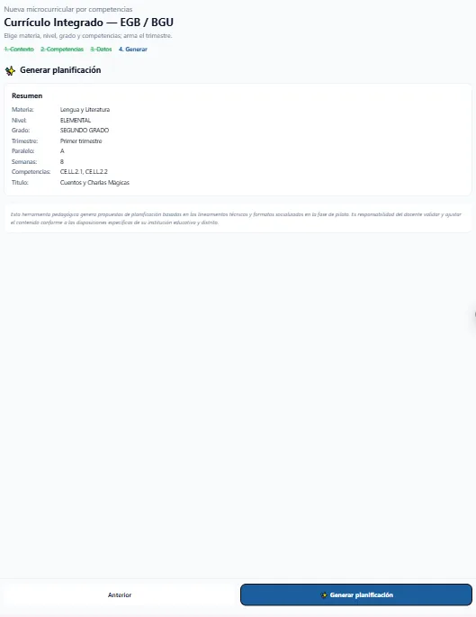

*Figura 143. Resumen del currículo integrado.*

Finalmente, en la vista de detalle de la planificación, exporte en **Word** o **PDF**:

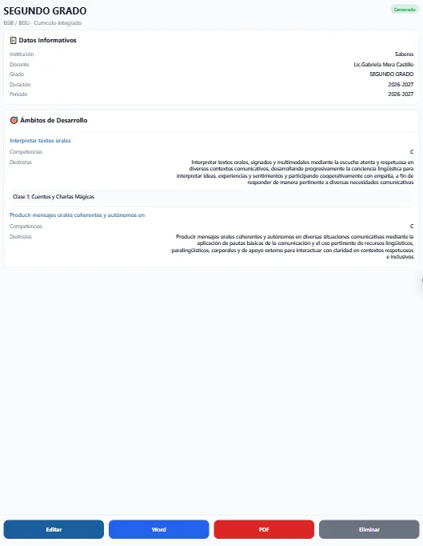

*Figura 144. Exportación del currículo por competencias.*

***Recomendaciones pedagógicas***

- Parta de una situación de aprendizaje real y cercana al contexto de los estudiantes, como plantean las Generalidades del currículo por competencias.
- Revise que los indicadores de evaluación de cada grado sean coherentes con las actividades planificadas y con los instrumentos de evaluación.
- En aulas multigrado, aproveche el tema común de cada semana para el trabajo colaborativo entre grados y diferencie las actividades según el nivel de cada grupo.

### 5.9.4. Biblioteca comunitaria (Comunidad)

La pestaña **Comunidad** de **Currículo por Competencias** reúne las planificaciones que otros docentes decidieron compartir. Su propósito es facilitar el intercambio de buenas prácticas entre docentes del Programa Piloto y ofrecer un punto de partida para planificar.

1. En **Currículo por Competencias**, seleccione la pestaña **Comunidad**. Las planificaciones se muestran de la más reciente a la más antigua, en tarjetas con el título, el nivel, el grado, las competencias y la fecha. Use **Ver más** para cargar planificaciones anteriores.
2. Haga clic en una tarjeta para abrir la planificación en modo de solo lectura.
3. Si desea utilizarla, haga clic en **Duplicar como mío**. El sistema crea una copia propia, no compartida y sin datos del autor, y la abre en el formulario de edición para que la adapte a su grupo.

> **Importante:** antes de compartir, revise que la situación de aprendizaje y las actividades no incluyan nombres de estudiantes u otros datos personales. El sistema elimina automáticamente el nombre del docente, la institución, el paralelo, los firmantes, las observaciones y los datos de estudiantes, pero no puede detectar nombres escritos dentro de textos libres.

> En Mis planificaciones, las planificaciones que usted compartió se identifican con la etiqueta “Compartida”. Para dejar de compartir una planificación, edítela, desactive ¿Compartir con la comunidad? y guarde los cambios.

## 5.10. Educación Inicial

Ruta: **Crear › Niveles educativos › Inicial**.

El módulo **Planificación Inicial** elabora la planificación semanal por experiencia de aprendizaje para niñas y niños de 3 a 5 años. El documento Word que produce sigue la estructura del Anexo 2 del Instructivo de planificación curricular 2021 del MINEDUC (planificación semanal por experiencia de aprendizaje): datos informativos, objetivo general, una fila por ámbito de desarrollo y aprendizaje con su destreza y proceso metodológico, adaptaciones curriculares, bibliografía, observaciones y firmas.

### 5.10.1. Fundamento normativo y pedagógico

El Currículo Priorizado de Educación Inicial organiza los aprendizajes en tres ejes de desarrollo y aprendizaje (desarrollo personal y social, descubrimiento del medio natural y cultural, y expresión y comunicación), de los que se derivan los ámbitos; en cada ámbito se proponen destrezas diferenciadas para el grupo de 3 a 4 años y para el de 4 a 5 años. El mismo documento advierte que el logro de las destrezas es continuo y progresivo, depende del ritmo de cada niña y niño y no debe valorarse con criterios de rigidez.

En cuanto a la metodología, el currículo señala el juego como la estrategia principal del nivel y describe dos formas de organizar el trabajo: el juego-trabajo en rincones y las experiencias de aprendizaje, entendidas como vivencias y actividades desafiantes, diseñadas intencionalmente por el docente a partir del interés de los niños, que producen gozo y asombro. Toda experiencia de aprendizaje se desarrolla en tres momentos (inicio, desarrollo y cierre), que son los mismos que la aplicación utiliza para estructurar cada clase. El Currículo Nacional de Primera Infancia articula esta etapa (3 a 5 años) con la educación de 0 a 3 años y con el subnivel Preparatoria (5 a 6 años).

La evaluación en Inicial es cualitativa, permanente y formativa: no aprueba ni reprueba, sino que identifica potencialidades y aspectos por fortalecer. Según el Currículo Priorizado de Educación Inicial, la técnica central es la observación, apoyada en instrumentos como la ficha de observación, el registro anecdótico, la lista de cotejo y el portafolio.

### 5.10.2. Estructura del formulario

La pantalla se organiza en cuatro bloques que se completan de arriba hacia abajo: **Datos de la semana**, **Ámbitos de la semana**, **Firmantes** y el botón de exportación. Cada ámbito se presenta como una tarjeta que se puede contraer o expandir tocando su cabecera, y dentro de cada ámbito se agregan una o varias clases.

1. Seleccione el **Grado**: **Inicial 1 (3 a 4 años)** o **Inicial 2 (4 a 5 años)**. De forma predeterminada está seleccionado Inicial 2.
2. Escriba la **Institución**, el **Docente** y la **Semana (rango de fechas)**.
3. Si lo requiere, registre **Observaciones** (feriados, eventos) y revise la **Bibliografía** propuesta.
4. En la tarjeta del ámbito, elija el **Ámbito de desarrollo** y, a continuación, la **Competencia /** **Destreza** en la lista desplazable.
5. En la sección **Clases de este ámbito**, escriba el **Tema de la clase** y elija la **Metodología**.
6. Para planificar más clases del mismo ámbito, haga clic en **+ Agregar clase**; para trabajar otro ámbito en la semana, haga clic en **+ Agregar ámbito**.

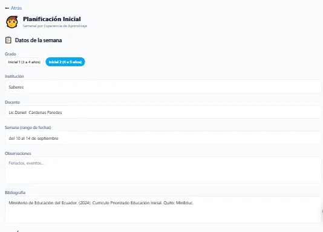

*Figura 145. Formulario de planificación de Educación Inicial con los datos de la semana y la tarjeta del ámbito.*

***Descripción de los campos: datos de la semana***

| **Campo** | **Descripción** | **Ejemplo u observación** |
| --- | --- | --- |
| **Grado** | Grupo de edad para el que se planifica. Determina qué destrezas se muestran (códigos INI.3 para 3 a 4 años e INI.4 para 4 a 5 años) y el objetivo general que se imprime en el Word. | Inicial 2 (4 a 5 años) |
| **Institución** | Nombre de la institución educativa. Si se deja vacío, el Word muestra un guion. | Unidad Educativa… |
| **Docente** | Nombre de la o el docente. Es el único dato obligatorio para exportar. | Lcda. Nombre Apellido |
| **Semana (rango de** **fechas)** | Periodo que cubre la planificación. Se imprime en la celda DURACIÓN/FECHA. | del 19 al 23 de mayo del 2025 |
| **Observaciones** | Texto libre que se imprime en la fila OBSERVACIONES del documento. | Feriado el viernes; casa abierta |
| **Bibliografía** | Viene precargada con la referencia al Currículo Priorizado de Educación Inicial del MINEDUC; puede editarse o ampliarse. | Agregue cuentos o recursos utilizados |

> El objetivo general no se escribe en el formulario: la aplicación lo asigna automáticamente según el grado seleccionado y lo imprime en la fila OBJETIVO GENERAL del Word, donde usted puede ajustarlo después de exportar.

***Descripción de los campos: ámbito y clase***

| **Campo** | **Descripción** | **Ejemplo u observación** |
| --- | --- | --- |
| **Ámbito de desarrollo** | Uno de los siete ámbitos disponibles: Identidad y Autonomía, Convivencia, Relaciones con el medio natural y cultural, Relaciones lógico-matemáticas, Comprensión y Expresión del Lenguaje, Expresión Artística, y Expresión corporal y motricidad. Al cambiar de ámbito se borra la destreza elegida. | 4. Relaciones lógico- matemáticas |
| **Competencia /** **Destreza** | Tarjetas con el código y la descripción de las destrezas del ámbito, filtradas por el grado. La destreza seleccionada se muestra resaltada debajo de la lista. | INI.4.1.1 Practicar con autonomía hábitos de higiene personal… |
| **Tema de la clase** | Tema generador de la clase; es obligatorio para generar con IA. | Color rojo; Conductas positivas |
| **Metodología** | Una de cuatro opciones: Juego-trabajo (predeterminada), Juego libre, Rincones de aprendizaje o Experiencia directa. Se imprime en el proceso metodológico. | Juego-trabajo |
| **Método de evaluación** | Selección múltiple entre Observación, Fichas anecdóticas, Fichas de cotejo y Portfolio. Las tres primeras vienen marcadas. En el Word aparece como “Método de observación”. | Observación y Portfolio |

> Si una destreza no aparece, verifique primero el grado: las destrezas de 3 a 4 años solo se muestran con Inicial 1 y las de 4 a 5 años con Inicial 2. Si el ámbito no tiene destrezas registradas para ese grado, la pantalla muestra “No hay destrezas registradas para este ámbito.”

### 5.10.3. Generación de la clase con IA

1. Escriba el tema y haga clic en **Generar con IA**.
2. Espere mientras el botón muestra “Generando con IA...”.
3. Revise el objetivo específico y las actividades propuestas para los momentos **INICIO**, **DESARROLLO** y **CIERRE**.
4. Si el resultado no se ajusta a su grupo, modifique el tema o la metodología y haga clic en **Regenerar con IA**.

Antes de llamar a la IA, el sistema verifica dos condiciones y, si no se cumplen, muestra un aviso: sin tema aparece “Escribe el tema de la clase primero.” y sin destreza aparece “Selecciona una competencia/destreza en el ámbito.”. La IA recibe el grado, el ámbito, la destreza, el tema, la metodología y el número de clase, y devuelve:

- Un **objetivo específico** redactado en una sola oración con verbo en infinitivo, alineado con la destreza y el tema.
- Entre cuatro y cinco actividades de **INICIO** (saludo, rutinas de la jornada como clima, fecha y asistencia, canción o motivación y activación del tema).
- Entre seis y nueve actividades de **DESARROLLO**, basadas en el juego, el movimiento, la canción y el material manipulativo, contextualizadas a la realidad ecuatoriana.
- Entre tres y cuatro actividades de **CIERRE** (ficha o cuadernillo, retroalimentación, felicitación y despedida).
- Para cada actividad, los indicadores DUA que le corresponden, representados con cuadros de color: rosa para Representación, azul oscuro para Acción y Expresión y verde para Implicación.

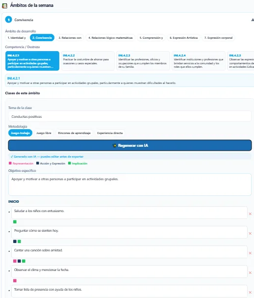

*Figura 146. Resultado de la planificación de Inicial: objetivo específico y leyenda DUA (1 de 2).*

Cuando la clase ya fue generada aparece el aviso “Generado con IA — puedes editar antes de exportar”. Todo el contenido es editable: puede corregir el objetivo específico, reescribir cualquier actividad, eliminarla con la ✕ o añadir otra con **+ Actividad** en el momento correspondiente. Las

actividades que usted agrega no llevan marcas DUA.

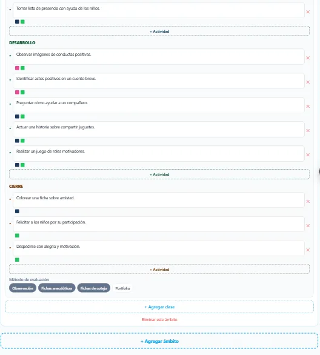

*Figura 147. Resultado de la planificación de Inicial: actividades de inicio, desarrollo y cierre con marcas DUA (2 de 2).*

> La IA propone; la responsabilidad pedagógica es del docente. Verifique que las actividades respeten el ritmo de su grupo, tengan pertinencia cultural y contextual y garanticen la participación de todas las niñas y los niños, tal como exige el Currículo Priorizado de Educación Inicial para una experiencia de aprendizaje.

### 5.10.4. Firmantes y generación del documento Word

1. Complete los datos de los firmantes en la sección **Firmantes**: **Elaborado por (nombre docente)**, **Revisado por (nombre)** con su **Cargo**, **Coordinadora/o (nombre)** y **Aprobado por (nombre)** con su **Cargo**.
2. Haga clic en **Generar Word (.docx)**.
3. En la versión web, el archivo se descarga automáticamente; en el dispositivo móvil, elija en el diálogo de compartir dónde guardarlo o a quién enviarlo.

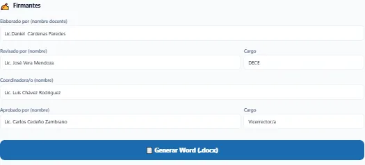

*Figura 148. Sección Firmantes y botón Generar Word (.docx).*

Los cargos de revisión y aprobación vienen precargados como DECE y Vicerrector/a, respectivamente, y pueden cambiarse según la organización de su institución. Si no escribe el nombre del docente en **Docente**, la exportación se detiene con el aviso “Ingresa el nombre del docente antes de exportar.”. El archivo se nombra con el patrón PlanInicial-I1 o PlanInicial-I2 seguido de un número de identificación.

***Contenido del documento Word***

| **Sección del documento** | **Contenido** |
| --- | --- |
| Encabezado | Título “PLANIFICACIÓN SEMANAL POR EXPERIENCIA DE APRENDIZAJE”, en hoja A4 horizontal. |
| Datos informativos | Nombre de la institución, nombre del docente, grado/curso, duración/fecha y objetivo general. |
| Cuerpo | Columnas ÁMBITOS DE DESARROLLO Y APRENDIZAJE, COMPETENCIA / HABILIDAD, DESTREZA CON CRITERIO DE DESEMPEÑO y PROCESO METODOLÓGICO. Cada clase ocupa una fila con su número y tema, objetivo, metodología, actividades de inicio, desarrollo y cierre con marcas DUA y método de observación. |
| Adaptaciones curriculares | Tabla con DESCRIPCIÓN DE NEE, COMPETENCIA, DESTREZA y PROCESO METODOLÓGICO. Este módulo la entrega con filas en blanco para completarla a mano. |
| Cierre | Bibliografía/webgrafía, observaciones y cuatro casillas de firma: elaborado, revisado (DECE y coordinación) y aprobado. |

> El módulo de Inicial no guarda la planificación en Mis planes: los datos permanecen en pantalla solo mientras no la abandone. Genere el Word antes de salir y conserve el archivo.

> El formato oficial de planificación microcurricular 2026-2027 para Inicial y Preparatoria incorpora elementos del currículo por competencias (situación de aprendizaje, competencias específicas, indicadores de evaluación y saberes declarativos, procedimentales y actitudinales). Si su institución exige ese formato, utilice el Word generado como base y complete esos apartados.

### 5.10.5. Recomendaciones pedagógicas

- Parta de un tema generador que surja del interés de los niños o de una situación significativa (una visita, un hallazgo en el patio, un acontecimiento familiar), como recomienda el Currículo Priorizado de Educación Inicial.
- Si la experiencia se extiende varios días, agregue una clase por día en el mismo ámbito y retome el propósito en cada momento de inicio.
- Elija Juego-trabajo o Rincones de aprendizaje cuando organice el aula por rincones; recuerde sus momentos de planificación, desarrollo, orden y socialización.
- Registre la observación de forma sistemática durante la semana (ficha de observación, registro anecdótico o lista de cotejo) y guarde evidencias en el portafolio para el informe cualitativo.

## 5.11. Preparatoria

Ruta: **Crear › Niveles educativos › Preparatoria**.

El módulo **Planificación Preparatoria** elabora la planificación semanal del primer grado de Educación General Básica (1.° EGB), subnivel Preparatoria, para niñas y niños de 5 a 6 años. A diferencia de los demás grados de EGB, Preparatoria no se organiza por asignaturas sino por los siete ámbitos del currículo integrador; por ello, en lugar de elegir un área, usted elige un ámbito y dentro de él las destrezas con criterios de desempeño (DCD) de las distintas áreas que lo componen. Este módulo usa el mismo motor de generación y la misma exportación que la planificación semanal de EGB.

### 5.11.1. Fundamento normativo y pedagógico

El Currículo Priorizado para el subnivel Preparatoria mantiene una estructura por ejes y ámbitos de desarrollo y aprendizaje. Los tres ejes (desarrollo personal y social, descubrimiento del medio natural y cultural, y expresión y comunicación) se despliegan en siete ámbitos: Identidad y autonomía; Convivencia; Descubrimiento y comprensión del medio natural y cultural; Relaciones lógico- matemáticas; Comprensión y expresión oral y escrita; Comprensión y expresión artística; y Expresión corporal. El documento aclara que esta división es solo organizativa y que el aprendizaje no debe segmentarse; además, establece la actividad lúdica como estrategia principal del subnivel y sugiere planificar las destrezas a partir de experiencias de aprendizaje.

Cada destreza del subnivel tiene asociados criterios e indicadores de evaluación. La aplicación los envía a la IA para que la evaluación propuesta se derive exclusivamente de la destreza seleccionada.

### 5.11.2. Datos informativos

1. Complete el formulario de planificación, empezando por la sección **1. Datos Informativos**.
2. Escriba la **Institución Educativa** y el **Nombre Docente**.
3. Seleccione el **Ámbito de desarrollo y aprendizaje**. Al hacerlo, la aplicación completa **N.º Unidad** con el número del ámbito y **Título de unidad de planificación** con su nombre; ambos campos pueden modificarse.
4. Seleccione el **Paralelo** y el **Trimestre**, y revise las fechas de **Semana inicio** y **Semana fin**.
5. Escriba los **Objetivos específicos de la unidad de planificación**.

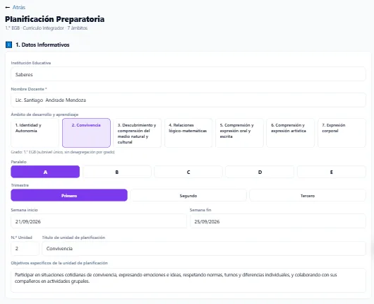

*Figura 149. Formulario de Preparatoria: sección Datos Informativos (1 de 5).*

| **Campo** | **Descripción** | **Ejemplo u observación** |
| --- | --- | --- |
| **Institución Educativa** | Nombre de la institución. | Escuela Fiscal… |
| **Nombre Docente** * | Campo obligatorio; sin él no se puede generar la planificación. | Nombre completo |
| **Ámbito de desarrollo y** **aprendizaje** | Uno de los siete ámbitos. Filtra las DCD disponibles en todas las horas de la semana. Debajo se indica que el grado es 1.° EGB (subnivel único, sin desagregación por grado). | 4. Relaciones lógico- matemáticas |
| **Paralelo** | Botones A a E. Un segundo clic sobre el mismo paralelo lo deselecciona. | B |
| **Trimestre** | Primero, Segundo o Tercero. De forma predeterminada, Primero. | Segundo |
| **Semana inicio** / **Semana fin** | Fechas en formato DD/MM/AAAA. Vienen precargadas con el lunes y el viernes de la semana en curso. | 08/09/2026 – 12/09/2026 |
| **N.º Unidad** y **Título de** **unidad de planificación** | Se completan al elegir el ámbito y pueden editarse. | 4 – Relaciones lógico- matemáticas |
| **Objetivos específicos** **de la unidad de** **planificación** | Texto libre de varias líneas. | Redáctelos en función de las destrezas de la semana |

### 5.11.3. Configuración por día y por hora

En la sección **2. Configuración por Día** aparece un bloque para cada día, de lunes a viernes. Cada bloque tiene un interruptor para activarlo o desactivarlo; los días desactivados muestran “Día desactivado — no se generará planificación”. Para cada día activo, elija el **Número de horas** (1, 2 o 3) y complete los datos de cada hora.

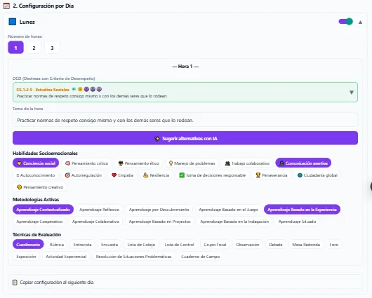

*Figura 150. Formulario de Preparatoria: configuración del día y número de horas (2 de 5).*

1. Haga clic en el selector **Seleccionar DCD del ámbito...** y elija la destreza en la ventana **Seleccionar DCD**. Puede buscar por código o descripción.
2. Escriba el **Tema de la hora**.
3. Opcionalmente, haga clic en **Sugerir alternativas con IA** y elija una propuesta en **Elige una** **alternativa:**.
4. Marque las **Habilidades Socioemocionales**, las **Metodologías Activas** y las **Técnicas de** **Evaluación** que desea registrar.
5. Si la configuración se repite, haga clic en **Copiar configuración al siguiente día**.

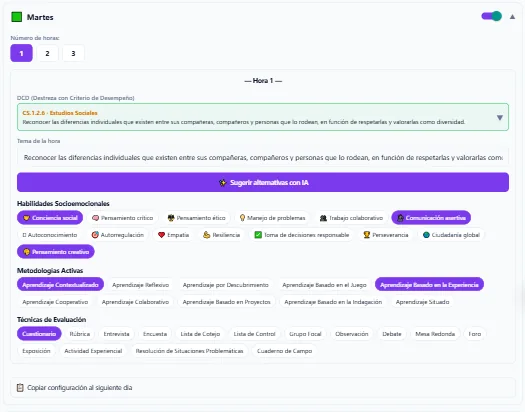

*Figura 151. Formulario de Preparatoria: selección de la DCD del ámbito (3 de 5).*

| **Campo** | **Descripción** | **Ejemplo u observación** |
| --- | --- | --- |
| **DCD (Destreza con** **Criterio de Desempeño)** | Abre una ventana con las destrezas del subnivel que pertenecen al ámbito elegido, de cualquier área (Ciencias Naturales, Estudios Sociales, Lengua, Matemática, Inglés, Educación Física o Educación Cultural y Artística). Cada destreza muestra su código y el área. Si aún no eligió ámbito, aparece “Selecciona un ámbito arriba para ver sus destrezas oficiales.” | Busque escribiendo parte del código o de la descripción |
| **Deporte específico** **(opcional)** | Solo aparece cuando la destreza pertenece a Educación Física. Orienta las actividades hacia un deporte. | Atletismo |
| **Tema de la hora** | Tema concreto de la clase; es obligatorio para que la hora se incluya en la generación. | Contamos semillas del huerto |
| **Sugerir alternativas con** **IA** | Se habilita cuando hay destreza y un tema de más de dos caracteres. Propone temas alternativos; al elegir uno, reemplaza el tema escrito. Puede tardar entre 15 y 30 segundos. | Opcional |
| **Habilidades** **Socioemocionales** | Selección múltiple. Si la destreza tiene habilidades asociadas, se muestran solo esas y quedan marcadas al elegirla. | Autoconocimiento |
| **Metodologías Activas** | Selección múltiple entre diez metodologías, entre ellas Aprendizaje Basado en el Juego, Aprendizaje Basado en la Experiencia y Aprendizaje por Descubrimiento. Se envían a la IA. | Aprendizaje Basado en el Juego |
| **Técnicas de Evaluación** | Selección múltiple (Observación, Lista de Cotejo, Rúbrica, Exposición, entre otras). Quedan registradas en la planificación. | Observación |

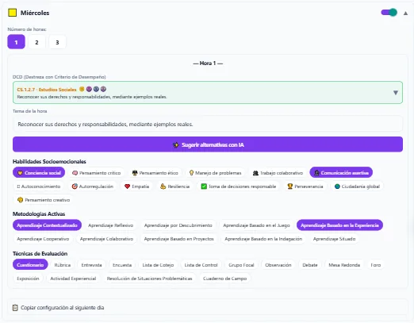

*Figura 152. Formulario de Preparatoria: tema, sugerencias de la IA y habilidades socioemocionales (4 de 5).*

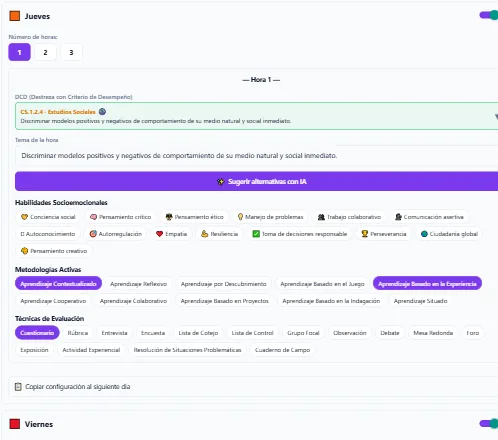

*Figura 153. Formulario de Preparatoria: metodologías activas, técnicas de evaluación y copia al siguiente día (5 de 5).*

> La opción Copiar configuración al siguiente día copia al día siguiente la destreza, el tema y todas las selecciones de cada hora. Úsela cuando una misma experiencia de aprendizaje se prolonga varios días y luego ajuste solo el tema.

### 5.11.4. Generación de la planificación

1. Haga clic en **Generar Planificación Semanal**.

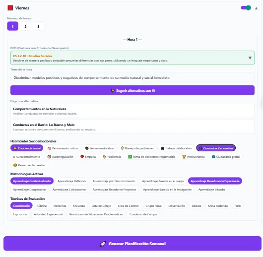

*Figura 154. Botón Generar Planificación Semanal de Preparatoria.*

Antes de enviar la solicitud, el sistema valida los datos. Si falta el nombre del docente, aparece “Por favor ingresa el nombre del docente”. Solo se incluyen los días activos y, dentro de ellos, las horas que tienen destreza y tema; si ninguna hora cumple esa condición, aparece “Activa al menos un día con destreza y tema”.

Se muestra la pantalla de espera y, a continuación, el resumen:

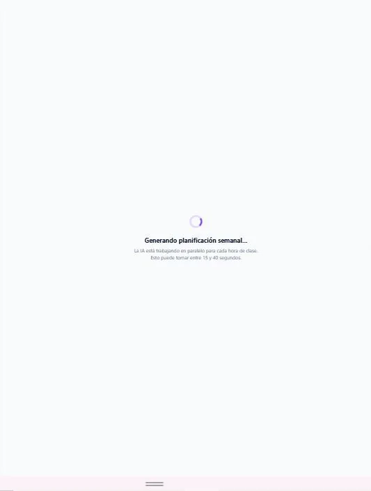

*Figura 155. Pantalla de espera “Generando planificación semanal...”.*

La IA trabaja en paralelo para cada hora de clase; el proceso suele tomar entre 15 y 40 segundos. Si ocurre un error general, la aplicación regresa al formulario y muestra el mensaje en una franja roja en la parte superior, sin perder los datos ingresados.

### 5.11.5. Revisión del resumen

El resumen presenta una pestaña por cada día generado. Cada hora aparece como una tarjeta con el código de la destreza, el tema, el **OBJETIVO DE APRENDIZAJE** y la clase de 45 minutos estructurada en las cuatro fases del ciclo de aprendizaje ERCA:

| **Fase** | **Duración** | **Propósito y número de actividades** |
| --- | --- | --- |
| EXPERIENCIA | 10 minutos | Recuperar saberes previos y vivencias relacionadas con el tema; 4 actividades. |
| REFLEXIÓN | 10 minutos | Analizar la experiencia mediante preguntas guiadas; 4 actividades. |
| CONCEPTUALIZACIÓN | 15 minutos | Construir y organizar el nuevo aprendizaje; 5 actividades. |
| APLICACIÓN | 10 minutos | Usar lo aprendido en situaciones concretas; 5 actividades. |

Cada actividad comienza con un verbo en infinitivo y lleva tres cuadros DUA (Representación, Acción/Expresión e Implicación); los que aplican se muestran con color intenso. Debajo de las fases, la tarjeta presenta los **Recursos** y la **Evaluación formativa**, con la técnica, el instrumento, la evidencia observable y el criterio de logro, derivados de los indicadores oficiales de la destreza.

1. Revise el resumen de cada día en su pestaña.
2. Si una hora no le satisface, haga clic en **Regenerar esta hora**; si una hora falló, haga clic en **Reintentar**.
3. Para cambiar datos del formulario, haga clic en **← Editar**.
4. Cuando el resultado sea adecuado, haga clic en **Guardar**.

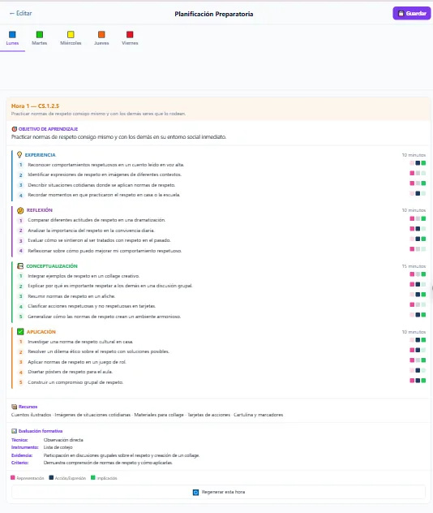

*Figura 156. Resumen de la planificación de Preparatoria con las fases ERCA y el botón Guardar.*

> En el resumen el contenido se muestra en modo de lectura. Para modificar una hora, regénerela o vuelva con ← Editar; los ajustes de redacción pueden hacerse en el Word exportado.

> Aunque la estructura ERCA es común a toda la EGB, el Currículo Priorizado de Preparatoria establece la actividad lúdica como estrategia principal. Al revisar el resumen, compruebe que las actividades sean de juego, manipulación y movimiento, y adecuadas a niñas y niños de 5 a 6 años.

### 5.11.6. Exportación

Al hacer clic en **Guardar**, la planificación se almacena en **Mis planes** y se abre la vista **Planificación** **Semanal**, con el rango de fechas y el docente en la cabecera, una pestaña por día y la pestaña **ADAPT.** para las adaptaciones curriculares.

1. Haga clic en **Exportar PDF**.
2. En la ventana **Exportar planificación semanal**, elija **Exportar como PDF** o **Exportar como Word**.

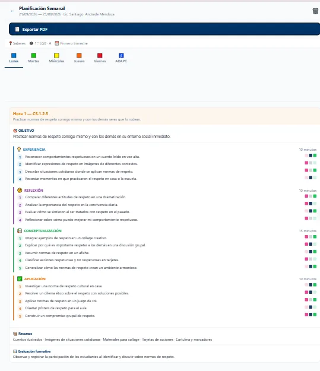

*Figura 157. Botón Exportar PDF en la vista de la planificación guardada.*

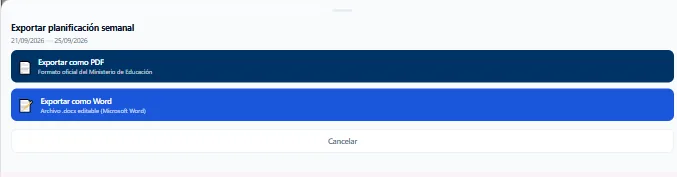

*Figura 158. Ventana Exportar planificación semanal con las opciones PDF y Word.*

| **Opción** | **Resultado** |
| --- | --- |
| **Exportar como PDF** | Documento con el formato de planificación semanal del Ministerio de Educación. En el dispositivo móvil se abre el diálogo para compartir el archivo. |
| **Exportar como Word** | Archivo .docx editable en Microsoft Word, útil para completar o ajustar la redacción antes de entregarlo. |

> Revise y firme el documento exportado según los procesos de su institución. Si su institución exige el formato de planificación microcurricular 2026-2027 para Inicial y Preparatoria, complete en el Word los apartados que ese formato añade (situación de aprendizaje, competencias específicas, indicadores de evaluación y saberes).

